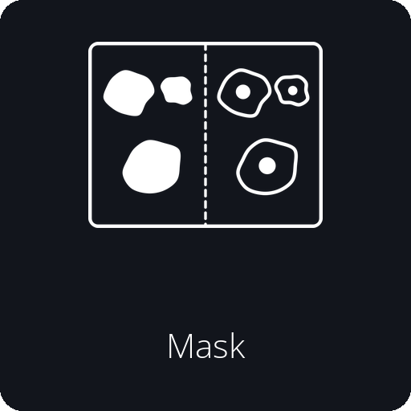
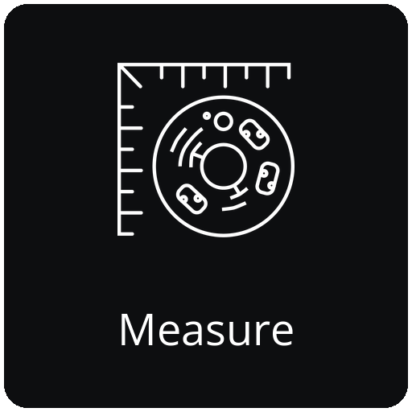
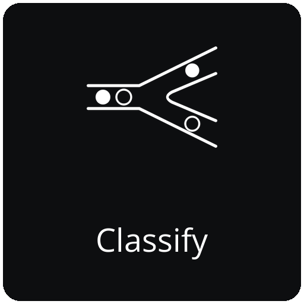
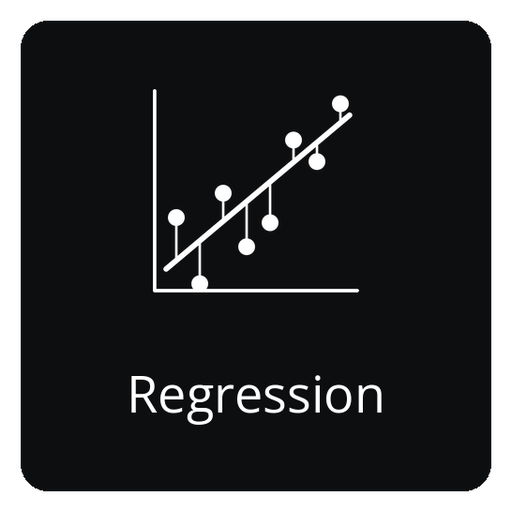
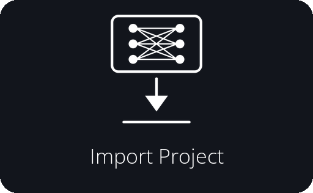
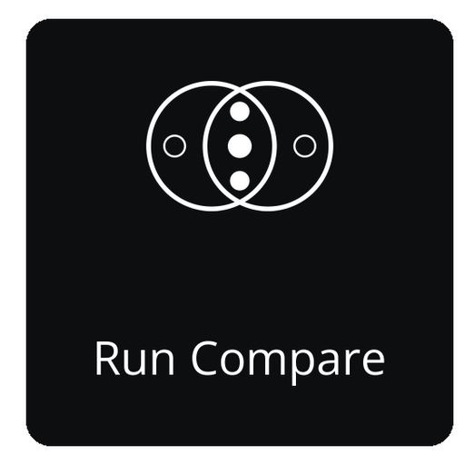
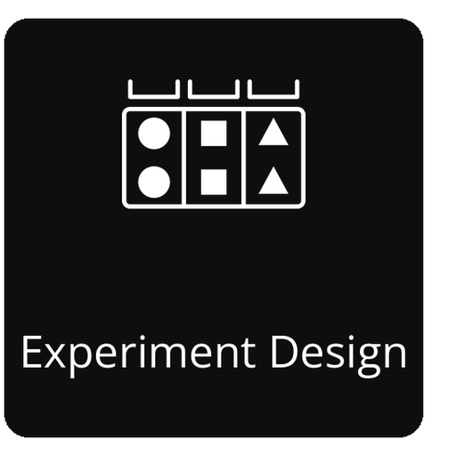
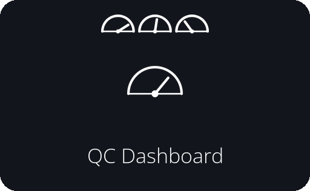
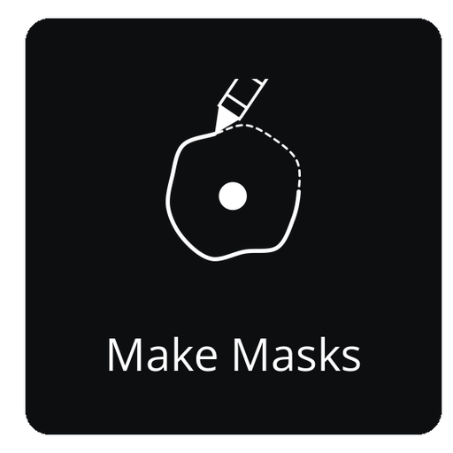
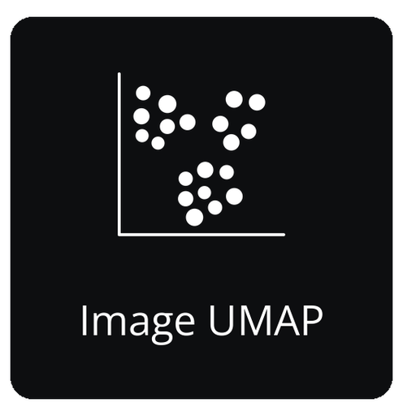

|Docs| |Tutorials| |PyPI| |Conda| |Python| |Tests| |Qt| |Source| |Issues| |License| |DOI|

.. |Docs| image:: https://github.com/EinarOlafsson/spacr/actions/workflows/pages/pages-build-deployment/badge.svg
   :target: https://einarolafsson.github.io/spacr/
   :alt: Documentation
.. |Tutorials| image:: https://img.shields.io/badge/Tutorials-Interactive%20walkthrough-4A9EFF
   :target: https://einarolafsson.github.io/spacr/tutorials/
   :alt: Interactive tutorials
.. |PyPI| image:: https://img.shields.io/pypi/v/spacr
   :target: https://pypi.org/project/spacr/
   :alt: PyPI version
.. |Python| image:: https://img.shields.io/badge/Python-3.9%E2%80%933.14-3776AB?logo=python&logoColor=white
   :target: https://pypi.org/project/spacr/
   :alt: Python 3.9 through 3.14
.. |Tests| image:: https://github.com/EinarOlafsson/spacr/actions/workflows/tests.yml/badge.svg?branch=nightly
   :target: https://github.com/EinarOlafsson/spacr/actions/workflows/tests.yml
   :alt: Test suite
.. |Qt| image:: https://img.shields.io/badge/GUI-Qt%20%28PySide6%29-41CD52
   :target: https://einarolafsson.github.io/spacr/
   :alt: Qt interface
.. |Source| image:: https://img.shields.io/badge/GitHub-Source-181717?logo=github
   :target: https://github.com/EinarOlafsson/spacr
   :alt: GitHub source
.. |Issues| image:: https://img.shields.io/github/issues/EinarOlafsson/spacr
   :target: https://github.com/EinarOlafsson/spacr/issues
   :alt: GitHub issues
.. |License| image:: https://img.shields.io/github/license/EinarOlafsson/spacr
   :target: https://github.com/EinarOlafsson/spacr/blob/main/LICENSE
   :alt: BSD 3-Clause license
.. |DOI| image:: https://img.shields.io/badge/DOI-10.5281%2Fzenodo.21343316-blue
   :target: https://doi.org/10.5281/zenodo.21343316
   :alt: Zenodo DOI
.. |Release| image:: https://img.shields.io/github/v/release/EinarOlafsson/spacr?label=Installers
   :target: https://github.com/EinarOlafsson/spacr/releases/latest
   :alt: Latest installers
.. |Conda| image:: https://anaconda.org/conda-forge/spacr/badges/version.svg
   :target: https://anaconda.org/conda-forge/spacr
   :alt: conda-forge version

spaCR
=====

Languages: `English <README.rst>`_ · `Svenska <docs/i18n/readme/README.sv.rst>`_ ·
`Deutsch <docs/i18n/readme/README.de.rst>`_ ·
`Español <docs/i18n/readme/README.es.rst>`_ ·
`简体中文 <docs/i18n/readme/README.zh_CN.rst>`_ ·
`Português <docs/i18n/readme/README.pt.rst>`_ ·
`हिन्दी <docs/i18n/readme/README.hi.rst>`_ ·
`한국어 <docs/i18n/readme/README.ko.rst>`_ ·
`Íslenska <docs/i18n/readme/README.is.rst>`_ ·
`Français <docs/i18n/readme/README.fr.rst>`_

**Spatial phenotype analysis of CRISPR screens.**

spaCR segments and measures single cells in high-content microscopy images,
integrates per-object phenotypes with sequencing-derived guide abundance, and
estimates which genes are associated with phenotypic changes. Starting from
plate images and FASTQ reads, it produces per-object measurements, trained
classifiers, per-guide and per-gene effect estimates, and a ranked hit list.

For image-based pooled CRISPR screens, spaCR provides the workflow from image
segmentation through hit prioritization. For high-content microscopy studies
without sequencing-based screens, the segmentation, measurement, annotation
and classification modules can be used independently.

Images, masks, crops, measurements, annotations, predictions, barcodes and
well identifiers live in one SQLite project, so a number in a result can be
traced back to the object it came from.

Run spaCR as a desktop application or headlessly on a workstation, server or
cluster. Both drive the same modules, and a GPU is used automatically where a
module supports it — NVIDIA (CUDA), AMD (ROCm on Linux, Metal on macOS),
Apple Silicon (Metal) and Intel Arc/Xe (XPU). spaCR picks the device for you
and falls back to the CPU when there is none; the setup screen and
``spacr-doctor`` name what was found and say which steps it will be used for.

What each configuration accelerates
~~~~~~~~~~~~~~~~~~~~~~~~~~~~~~~~~~~

.. spacr-hardware-begin

.. list-table::
   :header-rows: 1
   :widths: 32 18 18 22

   * - Hardware
     - Cellpose 4
     - Torch
     - UMAP / clustering
   * - NVIDIA (CUDA)
     - 🟢 GPU
     - 🟢 GPU
     - 🟢 GPU
   * - AMD on Linux (ROCm)
     - 🟣 GPU
     - 🟣 GPU
     - 🔴 CPU
   * - AMD in an Intel Mac (Metal)
     - 🟣 GPU
     - 🟣 GPU
     - 🔴 CPU
   * - Apple Silicon (Metal)
     - 🟣 GPU
     - 🟣 GPU
     - 🔴 CPU
   * - Intel Arc/Xe (XPU)
     - 🟣 GPU
     - 🟣 GPU
     - 🔴 CPU
   * - No GPU
     - 🟢 CPU
     - 🟢 CPU
     - 🟢 CPU

🟢 supported (stable)   🟣 implemented (beta)   🔴 not supported

Every cell is generated from ``spacr.accelerator.capabilities()``
with that backend's probe faked, so this table, the first setup
screen and ``spacr-doctor`` cannot disagree.

**No GPU is supported, not broken.** Every task runs on a CPU and
every result is identical; only the wall clock changes. On the
machine these were measured on, one 256x256 Cellpose image took
444.5 s on the CPU and 3.2 s on its Radeon.

*Beta* means implemented and dispatched to, but exercised on one
machine or none. CUDA is the only configuration with years behind
it.

.. spacr-hardware-end

Workflow at a glance
--------------------

.. spacr-workflow-begin

|Workflow_mask|\ |Workflow_arrow|\ |Workflow_measure|\ |Workflow_arrow|\ |Workflow_annotate|\ |Workflow_arrow|\ |Workflow_classify_merged|\ |Workflow_arrow|\ |Workflow_map_barcodes|\ |Workflow_arrow|\ |Workflow_regression|

**Data**

|App_foreign|\ |App_run_compare|\ |App_experiment_design|\ |App_power|\ |App_dose_response|\ |App_qc_dashboard|

**Tools**

|App_make_masks|\ |App_align|\ |App_umap|\ |App_gate_editor|\ |App_graph_builder|

**Assays**

|App_analyze_plaques|\ |App_recruitment|\ |App_invasion|\ |App_replication|

.. spacr-workflow-end

Select a workflow module to open its API page. The grid contains every other
application in the same categories and order used on the spaCR home screen.

Install spaCR
-------------

Desktop application
~~~~~~~~~~~~~~~~~~~

The desktop installers include a private Python environment, so conda and an
existing Python installation are not required.

.. spacr-installer-links-begin

|InstallerLinux| |InstallerMacOS| |InstallerWindows| |InstallerLegacy|

.. spacr-installer-links-end

The first three icons download the current release. The spaCR icon opens the
complete installer archive. Installer links and versioned filenames are
updated by the release workflow; earlier installers remain in the same
release archive.

On Linux, make the downloaded file executable and run it:

.. code-block:: bash

   chmod +x SpaCR-*-Linux-x86_64-Online.run
   ./SpaCR-*-Linux-x86_64-Online.run

On macOS, open the ``.pkg``. The current beta is not notarized; if Gatekeeper
blocks it, choose **System Settings → Privacy & Security → Open Anyway**.

See the `installer guide <docs/source/installer_guide.rst>`_ for update, uninstall,
offline and troubleshooting instructions.

Conda-forge installation
~~~~~~~~~~~~~~~~~~~~~~~~

The official conda-forge package installs spaCR and its desktop dependencies
into the active environment:

.. code-block:: bash

   conda create -n spacr python=3.12 -y
   conda activate spacr
   conda install conda-forge::spacr
   spacr

PyPI installation
~~~~~~~~~~~~~~~~~

For the PyPI release, install spaCR with pip inside a Conda environment.
Python 3.12 has the widest choice of optional scientific packages:

.. code-block:: bash

   conda create -n spacr python=3.12 -y
   conda activate spacr
   python -m pip install --upgrade pip
   python -m pip install "spacr[qt]"
   spacr

spaCR supports Python **3.9 through 3.14**, except Python 3.14.1, which
torchvision excludes. Linux is recommended for the heaviest CUDA and ROCm
workflows; macOS and Windows are also supported, and both use their GPUs —
macOS through Metal, which covers Apple Silicon and the AMD cards in Intel
Macs, and Windows through CUDA or DirectML.

For a server, cluster or CI runner, omit Qt:

.. code-block:: bash

   python -m pip install spacr
   spacr-run --list

Optional integrations are installed separately, for example
``spacr[zarr]``, ``spacr[omero]``, ``spacr[napari]`` and
``spacr[czi,nd2,lif]``. See the `installation guide
<docs/source/installer_guide.rst>`_ for the complete extras and Python-version
compatibility table.

Command-line entry points
~~~~~~~~~~~~~~~~~~~~~~~~~

.. code-block:: bash

   spacr                                      # launch the Qt application
   spacr-doctor                               # diagnose the installation
   spacr-run --list                           # list headless modules
   spacr-run --describe MODULE                # inspect a module contract
   spacr-run MODULE --settings settings.csv   # execute a module
   spacr-run validate --module MODULE \
       --settings settings.csv                # validate before running
   spacr-repro RUN_DIR                        # replay a recorded run

Set ``SPACR_LOG_LEVEL=DEBUG`` when troubleshooting. Rotating logs are written
to ``~/.spacr/logs/spacr.log``.

``spacr-run --list`` lists modules with headless command-line entry points.
GUI-only annotation, curation, comparison and exploration modules are omitted.

What you can do
---------------

The primary workflow comprises six modules:

- **Mask** segments cells, nuclei, pathogens and organelles with Cellpose.
- **Measure** writes morphology, intensity, texture, spatial and
  colocalization features, together with object crops, to SQLite.
- **Annotate** labels crops in a keyboard-driven grid and supports
  active-learning queues.
- **Classify** trains image or measurement-based models and records held-out
  performance with each checkpoint.
- **Map Barcodes** maps FASTQ reads to wells and gRNAs, with abundance,
  collision and coverage QC.
- **Regression** estimates guide, gene, condition and control effects with
  model families suited to continuous, fractional and count responses.

The same project can also design plates, estimate power, correct batch effects,
inspect segmentation quality, explore linked plots and crops, export AnnData,
resume interrupted work and record the settings behind each result.

Modules available from host screens
~~~~~~~~~~~~~~~~~~~~~~~~~~~~~~~~~~~

Twenty modules are integrated into related host screens rather than displayed
as separate Home tiles. Each opens from its host screen's masthead and uses the
active project. Mask, Measure, Annotate, Classify, Map Barcodes, Regression,
Image UMAP and Make Masks provide these integrated modules. Their help and API
documentation remain available, and modules with pipeline entry points can
still run headlessly. The `feature guide <docs/source/features.rst>`_ lists
each integrated module and its host.

Make Masks
~~~~~~~~~~

Make Masks appears under **Data** and provides manual correction of
segmentation masks. Its masthead also provides access to the Cellpose
workflows. The canvas has nine tools: **Brush**,
**Erase**, **Erase object**, **Wand +**, **Wand −**, **Draw**, **Divide**,
**Zoom** and **Recrop**. Draw creates one filled label from a free-form closed
outline. Divide separates a merged object along a user-defined line while
preserving all other object labels.

Recrop extracts a single-object field from a staged image containing multiple
objects. A bounding box around one object writes the corresponding image and
mask regions as a new field, schedules that field after the current one and
removes the original multi-object field from the curation queue. Recrop changes
the active field rather than editing label pixels.

Running Cellpose-SAM from Make Masks displays two intermediate outputs beside
the mask:
the **cell-probability map** and the **flow field**. A mask is a threshold on
the probability map, and flow-consistency checks can reject objects whose
derived flows differ from the predicted field. Inspect these outputs to
distinguish low cell probability from inconsistent flow when evaluating an
incorrect or incomplete mask.

Objects and settings
~~~~~~~~~~~~~~~~~~~~

spaCR supports cell, nucleus and pathogen objects, a cytoplasm derived from
their masks, and between zero and twenty-six organelle slots. Each organelle
slot has an independent channel, diameter, morphology preset and detection
method.

The settings panel displays controls only when they apply. Organelle slots
above the configured count are hidden, an object with no assigned channel is
excluded from the run, and morphology-specific controls are shown only for the
selected method. The **3D** and **Time** switches define the dimensionality:
``z_stack`` enables volumetric settings, ``timelapse`` enables tracking
settings, and four-dimensional settings appear when both are enabled.

Choose the next page by what you want to do:

- `Interactive tutorials <https://einarolafsson.github.io/spacr/tutorials/>`_
  — 73 guided workflows from installation through hit investigation.
- `Python API quickstart <docs/source/python_api.rst>`_ — run and validate
  pipelines from scripts, notebooks or a cluster.
- `Feature guide <docs/source/features.rst>`_ — capabilities, maturity and
  optional integrations.
- `Curated API reference
  <https://einarolafsson.github.io/spacr/api/index.html>`_ — supported entry
  points by task, with the complete module reference one level deeper.
- `Language & translation guide <docs/source/localization.rst>`_ — interface
  languages, contextual help and scientific-output policy.

Language & translation
~~~~~~~~~~~~~~~~~~~~~~

The interface supports ten languages across navigation and Preferences. AI and
LIVE controls, module descriptions and reviewed contextual help are also
translated. Change the
language under **spaCR → Preferences → Language** without restarting. Logs,
paths, database values and measurements are never translated; scientific
output remains canonical English. See the `contextual-help policy
<docs/source/localization.rst#contextual-help>`_.

Animated setting guidance
~~~~~~~~~~~~~~~~~~~~~~~~~

Settings with a visual explanation offer an **Animation** control in their
tooltip. Browse the `setting animation gallery
<https://einarolafsson.github.io/spacr/setting_animations.html>`_ or the
`Setting animation registry
<https://einarolafsson.github.io/spacr/api/spacr/setting_animations/index.html>`_.

Data
----

Reference datasets
~~~~~~~~~~~~~~~~~~

|DataBioStudies| |DataHuggingFace| |DataNCBI| |DataSpaCRPower| |DataBioRxiv|

Diagnosing performance
----------------------

Generate a hardware report and attach it to a performance-related issue::

    python tools/spacr_hardware_report.py

The command prints a report and saves a copy under ``~/.spacr/reports``; the
last line identifies the saved path. ``--quick`` omits the longer benchmarks,
and ``--out PATH`` selects another output location.

The report does not open a project or read project data. It records import and
numeric-library timing, display scaling, active preferences, main-window and
module-screen construction, and animation performance. The report file is the
only output it creates.

It also identifies processor-architecture emulation, such as an x86_64 Python
build on Apple Silicon, and the BLAS implementation used by NumPy. Either can
substantially affect performance.

Install from source
-------------------

Clone the repository and install it in editable mode, so your working copy
*is* the installed package and edits take effect without reinstalling::

    git clone https://github.com/EinarOlafsson/spacr.git
    cd spacr
    conda create -n spacr python=3.12 -y
    conda activate spacr
    pip install -e .
    spacr

The default branch is ``nightly``. For a specific release::

    git clone --branch v1.5.0.5 https://github.com/EinarOlafsson/spacr.git

To pull later changes, from inside the clone::

    git pull
    pip install -e .

The second line is only needed when dependencies or entry points changed;
Python code is picked up without it. If a command still runs old code after
pulling, ``spacr-doctor`` reports which ``spacr`` is actually on your path,
which is the usual cause.

Command-line reference
----------------------

Every command below is installed by ``pip install spacr``. All of them accept
``--help``.

Launching the application
~~~~~~~~~~~~~~~~~~~~~~~~~

.. code-block:: bash

   spacr              # the desktop application
   spaceout           # the same application, different dressing
   spacr-tutorial     # the interactive tutorial library
   spacr-server       # no first-run setup screen, for unattended launches

``spacr-server`` exists because the setup screen is modal and opens before
the main window, so a job with nobody in front of it would block on it.

``spacr-qt`` and ``spacr-nightly`` are aliases of ``spacr`` and start the
same application. They exist so that a script written against either name
keeps working.

When spaCR will not start
~~~~~~~~~~~~~~~~~~~~~~~~~

.. code-block:: bash

   spacr-doctor       # diagnose the installation and say how to fix it
   safespacr          # the least spaCR that can still change a setting

``spacr-doctor`` prints one line per check, and for every line that is not
``PASS`` a command you can copy and run. It also answers the question that
wastes the most time: *which* ``spacr`` is actually running, when an old
editable install is shadowing the one you just edited.

``safespacr`` is for when a saved preference is what breaks the launch. It
reads every preference as its default and forces the backdrop, animations,
verbose logging and preloading off, so you can get in and re-save the value
that broke it. It changes nothing permanently by itself.

Running modules headlessly
~~~~~~~~~~~~~~~~~~~~~~~~~~

No Qt, no display — for clusters, servers and CI.

.. code-block:: bash

   spacr-run --list                              # modules with a headless entry
   spacr-run --describe MODULE                   # what a module consumes and produces
   spacr-run validate --module MODULE \
       --settings settings.csv                   # check settings before spending the run
   spacr-run MODULE --settings settings.csv      # execute
   spacr-remote --help                           # submit and monitor SSH, Slurm or cloud jobs

Validate first. It reads the same settings the run would and reports what is
missing, contradictory or pointing at nothing — which costs a second, against
a run that may not.

``spacr-run --list`` shows only modules with a headless entry point.
Annotation, curation and exploration are interactive by nature and are
omitted.

Inspecting a run afterwards
~~~~~~~~~~~~~~~~~~~~~~~~~~~

Every run is journalled to ``~/.spacr/runs`` with its settings, hashed
inputs, outputs, warnings, versions and seeds.

.. code-block:: bash

   spacr-repro RUN_DIR        # replay a recorded run from its journal
   spacr-workspace RUN_DIR    # what that run had open: databases, montages, views

Auditing data and installation
~~~~~~~~~~~~~~~~~~~~~~~~~~~~~~

.. code-block:: bash

   spacr-db-audit DB      # SQLite health, integrity, locking, reader/writer probe
   spacr-leakage          # classifier train/test leakage audit
   spacr-plugins          # installed plugin registry and failure diagnostics

Environment
~~~~~~~~~~~

.. code-block:: bash

   SPACR_LOG_LEVEL=DEBUG spacr      # verbose logging for one launch

Rotating logs are written to ``~/.spacr/logs/spacr.log``. Attach that file to
a bug report rather than a screenshot of a terminal — the terminal is usually
gone by the time the crash is noticed.

Contributing and support
------------------------

Submit bug reports and focused feature requests through
`GitHub Issues <https://github.com/EinarOlafsson/spacr/issues>`_.
When reporting a failure, include the spaCR version, operating system, Python
version, module settings and the relevant log excerpt. ``spacr-doctor``
collects most of this information; include the hardware report when reporting
performance problems.

Licensing
~~~~~~~~~

spaCR is open source under the `BSD 3-Clause License
<https://github.com/EinarOlafsson/spacr/blob/main/LICENSE>`_, the same licence
as CellProfiler, napari and Cellpose. Use it for any purpose, including
commercially. Releases from 1.5.0.0 through 1.5.0.4 carried the PolyForm
Noncommercial License 1.0.0 and versions through 1.4.9.9 carried the MIT
License; those releases remain available under the licence that accompanied
them.

If spaCR contributed to published work, a citation is appreciated and is not
a condition of the licence — see `Citing spaCR`_ below.

Tutorials
~~~~~~~~~

The `interactive spaCR tutorial library
<https://einarolafsson.github.io/spacr/tutorials/>`_ contains narrated,
captioned walkthroughs of installation and of each application workflow, in
73 lessons with 50 voices across eight languages.

Citing spaCR
~~~~~~~~~~~~

If spaCR contributes to your research, cite:

Olafsson EB, *et al.* A pooled image-based CRISPR screen identifies
EAF1 as a *T. gondii* modulator of ESCRT subversion.

`bioRxiv preprint <https://www.biorxiv.org/content/10.64898/2026.07.08.737057v1>`_ ·
`software archive <https://doi.org/10.5281/zenodo.21343316>`_

Acknowledgments
~~~~~~~~~~~~~~~

spaCR builds on open scientific software including NumPy, pandas,
scikit-image, scikit-learn, Cellpose, PyTorch and Qt. See the
`translation model attribution <docs/i18n/TRANSLATION_MODELS.md>`_ for the
models used to prepare the multilingual documentation and interface catalogs.
