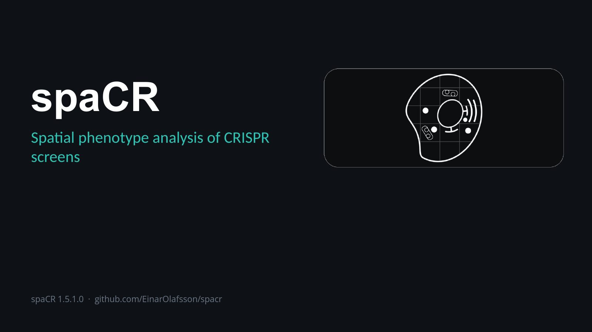
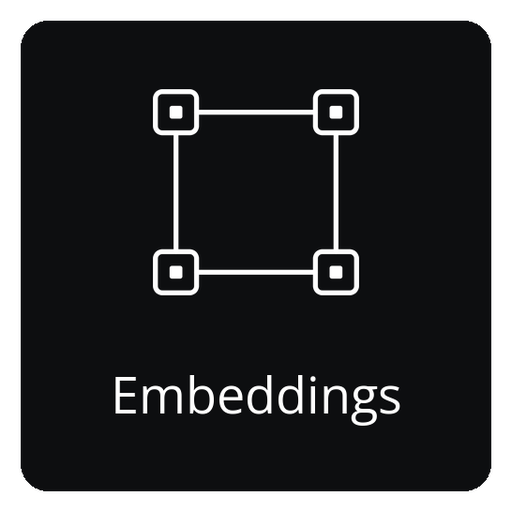
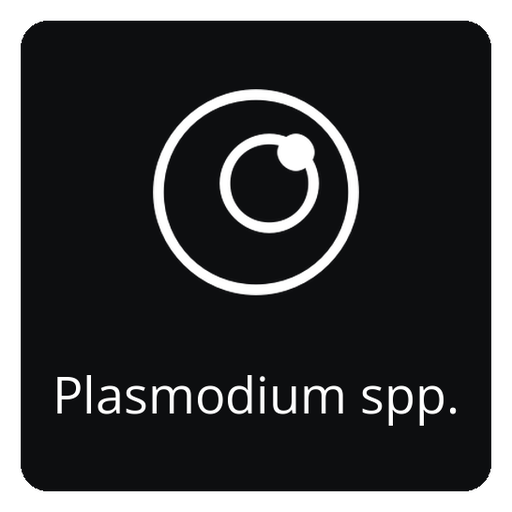

|Platforms| |Python| |Qt| |Tests| |Release| |Issues| |Source| |Conda| |PyPI| |Conda Downloads| |PyPI Downloads| |Docs| |Tutorials| |Preprint| |DOI| |Cite| |License| |PyPI rank|

.. |Docs| image:: https://img.shields.io/github/actions/workflow/status/EinarOlafsson/spacr/pages%2Fpages-build-deployment?label=API%20Documentation
   :target: https://einarolafsson.github.io/spacr/
   :alt: API Documentation
.. |Tutorials| image:: https://img.shields.io/badge/Tutorials-Interactive%20walkthrough-4A9EFF
   :target: https://einarolafsson.github.io/spacr/tutorials/
   :alt: Interactive tutorials
.. |PyPI| image:: https://img.shields.io/pypi/v/spacr
   :target: https://pypi.org/project/spacr/
   :alt: PyPI version
.. |Python| image:: https://img.shields.io/badge/Python-3.9%E2%80%933.14-3776AB?logo=python&logoColor=white
   :target: https://pypi.org/project/spacr/
   :alt: Python 3.9 through 3.14
.. |Tests| image:: https://github.com/EinarOlafsson/spacr/actions/workflows/tests.yml/badge.svg?branch=nightly
   :target: https://github.com/EinarOlafsson/spacr/actions/workflows/tests.yml
   :alt: Test suite
.. |Qt| image:: https://img.shields.io/badge/GUI-Qt%20%28PySide6%29-41CD52
   :target: https://einarolafsson.github.io/spacr/api/spacr/qt/index.html#module-spacr.qt
   :alt: Qt interface
.. |Source| image:: https://img.shields.io/badge/GitHub-Source-181717?logo=github
   :target: https://github.com/EinarOlafsson/spacr
   :alt: GitHub source
.. |Issues| image:: https://img.shields.io/github/issues/EinarOlafsson/spacr
   :target: https://github.com/EinarOlafsson/spacr/issues
   :alt: GitHub issues
.. |License| image:: https://img.shields.io/github/license/EinarOlafsson/spacr
   :target: https://github.com/EinarOlafsson/spacr/blob/main/LICENSE
   :alt: BSD 3-Clause license
.. |Preprint| image:: https://img.shields.io/badge/bioRxiv-2026.07.08.737057-BF2636
   :target: https://www.biorxiv.org/content/10.64898/2026.07.08.737057v1
   :alt: bioRxiv preprint
.. |DOI| image:: https://img.shields.io/badge/DOI-10.5281%2Fzenodo.21343316-blue
   :target: https://doi.org/10.5281/zenodo.21343316
   :alt: Zenodo DOI
.. |Release| image:: https://img.shields.io/github/v/release/EinarOlafsson/spacr?label=Installers
   :target: https://github.com/EinarOlafsson/spacr/releases/latest
   :alt: Latest installers
.. |Conda| image:: https://anaconda.org/conda-forge/spacr/badges/version.svg
   :target: https://anaconda.org/conda-forge/spacr
   :alt: conda-forge version
.. |Conda Downloads| image:: https://anaconda.org/conda-forge/spacr/badges/downloads.svg
   :target: https://anaconda.org/conda-forge/spacr
   :alt: conda-forge downloads
.. |Release date| image:: https://anaconda.org/conda-forge/spacr/badges/latest_release_date.svg
   :target: https://anaconda.org/conda-forge/spacr
   :alt: conda-forge latest_release_date
.. |PyPI Downloads| image:: https://static.pepy.tech/personalized-badge/spacr?period=total&units=INTERNATIONAL_SYSTEM&left_color=GRAY&right_color=GREEN&left_text=downloads
   :target: https://pepy.tech/projects/spacr
   :alt: PyPI Downloads
.. |Platforms| image:: https://img.shields.io/badge/Platforms-Linux%20%7C%20macOS%20%7C%20Windows-lightgrey
   :target: https://github.com/EinarOlafsson/spacr/blob/nightly/docs/source/installers.rst
   :alt: Linux, macOS, and Windows
.. |Cite| image:: https://img.shields.io/badge/Cite-CITATION.cff-8A2BE2
   :target: https://github.com/EinarOlafsson/spacr/blob/main/CITATION.cff
   :alt: Cite spaCR
.. |PyPI rank| image:: https://img.shields.io/badge/dynamic/json?url=https%3A%2F%2Fsql-clickhouse.clickhouse.com%2F%3Fuser%3Ddemo%26param_package_name%3Dspacr%26param_days%3D30%26query%3DWITH%2B%2528%2BSELECT%2Bsum%2528count%2529%2BFROM%2Bpypi.pypi_downloads_per_day%2BWHERE%2Bproject%2B%253D%2B%257Bpackage_name%253AString%257D%2BAND%2Bdate%2B%253E%253D%2BtoDate%2528now%2528%2527UTC%2527%2529%2529%2B-%2B%257Bdays%253AUInt16%257D%2BAND%2Bdate%2B%253C%2BtoDate%2528now%2528%2527UTC%2527%2529%2529%2B%2529%2BAS%2Bdownloads%2BSELECT%2Bdownloads%2BAS%2Bpackage_downloads%252C%2BcountIf%2528n%2B%253E%253D%2Bdownloads%2529%2BAS%2Brank%252C%2Bcount%2528%2529%2BAS%2Btotal_packages%252C%2B100.0%2B%252A%2Brank%2B%252F%2BnullIf%2528total_packages%252C%2B0%2529%2BAS%2Bpercentile%252C%2Bif%2528%2Btotal_packages%2B%253D%2B0%2BOR%2Bdownloads%2B%253D%2B0%252C%2B%2527no%2Bdata%2527%252C%2Bconcat%2528%2B%2527top%2B%2527%252C%2BtoString%2528ceil%25281000.0%2B%252A%2Brank%2B%252F%2BnullIf%2528total_packages%252C%2B0%2529%2529%2B%252F%2B10%2529%252C%2B%2527%2525%2527%2B%2529%2B%2529%2BAS%2Bmessage%2BFROM%2B%2528%2BSELECT%2Bproject%252C%2Bsum%2528count%2529%2BAS%2Bn%2BFROM%2Bpypi.pypi_downloads_per_day%2BWHERE%2Bdate%2B%253E%253D%2BtoDate%2528now%2528%2527UTC%2527%2529%2529%2B-%2B%257Bdays%253AUInt16%257D%2BAND%2Bdate%2B%253C%2BtoDate%2528now%2528%2527UTC%2527%2529%2529%2BGROUP%2BBY%2Bproject%2B%2529%2BFORMAT%2BJSON&query=%24.data%5B0%5D.message&label=PyPI+rank+%2830d%29&color=brightgreen&cacheSeconds=86400
   :target: https://clickpy.clickhouse.com/dashboard/spacr
   :alt: spaCR PyPI download ranking over the previous 30 complete days

`← Back <docs/source/_static/deck/pages/51.md>`_   `Next → <docs/source/_static/deck/pages/02.md>`_

spaCR
=====

.. spacr-language-picker-begin

Languages: `🌐 English ▾ <docs/i18n/readme/README.md>`_

.. spacr-language-picker-end

**Spatial phenotype analysis of CRISPR screens.**

spaCR segments and measures single cells in high-content microscopy images,
integrates per-object phenotypes with sequencing-derived guide abundance, and
estimates which genes are associated with phenotypic changes. Starting from
plate images and FASTQ reads, it produces per-object measurements, trained
classifiers, per-guide and per-gene effect estimates, and a ranked hit list.

The segmentation, measurement, annotation and classification modules also
run without a sequencing arm.

Images, masks, crops, measurements, annotations, predictions, barcodes and
well identifiers live in one SQLite project.

Runs as a desktop application or headlessly on a workstation, server or
cluster.

Try spaCR
~~~~~~~~~

.. code-block:: bash

   conda create -n spacr python=3.12 -y
   conda activate spacr
   python -m pip install "spacr[qt]"
   spacr

Use **Load test data…** in Import, Make Masks, Annotate or an assay screen
to download example data. From a terminal, use ``spacr-download``.

Hardware support
~~~~~~~~~~~~~~~~

.. spacr-hardware-begin

.. list-table::
   :header-rows: 1
   :widths: 32 18 18 22

   * - Hardware
     - Cellpose 4
     - Torch
     - UMAP / clustering
   * - NVIDIA (CUDA)
     - 🟢 GPU
     - 🟢 GPU
     - 🟢 GPU
   * - AMD on Linux (ROCm)
     - 🟣 GPU
     - 🟣 GPU
     - 🔴 CPU
   * - AMD in an Intel Mac (Metal)
     - 🟣 GPU
     - 🟣 GPU
     - 🔴 CPU
   * - Apple Silicon (Metal)
     - 🟣 GPU
     - 🟣 GPU
     - 🔴 CPU
   * - Intel Arc/Xe (XPU)
     - 🟣 GPU
     - 🟣 GPU
     - 🔴 CPU
   * - No GPU
     - 🟢 CPU
     - 🟢 CPU
     - 🟢 CPU

🟢 supported (stable)   🟣 implemented (beta)   🔴 CPU support only

.. spacr-hardware-end

Install spaCR
~~~~~~~~~~~~~

Desktop application
-------------------

The installers bundle their own Python. Conda is not required.

.. spacr-installer-links-begin

|InstallerLinux| |InstallerMacOS| |InstallerWindows| |InstallerLegacy|

.. |InstallerWindows| image:: spacr/resources/icons/platforms/windows.png
   :width: 64
   :alt: Download spaCR 1.5.1.0 for Windows 10/11
   :target: https://github.com/EinarOlafsson/spacr/releases/download/v1.5.1.0/spaCR-1.5.1.0-Windows-Online-Setup.exe
.. |InstallerMacOS| image:: spacr/resources/icons/platforms/macos.png
   :width: 64
   :alt: Download spaCR 1.5.1.0 for macOS 11+ (Intel and Apple silicon)
   :target: https://github.com/EinarOlafsson/spacr/releases/download/v1.5.1.0/spaCR-1.5.1.0-macOS-Universal-Online.pkg
.. |InstallerLinux| image:: spacr/resources/icons/platforms/linux.png
   :width: 64
   :alt: Download spaCR 1.5.1.0 for 64-bit Linux
   :target: https://github.com/EinarOlafsson/spacr/releases/download/v1.5.1.0/spaCR-1.5.1.0-Linux-x86_64-Online.run
.. |InstallerLegacy| image:: spacr/resources/icons/platforms/legacy.png
   :width: 64
   :alt: Earlier spaCR installers
   :target: docs/source/installers.rst

.. spacr-installer-links-end

The first three icons download the current release. The spaCR icon opens the
complete installer archive. Installer links and versioned filenames are
updated by the release workflow; earlier installers remain in the same
release archive.

On Linux, make the downloaded file executable and run it:

.. code-block:: bash

   chmod +x SpaCR-*-Linux-x86_64-Online.run
   ./SpaCR-*-Linux-x86_64-Online.run

On macOS, open the ``.pkg``. The current beta is not notarized; if Gatekeeper
blocks it, choose **System Settings → Privacy & Security → Open Anyway**.

See the `installer guide <docs/source/installer_guide.rst>`_ for update, uninstall,
offline and troubleshooting instructions, and `system requirements
<docs/source/system_requirements.rst>`_ for workstation and server recommendations
and the GPU compatibility tables.

PyPI installation
-----------------

For the PyPI release, install spaCR with pip inside a Conda
environment. Python 3.12 has the widest choice of optional scientific packages:

.. code-block:: bash

   conda create -n spacr python=3.12 -y
   conda activate spacr
   python -m pip install --upgrade pip
   python -m pip install "spacr[qt]"
   spacr

spaCR supports Python **3.9 through 3.14**, except Python 3.14.1, which
torchvision excludes. Linux is recommended for the heaviest CUDA and ROCm
workflows; macOS and Windows are also supported, and both use their GPUs —
macOS through Metal, which covers Apple Silicon and the AMD cards in Intel
Macs, and Windows through CUDA or DirectML.

For a server, cluster or CI runner, omit Qt:

.. code-block:: bash

   python -m pip install spacr
   spacr-run --list

Optional integrations are installed separately, for example
``spacr[zarr]``, ``spacr[omero]``, ``spacr[napari]`` and
``spacr[czi,nd2,lif]``. See the `installation guide
<docs/source/installer_guide.rst>`_ for the complete extras and Python-version
compatibility table.

Conda-forge installation
------------------------

The official conda-forge package installs spaCR and its desktop dependencies
into the active environment:

.. code-block:: bash

   conda create -n spacr python=3.12 -y
   conda activate spacr
   conda install conda-forge::spacr
   spacr

Install from source
-------------------

Clone the repository and install it in editable mode, so your working copy
*is* the installed package and edits take effect without reinstalling::

    git clone https://github.com/EinarOlafsson/spacr.git
    cd spacr
    conda create -n spacr python=3.12 -y
    conda activate spacr
    pip install -e .
    spacr

This clones ``main``, the default branch, which carries the latest release.
Development happens on ``nightly``; add ``--branch nightly`` to clone it
instead. For a specific release::

    git clone --branch v1.5.0.5 https://github.com/EinarOlafsson/spacr.git

To pull later changes, from inside the clone::

    git pull
    pip install -e .

The second line is only needed when dependencies or entry points changed;
Python code is picked up without it. If a command still runs old code after
pulling, ``spacr-doctor`` reports which ``spacr`` is actually on your path,
which is the usual cause.

Install from source (light)
---------------------------

Contributors need the history; to only run spaCR, take one of these,
measured 2026-09-15 by ``packaging/measure_clone_forms.sh``::

    # One commit instead of every version: 540 MB downloaded, 69 s.
    # No history, so no git log, no git blame and no git bisect.
    # git pull still works, but stays shallow until git fetch --unshallow.
    git clone --depth 1 https://github.com/EinarOlafsson/spacr.git
    cd spacr && pip install -e .

    # Only the files spaCR runs from: 81 MB on disk, 39 s. No history
    # either, and no docs, tests, tools or example data.
    # --with-docs, --with-tests and --with-translations put those back;
    # --dir, --branch, --no-install and --help do the obvious things.
    # packaging/source_install_excludes.txt lists every skipped path.
    curl -fsSL https://raw.githubusercontent.com/EinarOlafsson/spacr/nightly/packaging/install_from_source.sh -o install_spacr.sh
    sh install_spacr.sh --branch nightly

On 2026-09-15, the full clone downloaded 5.8 GB. Adding
``--filter=blob:none`` to the shallow clone did not reduce its measured download.
The nightly tracked tree is a 1934 MB checkout (measured 2026-09-25),
excluding Git history. Download sizes and times vary with the branch.

Command-line entry points
~~~~~~~~~~~~~~~~~~~~~~~~~

.. code-block:: bash

   spacr                                      # launch the Qt application
   spacr-doctor                               # diagnose the installation
   spacr-run --list                           # list headless modules
   spacr-run --describe MODULE                # inspect a module contract
   spacr-run MODULE --settings settings.csv   # execute a module
   spacr-run validate --module MODULE \
       --settings settings.csv                # validate before running
   spacr-repro RUN_DIR                        # replay a recorded run
   spacr-download --list                      # what example data exists
   spacr-download measure annotate            # fetch example sets by name
   spacr-make-masks --folder DIR              # curate masks as a resumable queue
   spacr-make-masks --folder DIR --order easy --limit 50

``spacr-run --list`` lists modules with headless command-line entry points.
GUI-only annotation, curation, comparison and exploration modules are omitted.

Core workflow
-------------

The primary workflow comprises six modules:

- **Mask** segments cells, nuclei, pathogens and organelles with Cellpose.
- **Measure** writes morphology, intensity, texture, spatial and
  colocalization features, together with object crops, to SQLite.
- **Annotate** labels crops in a keyboard-driven grid and supports
  active-learning queues.
- **Classify** trains image or measurement-based models and records held-out
  performance with each checkpoint.
- **Map Barcodes** maps FASTQ reads to wells and gRNAs, with abundance,
  collision and coverage QC.
- **Regression** estimates guide, gene, condition and control effects with
  model families suited to continuous, fractional and count responses.

spaCR modules
-------------

.. spacr-workflow-begin

Core
^^^^

Core sequence from microscopy images through segmentation, measurements,
annotations, classification, barcode mapping and regression.

| |Module_mask|\ |Module_measure|\ |Module_annotate|\ |Module_classify_merged|\ |Module_map_barcodes|\ |Module_regression|

Data
^^^^

Import images and tables into spaCR projects and execute reproducible
multi-plate workflows.

| |Module_foreign|\ |Module_embeddings|\ |Module_run_compare|\ |Module_experiment_design|\ |Module_power|\ |Module_dose_response|
| |Module_qc_dashboard|

Tools
^^^^^

Point these at a project: edit masks by hand, stitch tiles, read an
embedding, draw a gate, build a plot, check quality.

| |Module_make_masks|\ |Module_align|\ |Module_umap|\ |Module_gate_editor|\ |Module_graph_builder|

Assays
^^^^^^

Quantitative readouts for biological assays.

| |Module_toxoplasma|\ |Module_plasmodium|\ |Module_candida|

.. |Module_mask| image:: spacr/resources/icons/workflow/mask.png
   :width: 16.0%
   :alt: Open the Mask API
   :target: https://einarolafsson.github.io/spacr/api/spacr/core/index.html#spacr.core.preprocess_generate_masks
   :align: middle
.. |Module_measure| image:: spacr/resources/icons/workflow/measure.png
   :width: 16.0%
   :alt: Open the Measure API
   :target: https://einarolafsson.github.io/spacr/api/spacr/measure/index.html
   :align: middle
.. |Module_annotate| image:: spacr/resources/icons/workflow/annotate.png
   :width: 16.0%
   :alt: Open the Annotate API
   :target: https://einarolafsson.github.io/spacr/api/spacr/qt/screens/annotate/index.html
   :align: middle
.. |Module_classify_merged| image:: spacr/resources/icons/workflow/classify_merged.png
   :width: 16.0%
   :alt: Open the Classify API
   :target: https://einarolafsson.github.io/spacr/api/spacr/classify/index.html
   :align: middle
.. |Module_map_barcodes| image:: spacr/resources/icons/workflow/map_barcodes.png
   :width: 16.0%
   :alt: Open the Map Barcodes API
   :target: https://einarolafsson.github.io/spacr/api/spacr/sequencing/index.html
   :align: middle
.. |Module_regression| image:: spacr/resources/icons/workflow/regression.png
   :width: 16.0%
   :alt: Open the Regression API
   :target: https://einarolafsson.github.io/spacr/api/spacr/ml/index.html
   :align: middle
.. |Module_foreign| image:: spacr/resources/icons/workflow/apps/foreign.png
   :width: 16.0%
   :alt: Open the Import API
   :target: https://einarolafsson.github.io/spacr/api/spacr/foreign/index.html
   :align: middle

.. |Module_run_compare| image:: spacr/resources/icons/workflow/apps/run_compare.png
   :width: 16.0%
   :alt: Open the Run Compare API
   :target: https://einarolafsson.github.io/spacr/api/spacr/qt/screens/run_compare/index.html
   :align: middle
.. |Module_experiment_design| image:: spacr/resources/icons/workflow/apps/experiment_design.png
   :width: 16.0%
   :alt: Open the Experiment Design API
   :target: https://einarolafsson.github.io/spacr/api/spacr/qt/screens/experiment_design/index.html
   :align: middle
.. |Module_power| image:: spacr/resources/icons/workflow/apps/power.png
   :width: 16.0%
   :alt: Open the Power / Design API
   :target: https://einarolafsson.github.io/spacr/api/spacr/qt/screens/power/index.html
   :align: middle
.. |Module_dose_response| image:: spacr/resources/icons/workflow/apps/dose_response.png
   :width: 16.0%
   :alt: Open the Dose–Response API
   :target: https://einarolafsson.github.io/spacr/api/spacr/qt/screens/dose_response/index.html
   :align: middle
.. |Module_qc_dashboard| image:: spacr/resources/icons/workflow/apps/qc_dashboard.png
   :width: 16.0%
   :alt: Open the QC API
   :target: https://einarolafsson.github.io/spacr/api/spacr/qt/screens/qc_dashboard/index.html
   :align: middle
.. |Module_make_masks| image:: spacr/resources/icons/workflow/apps/make_masks.png
   :width: 16.0%
   :alt: Open the Make Masks API
   :target: https://einarolafsson.github.io/spacr/api/spacr/qt/screens/make_masks/index.html
   :align: middle
.. |Module_align| image:: spacr/resources/icons/workflow/apps/align.png
   :width: 16.0%
   :alt: Open the Align & Stitch API
   :target: https://einarolafsson.github.io/spacr/api/spacr/align/index.html
   :align: middle
.. |Module_umap| image:: spacr/resources/icons/workflow/apps/umap.png
   :width: 16.0%
   :alt: Open the Image UMAP API
   :target: https://einarolafsson.github.io/spacr/api/spacr/core/index.html#spacr.core.generate_image_umap
   :align: middle
.. |Module_gate_editor| image:: spacr/resources/icons/workflow/apps/gate_editor.png
   :width: 16.0%
   :alt: Open the Gate Editor API
   :target: https://einarolafsson.github.io/spacr/api/spacr/qt/screens/gate_editor/index.html
   :align: middle
.. |Module_graph_builder| image:: spacr/resources/icons/workflow/apps/graph_builder.png
   :width: 16.0%
   :alt: Open the Graph Builder API
   :target: https://einarolafsson.github.io/spacr/api/spacr/qt/screens/graph_builder/index.html
   :align: middle

.. spacr-workflow-end

Every module with a Home tile, in Home's order: the six pipeline modules
first, then the rest. Select a tile to open that
module's API page.

See the `feature guide <docs/source/features.rst>`_ for each tool.

Other resources
~~~~~~~~~~~~~~~

- `Interactive tutorials <https://einarolafsson.github.io/spacr/tutorials/>`_
  — guided workflows from installation through hit investigation.
- `Python API quickstart <docs/source/python_api.rst>`_ — run and validate
  pipelines from scripts, notebooks or a cluster.
- `Feature guide <docs/source/features.rst>`_ — capabilities, maturity and
  optional integrations.
- `Curated API reference
  <https://einarolafsson.github.io/spacr/api/index.html>`_ — supported entry
  points by task, with the complete module reference one level deeper.
- `Language & translation guide <docs/source/localization.rst>`_ — interface
  languages, contextual help and scientific-output policy.

Language & translation
~~~~~~~~~~~~~~~~~~~~~~

The interface supports ten languages across navigation and Preferences. AI and
LIVE controls, module descriptions and reviewed contextual help are also
translated. Change the language under **spaCR → Preferences → Language**
without restarting. Logs, paths, database values and measurements are never
translated; scientific output remains canonical English. See the
`contextual-help policy <docs/source/localization.rst#contextual-help>`_.

The nine non-English catalogs are machine-drafted and technically reviewed
rather than read end to end by a native speaker. The
`review scope <docs/i18n/REVIEW_SCOPE_2026-09-04.md>`_ records which languages
have had a human pass and every term left in English by decision.

Animated setting guidance
~~~~~~~~~~~~~~~~~~~~~~~~~

Settings with a visual explanation offer an **Animation** control in their
tooltip. Browse the `setting animation gallery
<https://einarolafsson.github.io/spacr/setting_animations.html>`_ or the
`Setting animation registry
<https://einarolafsson.github.io/spacr/api/spacr/setting_animations/index.html>`_.

Data
~~~~

Reference datasets
~~~~~~~~~~~~~~~~~~

|DataBioStudies| |DataHuggingFace| |DataNCBI| |DataSpaCRPower| |DataBioRxiv|

.. |DataBioStudies| image:: spacr/resources/icons/databanks/biostudies_button.png
   :width: 72
   :alt: Open the BioStudies microscopy dataset
   :target: https://doi.org/10.6019/S-BIAD2135
.. |DataHuggingFace| image:: spacr/resources/icons/databanks/huggingface_button.png
   :width: 72
   :alt: Open the Hugging Face testing dataset
   :target: https://huggingface.co/datasets/einarolafsson/toxo_mito
.. |DataNCBI| image:: spacr/resources/icons/databanks/ncbi_button.png
   :width: 72
   :alt: Open the NCBI sequencing dataset
   :target: https://www.ncbi.nlm.nih.gov/bioproject/?term=PRJNA1261935
.. |DataSpaCRPower| image:: spacr/resources/icons/databanks/spacrpower_button.png
   :width: 72
   :alt: Open spaCRPower
   :target: https://github.com/maomlab/spaCRPower
.. |DataBioRxiv| image:: spacr/resources/icons/databanks/biorxiv_button.png
   :width: 72
   :alt: Open the bioRxiv preprint
   :target: https://www.biorxiv.org/content/10.64898/2026.07.08.737057v1

Model zoo
~~~~~~~~~

spaCR ships a catalogue of trained models and fetches them on demand. Open
**Model Zoo** from the home screen to browse and install them, or name a key
in a settings file -- ``pathogen_model: toxoplasma_pv_v1`` -- and the model is
downloaded and checksum-verified the first time it is needed. Every published
entry carries a SHA-256; an entry without one is refused rather than installed,
because a truncated or substituted checkpoint cannot be told from the real one.

.. spacr-model-zoo-begin

.. list-table::
   :header-rows: 1
   :widths: 24 34 42

   * - Model
     - Training data
     - Hold-out performance
   * - ``toxoplasma_pv_v1``
       (Cellpose-SAM (cpsam_v2))
     - anti-Toxoplasma-biotin and DsRed PV lumen; 229 images from 2 datasets, 104 round-1 and 125 newly curated
     - F1 0.864 against 0.713 for stock cpsam on 11 held-out in-house wells, at IoU 0.5; literature hold-out pending
   * - ``toxoplasma_plaque_v1``
       (Cellpose-SAM (cpsam))
     - crystal violet plaque wells; 184 wells from 3 datasets, 95 in-house and 89 literature
     - F1 0.856 in-domain; 0.806 on literature (3-fold cross-validated, SD 0.020)
   * - ``toxoplasma_plaque_v2``
       (Cellpose-SAM (cpsam_v2))
     - 488 curated fields across four domains -- 298 wells cropped from published figures, 96 phone-camera wells, 67 PFA and 27 methanol-fixed whole-well microscope scans; 27,582 plaques
     - not scored against stock; on 81 held-out fields it ties round 3 on literature (0.819 vs 0.820) and beats it by 0.166 on phone-camera wells (0.415 vs 0.249)
   * - ``toxoplasma_well_detector_v1``
       (YOLO11n)
     - whole-plate and multi-well crystal violet images; 562 images from 1 dataset, 190 of them with no well in them
     - mAP50 0.993 on its own held-out split; on the test set shared with v2 it scores mAP50 0.8838, against v2's 0.9457
   * - ``toxoplasma_well_detector_v2``
       (YOLO26n (ultralytics 8.4.155))
     - plate images and literature figures; 1,070 train / 254 val / 129 test, split by PMC article so no paper is in two sets; training data at einarolafsson/toxoplasma-plaque-well-detector-dataset
     - mAP50 0.9457 and mAP50-95 0.8341 against v1's (yolo_welldetect_v3.pt) 0.8838 and 0.7630 on the SAME test set; stock YOLO has no plaque-well class, so v1 is the baseline
   * - ``toxoplasma_from_cellmask_v1``
       (Cellpose-SAM (cpsam_v2))
     - Toxoplasma PV masks predicted from the HOST CELL MASK channel alone; 2567 training and 463 held-out fields, split by well, hosts HFF/HeLa/THP1
     - F1 0.606 against 0.021 for stock cpsam_v2 on 463 well-grouped held-out fields, at IoU 0.5
   * - ``toxoplasma_pv_v2``
       (Cellpose-SAM (cpsam_v2))
     - anti-Toxoplasma-biotin and DsRed PV lumen; 556 curated images accumulated over five rounds
     - F1 0.817 +/- 0.036 by 5-fold cross-validation over 619 pairs; ~0.86 against 0.713 for stock on the 11 in-house held-out wells
   * - ``toxoplasma_pv_v3``
       (Cellpose-SAM (cpsam_v2))
     - the 556 curated PV fields of round 5, split 437 train / 108 validation / 11 test; training data at einarolafsson/toxoplasma-pv-segmentation-dataset
     - F1 0.860 against stock cpsam_v2's 0.765 on the 11 anchor wells at IoU 0.5; AJI 0.803 against 0.505
   * - ``live_cell_v1``
       (Cellpose-SAM (cpsam_v2))
     - 11,007 transmitted-light fields from 14 public datasets, split by acquisition 6,778 train / 2,030 validation / 2,199 test; training data at einarolafsson/live-cell-segmentation-dataset
     - on the datasets stock cpsam_v2 never trained on, F1 0.960 against 0.885 at IoU 0.5; over all 2,199 test fields, 0.694 against 0.738, because stock trained on LIVECell and YeaZ and wins on LIVECell
   * - ``nuclei_from_cellmask_v1``
       (Cellpose-SAM (cpsam_v2))
     - nuclei predicted from the HOST CELL MASK channel alone; 453 well-grouped held-out fields, hosts HFF/HeLa/THP1
     - F1 0.888 against 0.201 for stock cpsam_v2 on 453 well-grouped held-out fields, at IoU 0.5
   * - ``cell_from_hoechst_v1``
       (Cellpose-SAM (cpsam_v2))
     - the HOST CELL outline predicted from the Hoechst (nuclear) channel alone; 2,578 training fields and 451 held-out test fields, split by well so no well is on both sides
     - F1 0.870 against stock cpsam_v2's 0.301 on 451 held-out fields at IoU 0.5 -- a delta of 0.569
   * - ``toxoplasma_from_hoechst_v1``
       (Cellpose-SAM (cpsam_v2))
     - Toxoplasma PV masks predicted from the HOECHST channel alone; 2567 training and 463 held-out fields, split by well, hosts HFF/HeLa/THP1
     - F1 0.569 against 0.002 for stock cpsam_v2 on 463 well-grouped held-out fields, at IoU 0.5

.. spacr-model-zoo-end

Every figure above is measured on images the model never saw in training.

**Precision** is how many of the objects a model reported are real; **recall**
is how many of the real objects it found. They fail in opposite directions:
poor precision invents plaques, poor recall misses them.

**F1** is the two combined, and is quoted because each alone is trivially
gamed -- report one unmistakable plaque for near-perfect precision, or every
dark blob for near-perfect recall. Which you would rather lose depends on the
assay, and counting is usually better served by over-calling: the plaque model
was accepted at precision 0.858 with recall 0.811 over an earlier round at
0.939 and 0.631.

**IoU**, intersection over union, divides the overlap between predicted and
reference objects by their combined area. Read scores with their threshold:
"F1 0.864 at IoU 0.5" counts a vacuole as found when that overlap reaches half
the combined area.

**mAP50** and **mAP50-95** belong to the detector. The first asks whether the
wells were found; the second repeats it across ten thresholds from 0.5 to
0.95, so it also asks how tightly each box is drawn. The gap between them is
placement, not detection.

**Cross-validated**, with an **SD**, means the score is the mean of three runs
on different splits and the SD is how far they moved apart. One split can be
lucky: this model's literature figure is 0.834 on a single 19-well split and
0.806 across all three.

Models are hosted on each author's own Hugging Face account;
``spacr.model_zoo.publish_model`` uploads one and prints the catalogue row to add.

Diagnosing performance
----------------------

Generate a hardware report and attach it to a performance-related issue::

    python tools/spacr_hardware_report.py

Saves to ``~/.spacr/reports`` and prints the path. ``--quick`` skips the
longer benchmarks; ``--out PATH`` sets the location.

Reads no project data. Times imports, numeric libraries, window
construction and animation, and reports x86_64 emulation on Apple Silicon
and NumPy's BLAS.

Command-line reference
----------------------

Every command below is installed by ``pip install spacr``. All of them accept
``--help``.

Launching the application
~~~~~~~~~~~~~~~~~~~~~~~~~

.. code-block:: bash

   spacr              # the desktop application
   spacr-tutorial     # the interactive tutorial library
   spacr-server       # no first-run setup screen, for unattended launches

``spacr-qt`` and ``spacr-nightly`` are aliases of ``spacr``.

When spaCR will not start
~~~~~~~~~~~~~~~~~~~~~~~~~

.. code-block:: bash

   spacr-doctor       # diagnose the installation and say how to fix it
   safespacr          # the least spaCR that can still change a setting

``spacr-doctor`` prints one line per check, with a command to run for each
failure. It also reports which ``spacr`` is on the path, which is what an old
editable install shadows.

``safespacr`` reads every preference as its default and forces the backdrop,
animations, verbose logging and preloading off. Use it when a saved
preference breaks the launch. It changes nothing permanently.

Running modules headlessly
~~~~~~~~~~~~~~~~~~~~~~~~~~

No Qt, no display — for clusters, servers and CI.

.. code-block:: bash

   spacr-run --list                              # modules with a headless entry
   spacr-run --describe MODULE                   # what a module consumes and produces
   spacr-run validate --module MODULE \
       --settings settings.csv                   # check settings before spending the run
   spacr-run MODULE --settings settings.csv      # execute
   spacr-remote --help                           # submit and monitor SSH, Slurm or cloud jobs

``validate`` reads the same settings the run would and reports what is
missing, contradictory or pointing at nothing.

Inspecting a run afterwards
~~~~~~~~~~~~~~~~~~~~~~~~~~~

Every run is journalled to ``~/.spacr/runs`` with its settings, hashed
inputs, outputs, warnings, versions and seeds.

.. code-block:: bash

   spacr-repro RUN_DIR        # replay a recorded run from its journal
   spacr-workspace RUN_DIR    # what that run had open: databases, montages, views

Auditing data and installation
~~~~~~~~~~~~~~~~~~~~~~~~~~~~~~

.. code-block:: bash

   spacr-db-audit DB      # SQLite health, integrity, locking, reader/writer probe
   spacr-leakage          # classifier train/test leakage audit
   spacr-plugins          # installed plugin registry and failure diagnostics

Environment
~~~~~~~~~~~

.. code-block:: bash

   SPACR_LOG_LEVEL=DEBUG spacr      # verbose logging for one launch

Rotating logs are written to ``~/.spacr/logs/spacr.log``. Attach that file
to a bug report.

Contributing and support
~~~~~~~~~~~~~~~~~~~~~~~~

Submit bug reports and focused feature requests through
`GitHub Issues <https://github.com/EinarOlafsson/spacr/issues>`_.
When reporting a failure, include the spaCR version, operating system, Python
version, module settings and the relevant log excerpt. ``spacr-doctor``
collects most of this information; include the hardware report when reporting
performance problems.

Licensing
~~~~~~~~~

spaCR is released under the `BSD 3-Clause License
<https://github.com/EinarOlafsson/spacr/blob/main/LICENSE>`_.

If spaCR contributed to published work, a citation is appreciated and is not
a condition of the licence — see `Citing spaCR`_ below.

Tutorials
~~~~~~~~~

The `interactive spaCR tutorial library
<https://einarolafsson.github.io/spacr/tutorials/>`_ provides installation and
module walkthroughs. Available narration and languages are listed for each lesson.

Citing spaCR
~~~~~~~~~~~~

If spaCR contributes to your research, cite:

Olafsson EB, *et al.* A pooled image-based CRISPR screen identifies
EAF1 as a *T. gondii* modulator of ESCRT subversion.

`bioRxiv preprint <https://www.biorxiv.org/content/10.64898/2026.07.08.737057v1>`_ ·
`software archive <https://doi.org/10.5281/zenodo.21343316>`_

Other work citing spaCR
~~~~~~~~~~~~~~~~~~~~~~~

* `Metabolic adaptability and nutrient scavenging in Toxoplasma gondii: insights from ingestion pathway-deficient mutants. <https://journals.asm.org/doi/full/10.1128/msphere.01011-24>`_
* `IRE1α promotes phagosomal calcium flux to enhance macrophage fungicidal activity. <https://www.cell.com/cell-reports/fulltext/S2211-1247(25)00465-6>`_
* `Toxoplasma GRA8 engages the host ESCRT accessory protein ALG-2 and is necessary for parasite metabolic integrity. <https://www.biorxiv.org/content/10.64898/2026.07.20.739547v1.abstract>`_
* `spaCR: Spatial phenotype analysis of CRISPR-Cas9 screens (preprint version 1). <https://www.researchsquare.com/article/rs-7368254/v1>`_

Acknowledgments
~~~~~~~~~~~~~~~

spaCR builds on open scientific software including NumPy, pandas,
scikit-image, scikit-learn, Cellpose, PyTorch and Qt. See the
`translation model attribution <docs/i18n/TRANSLATION_MODELS.md>`_ for the
models used to prepare the multilingual documentation and interface catalogs.
