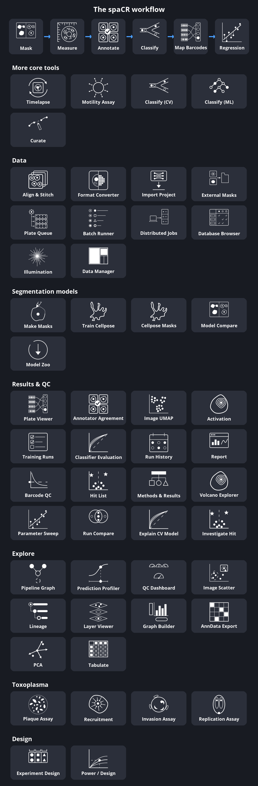

|Docs| |Tutorials| |PyPI| |Python| |Tests| |Qt| |Source| |Issues| |License| |DOI|

.. |Docs| image:: https://github.com/EinarOlafsson/spacr/actions/workflows/pages/pages-build-deployment/badge.svg
   :target: https://einarolafsson.github.io/spacr/
   :alt: दस्तावेज़
.. |Tutorials| image:: https://img.shields.io/badge/Tutorials-Interactive%20walkthrough-4A9EFF
   :target: https://einarolafsson.github.io/spacr/tutorials/
   :alt: इंटरैक्टिव ट्यूटोरियल
.. |PyPI| image:: https://img.shields.io/pypi/v/spacr
   :target: https://pypi.org/project/spacr/
   :alt: PyPI संस्करण
.. |Python| image:: https://img.shields.io/badge/Python-3.9%E2%80%933.14-3776AB?logo=python&logoColor=white
   :target: https://pypi.org/project/spacr/
   :alt: Python 3.9 से 3.14
.. |Tests| image:: https://github.com/EinarOlafsson/spacr/actions/workflows/tests.yml/badge.svg
   :target: https://github.com/EinarOlafsson/spacr/actions/workflows/tests.yml
   :alt: परीक्षण समूह
.. |Qt| image:: https://img.shields.io/badge/GUI-Qt%20%28PySide6%29-41CD52
   :target: https://einarolafsson.github.io/spacr/
   :alt: Qt इंटरफ़ेस
.. |Source| image:: https://img.shields.io/badge/GitHub-Source-181717?logo=github
   :target: https://github.com/EinarOlafsson/spacr
   :alt: GitHub स्रोत
.. |Issues| image:: https://img.shields.io/github/issues/EinarOlafsson/spacr
   :target: https://github.com/EinarOlafsson/spacr/issues
   :alt: GitHub समस्याएँ
.. |License| image:: https://img.shields.io/github/license/EinarOlafsson/spacr
   :target: https://github.com/EinarOlafsson/spacr/blob/main/LICENSE
   :alt: PolyForm गैर-व्यावसायिक लाइसेंस
.. |DOI| image:: https://img.shields.io/badge/DOI-10.5281%2Fzenodo.21343317-blue
   :target: https://doi.org/10.5281/zenodo.21343317
   :alt: Zenodo DOI
.. |Release| image:: https://img.shields.io/github/v/release/EinarOlafsson/spacr?label=Installers
   :target: https://github.com/EinarOlafsson/spacr/releases/latest
   :alt: नवीनतम इंस्टॉलर
.. |CondaRecipe| image:: https://img.shields.io/badge/conda--forge-recipe-44A833?logo=anaconda
   :target: https://github.com/EinarOlafsson/spacr/tree/main/conda-forge/recipe
   :alt: conda-forge रेसिपी

.. image:: https://raw.githubusercontent.com/EinarOlafsson/spacr/main/spacr/resources/icons/logo_spacr.png
   :alt: spaCR
   :align: center
   :width: 360

spaCR
=====

भाषाएँ: `English <../../../README.rst>`_ · `Svenska <README.sv.rst>`_ ·
`Deutsch <README.de.rst>`_ ·
`Español <README.es.rst>`_ ·
`简体中文 <README.zh_CN.rst>`_ ·
`Português <README.pt.rst>`_ ·
`हिन्दी <README.hi.rst>`_ ·
`한국어 <README.ko.rst>`_ ·
`Íslenska <README.is.rst>`_ ·
`Français <README.fr.rst>`_

**CRISPR स्क्रीनिंग का स्थानिक फीनोटाइप विश्लेषण।**

spaCR उच्च-सामग्री माइक्रोस्कोपी छवियों में एकल कोशिकाओं का विभाजन और मापन करता है, प्रत्येक कोशिका को मिले gRNA से जोड़ता है और बताता है कि किन जीनों ने फीनोटाइप बदला। इनपुट के रूप में प्लेट छवियाँ और FASTQ रीड आती हैं; आउटपुट में प्रति-वस्तु मापन, प्रशिक्षित वर्गीकारक, प्रति-गाइड और प्रति-जीन प्रभाव आकार तथा प्राथमिकता के अनुसार परिणामों की सूची मिलती है।

छवि-आधारित पूल्ड CRISPR स्क्रीनिंग के लिए यह पूरा कार्यप्रवाह है। यदि आपके पास उच्च-सामग्री माइक्रोस्कोपी है लेकिन कोई स्क्रीनिंग नहीं है, तो विभाजन, मापन, एनोटेशन और वर्गीकरण वाले भाग स्वतंत्र रूप से चलाए जा सकते हैं।

छवियाँ, मास्क, इमेज क्रॉप, मापन, एनोटेशन, पूर्वानुमान, बारकोड और वेल पहचानकर्ता एक ही SQLite प्रोजेक्ट में रहते हैं, इसलिए किसी परिणाम के मान को उसके स्रोत ऑब्जेक्ट तक वापस खोजा जा सकता है।

spaCR को डेस्कटॉप एप्लिकेशन के रूप में या वर्कस्टेशन, सर्वर अथवा क्लस्टर पर बिना ग्राफ़िकल इंटरफ़ेस के चलाएँ। दोनों तरीके समान मॉड्यूल चलाते हैं और समर्थित मॉड्यूल में CUDA अपने आप उपयोग होता है।

कार्यप्रवाह का अवलोकन
---------------------

मुख्य मार्ग **मास्क → माप → नोट → वर्गीकरण → मानचित्र बारकोड → रीग्रेसिंग** है. इसके नीचे की नेटवर्क में spaCR होम स्क्रीन पर उपयोग किए जाने वाले सभी अन्य अनुप्रयोगों को समान श्रेणियों और क्रम में शामिल किया गया है.

spaCR इंस्टॉल करें
------------------

डेस्कटॉप एप्लिकेशन
~~~~~~~~~~~~~~~~~~~

डेस्कटॉप इंस्टॉलर में एक निजी Python वातावरण शामिल है, इसलिए कॉन्डा और मौजूदा Python स्थापना की आवश्यकता नहीं है।

.. spacr-installer-links-begin

|InstallerLinux| |InstallerMacOS| |InstallerWindows| |InstallerLegacy|

.. |InstallerWindows| image:: ../../../spacr/resources/icons/platforms/windows.png
   :width: 64
   :alt: Windows 10/11 के लिए spaCR 1.5.0.4 डाउनलोड करें
   :target: https://github.com/EinarOlafsson/spacr/releases/download/v1.5.0.4/SpaCR-1.5.0.4-Windows-Online-Setup.exe
.. |InstallerMacOS| image:: ../../../spacr/resources/icons/platforms/macos.png
   :width: 64
   :alt: macOS 11+ (Intel और Apple Silicon) के लिए spaCR 1.5.0.4 डाउनलोड करें
   :target: https://github.com/EinarOlafsson/spacr/releases/download/v1.5.0.4/SpaCR-1.5.0.4-macOS-Universal-Online.pkg
.. |InstallerLinux| image:: ../../../spacr/resources/icons/platforms/linux.png
   :width: 64
   :alt: 64-बिट Linux के लिए spaCR 1.5.0.4 डाउनलोड करें
   :target: https://github.com/EinarOlafsson/spacr/releases/download/v1.5.0.4/SpaCR-1.5.0.4-Linux-x86_64-Online.run
.. |InstallerLegacy| image:: ../../../spacr/resources/icons/platforms/legacy.png
   :width: 64
   :alt: spaCR के पुराने इंस्टॉलर
   :target: ../../source/installers.rst

.. spacr-installer-links-end

पहले तीन आइकन वर्तमान रिलीज डाउनलोड करते हैं. spaCR आईकन पूरे इंस्टॉलर संग्रहालय को खोलता है. इंस्टॉलर लिंक और संस्करण फ़ाइल नाम जारी कार्यप्रवाह द्वारा अद्यतन किए जाते हैं; पिछले इंस्टोलर एक ही रिलीज़ संग्रहीत में रहते हैं.

Linux पर, डाउनलोड फ़ाइल को निष्पादित करें और इसे चलाएं:

.. code-block:: bash

   chmod +x SpaCR-*-Linux-x86_64-Online.run
   ./SpaCR-*-Linux-x86_64-Online.run

macOS पर, ``.pkg`` खोलें. वर्तमान बीटा नोटिस नहीं किया गया है; यदि Gatekeeper इसे ब्लॉक करता है, तो **सिस्टम सेटिंग्स → गोपनीयता और सुरक्षा → किसी भी तरह से खोलें** का चयन करें.

अद्यतन, अनइंस्टॉल, ऑफ़लाइन और समस्या हल करने के लिए निर्देशों के लिए `इंस्टॉलर गाइड <../../source/installers.rst>`_ देखें।

Python इंस्टॉलेशन
~~~~~~~~~~~~~~~~~~~

Python 3.12 वैज्ञानिक पैकेजों का सबसे व्यापक विकल्प है:

.. code-block:: bash

   conda create -n spacr python=3.12 -y
   conda activate spacr
   python -m pip install --upgrade pip
   python -m pip install "spacr[qt]"
   spacr

spaCR का समर्थन करता है Python **3.9 से 3.14** तक, Python 3.14.1 को छोड़कर, जो torchvision को छोड़ देता है. Linux को CUDA कार्यप्रवाहों के लिए सिफारिश की जाती है; macOS और Windows का भी समर्थन किया जाता है.

एक सर्वर, क्लस्टर या सीआई रनर के लिए, Qt को अनदेखा करें:

.. code-block:: bash

   python -m pip install spacr
   spacr-run --list

वैकल्पिक एकीकरण अलग से स्थापित किए जाते हैं, उदाहरण के लिए ``spacr[ome-zarr]``, ``spacr[omero]``,``spacr[napari]`` और ``spacr[czi,nd2,lif]``. पूर्ण अतिरिक्त और Python संस्करण संगतता तालिका में `स्थापना गाइड <../../source/installers.rst>`_ देखें.

कमांड-लाइन प्रवेश बिंदु
~~~~~~~~~~~~~~~~~~~~~~~~~

.. code-block:: bash

   spacr                                      # launch the Qt application
   spacr-doctor                               # diagnose the installation
   spacr-run --list                           # list headless modules
   spacr-run --describe MODULE                # inspect a module contract
   spacr-run MODULE --settings settings.csv   # execute a module
   spacr-run validate --module MODULE \
       --settings settings.csv                # validate before running
   spacr-repro RUN_DIR                        # replay a recorded run

समस्या हल करते समय ``SPACR_LOG_LEVEL=DEBUG`` सेट करें. घूर्णन लॉग ``~/.spacr/logs/spacr.log`` में लिखे जाते हैं. क्लासिक Tk इंटरफ़ेस ``spacr-legacy`` के रूप में उपलब्ध रहता है लेकिन अब विकसित नहीं हुआ है.

आप क्या कर सकते हैं
-------------------

अधिकांश स्क्रीनिंग छह मॉड्यूल का पालन करते हैं:

- **Mask** कोशिकाओं, कोरों, रोगजनक और organelles को Cellpose के साथ विभाजित करता है।
- **Measure** मॉर्फोलॉजी, तीव्रता, संरचना, अंतरिक्ष और कोकोलाइज़ेशन विशेषताओं को, ऑब्जेक्ट क्रॉपों के साथ, SQLite में लिखता है।
- **Annotate** labels crops in a keyboard-driven grid and supports active-learning queues.
- **Classify** प्रत्येक चेकपॉइंट के साथ छवि या माप-आधारित मॉडलों और रिकॉर्ड को रखा जाता है।
- **Map Barcodes** मानचित्र FASTQ बर्तनों और gRNAs के लिए पढ़ता है, बहुतायत, टकराव और कवरेज QC के साथ।
- **Regression** मॉडल परिवारों के साथ मार्गदर्शक, जीन, स्थिति और नियंत्रण प्रभावों का अनुमान लगाता है जो निरंतर, फ्रैक्शनल और गिनती प्रतिक्रियाओं के लिए उपयुक्त हैं।

उसी परियोजना में प्लेटों को डिजाइन भी किया जा सकता है, बिजली का अनुमान, सही बैच प्रभाव, विभाजन गुणवत्ता की जांच की जा सकती है, जुड़े खेतों और क्रॉपों का पता लगाने, AnnData निर्यात करने, रुक गए काम को फिर से रिकॉर्ड करने और प्रत्येक परिणाम के पीछे सेटिंग्स को रजिस्टर करने में सक्षम है।

अगले पृष्ठ का चयन करें जो आप करना चाहते हैं:

- `इंटरैक्टिव ट्यूटोरियल <https://einarolafsson.github.io/spacr/tutorials/>`_ — स्थापना से हिट जांच के माध्यम से 73 निर्देशित कार्यप्रवाह।
- `Python API त्वरित प्रारंभ <../../source/python_api.rst>`_ - स्क्रिप्ट, नोटबुक या एक क्लस्टर से पाइपलाइन चलाएं और वैध करें।
- `सुविधा गाइड <../../source/features.rst>`_ — क्षमताओं, परिपक्वता और वैकल्पिक एकीकरण।
- `शुद्ध API संदर्भ <https://einarolafsson.github.io/spacr/api/index.html>`_ - कार्य के आधार पर समर्थित प्रवेश बिंदु, पूर्ण मॉड्यूल संदर्भ एक स्तर गहरा है।
- `भाषा और अनुवाद गाइड <../../source/localization.rst>`_ — इंटरफ़ेस भाषाएं, संदर्भ सहायता और वैज्ञानिक-आउटपुट नीति।

भाषा और अनुवाद
~~~~~~~~~~~~~~~~~~~~~~

इंटरफ़ेस नेविगेशन और प्राथमिकताओं में दस भाषाओं का समर्थन करता है। AI और LIVE नियंत्रण, मॉड्यूल विवरण और समीक्षित संदर्भ सहायता भी अनुवादित हैं। पुनः आरंभ किए बिना **spaCR → प्राथमिकताएँ → भाषा** में भाषा बदलें। लॉग, पथ, डेटाबेस मान और मापन कभी अनुवादित नहीं होते; वैज्ञानिक आउटपुट मानक अंग्रेज़ी में रहता है। `संदर्भ-सहायता नीति <../../source/localization.rst#contextual-help>`_ देखें।

एनिमेटेड सेटिंग मार्गदर्शन
~~~~~~~~~~~~~~~~~~~~~~~~~~

दृश्य व्याख्या वाली सेटिंग के टूलटिप में **Animation** नियंत्रण मिलता है। `सेटिंग एनिमेशन गैलरी <https://einarolafsson.github.io/spacr/setting_animations.html>`_ या `सेटिंग एनिमेशन रजिस्ट्री <https://einarolafsson.github.io/spacr/api/spacr/setting_animations/index.html>`_ देखें।

डेटा
----

संदर्भ डेटासेट
~~~~~~~~~~~~~~~~~~

|DataBioStudies| |DataHuggingFace| |DataNCBI| |DataSpaCRPower| |DataBioRxiv| के बारे में

.. |DataBioStudies| image:: ../../../spacr/resources/icons/databanks/biostudies_button.png
   :width: 72
   :alt: BioStudies माइक्रोस्कोपी डेटासेट खोलें
   :target: https://doi.org/10.6019/S-BIAD2135
.. |DataHuggingFace| image:: ../../../spacr/resources/icons/databanks/huggingface_button.png
   :width: 72
   :alt: Hugging Face परीक्षण डेटासेट खोलें
   :target: https://huggingface.co/datasets/einarolafsson/toxo_mito
.. |DataNCBI| image:: ../../../spacr/resources/icons/databanks/ncbi_button.png
   :width: 72
   :alt: NCBI अनुक्रमण डेटासेट खोलें
   :target: https://www.ncbi.nlm.nih.gov/bioproject/?term=PRJNA1261935
.. |DataSpaCRPower| image:: ../../../spacr/resources/icons/databanks/spacrpower_button.png
   :width: 72
   :alt: spaCRPower खोलें
   :target: https://github.com/maomlab/spaCRPower
.. |DataBioRxiv| image:: ../../../spacr/resources/icons/databanks/biorxiv_button.png
   :width: 72
   :alt: bioRxiv प्रीप्रिंट खोलें
   :target: https://www.biorxiv.org/content/10.64898/2026.07.08.737057v1

- `पूर्ण माइक्रोस्कोप डेटासेट: BioStudies S-BIAD2135 <https://doi.org/10.6019/S-BIAD2135>`_
- `परीक्षण डेटासेट: Hugging Face toxo_mito <https://huggingface.co/datasets/einarolafsson/toxo_mito>`_
- `अनुक्रम डेटा: NCBI BioProject PRJNA1261935 <https://www.ncbi.nlm.nih.gov/bioproject/?term=PRJNA1261935>`_
- `बिजली का विश्लेषण: spaCRPower <https://github.com/maomlab/spaCRPower>`_

योगदान और सहायता
------------------------

Bug reports and focused feature requests are welcome through `GitHub मुद्दे <https://github.com/EinarOlafsson/spacr/issues>`_. When reporting a failure, include the spaCR version, operating system, Python version, module settings and the relevant log excerpt. ``spacr-doctor`` collects most of that for you.

लाइसेंस
~~~~~~~~~

वर्तमान विकास शाखा स्रोत-अनुकूल है `PolyForm गैर-व्यावसायिक लाइसेंस 1.0.0 <https://github.com/EinarOlafsson/spacr/blob/main/LICENSE>`_. वाणिज्यिक उपयोग के लिए कॉपीराइट धारक से एक अलग लाइसेंस की आवश्यकता होती है. spaCR 1.4.9.9 के माध्यम से जारी संस्करण एमआईटी लाइसेंस के तहत उपलब्ध रहते हैं जो इन रिलीजों के साथ आता है.

ट्यूटोरियल
~~~~~~~~~~

`इंटरैक्टिव spaCR ट्यूटोरियल लाइब्रेरी <https://einarolafsson.github.io/spacr/tutorials/>`_ में संदर्भित, प्रतिबिंबित स्थापना और प्रत्येक अनुप्रयोग कार्यप्रवाह के पैदल मार्ग शामिल हैं, 73 सबक में, आठ भाषाओं में 50 वोटों के साथ।

spaCR का संदर्भ
~~~~~~~~~~~~~~~

यदि spaCR आपके शोध में योगदान देता है, तो उद्धरण करें:

Olafsson EB, *et al.* एक संयोजित छवि-आधारित CRISPR स्क्रीनिंग EAF1 को *T. gondii* के रूप में पहचानती है ESCRT उप-विवाद का मॉड्यूलर।

`BioRxiv प्रीप्रिंट <https://www.biorxiv.org/content/10.64898/2026.07.08.737057v1>`_ · `सॉफ्टवेयर संग्रह <https://doi.org/10.5281/zenodo.21343317>`_ के लिए

आभार
~~~~~~~~~~~~~~~

spaCR NumPy, pandas, scikit-image, scikit-learn, Cellpose, PyTorch और Qt सहित मुक्त वैज्ञानिक सॉफ़्टवेयर पर आधारित है। बहुभाषी दस्तावेज़ और इंटरफ़ेस कैटलॉग तैयार करने में उपयोग किए गए मॉडल के लिए `अनुवाद मॉडल श्रेय <../TRANSLATION_MODELS.md>`_ देखें।
