|Docs| |Tutorials| |PyPI| |Python| |Tests| |Qt| |Source| |Issues| |License| |DOI|

.. |Docs| image:: https://github.com/EinarOlafsson/spacr/actions/workflows/pages/pages-build-deployment/badge.svg
   :target: https://einarolafsson.github.io/spacr/
   :alt: 문서
.. |Tutorials| image:: https://img.shields.io/badge/Tutorials-Interactive%20walkthrough-4A9EFF
   :target: https://einarolafsson.github.io/spacr/tutorials/
   :alt: 대화형 튜토리얼
.. |PyPI| image:: https://img.shields.io/pypi/v/spacr
   :target: https://pypi.org/project/spacr/
   :alt: PyPI 버전
.. |Python| image:: https://img.shields.io/badge/Python-3.9%E2%80%933.14-3776AB?logo=python&logoColor=white
   :target: https://pypi.org/project/spacr/
   :alt: Python 3.9~3.14
.. |Tests| image:: https://github.com/EinarOlafsson/spacr/actions/workflows/tests.yml/badge.svg?branch=nightly
   :target: https://github.com/EinarOlafsson/spacr/actions/workflows/tests.yml
   :alt: 테스트 모음
.. |Qt| image:: https://img.shields.io/badge/GUI-Qt%20%28PySide6%29-41CD52
   :target: https://einarolafsson.github.io/spacr/
   :alt: Qt 인터페이스
.. |Source| image:: https://img.shields.io/badge/GitHub-Source-181717?logo=github
   :target: https://github.com/EinarOlafsson/spacr
   :alt: GitHub 소스 코드
.. |Issues| image:: https://img.shields.io/github/issues/EinarOlafsson/spacr
   :target: https://github.com/EinarOlafsson/spacr/issues
   :alt: GitHub 이슈
.. |License| image:: https://img.shields.io/github/license/EinarOlafsson/spacr
   :target: https://github.com/EinarOlafsson/spacr/blob/main/LICENSE
   :alt: PolyForm 비상업용 라이선스
.. |DOI| image:: https://img.shields.io/badge/DOI-10.5281%2Fzenodo.21343317-blue
   :target: https://doi.org/10.5281/zenodo.21343317
   :alt: Zenodo DOI
.. |Release| image:: https://img.shields.io/github/v/release/EinarOlafsson/spacr?label=Installers
   :target: https://github.com/EinarOlafsson/spacr/releases/latest
   :alt: 최신 설치 프로그램
.. |CondaRecipe| image:: https://img.shields.io/badge/conda--forge-recipe-44A833?logo=anaconda
   :target: https://github.com/EinarOlafsson/spacr/tree/main/conda-forge/recipe
   :alt: conda-forge 레시피

.. image:: ../../../spacr/resources/icons/logo_spacr_readme.png
   :alt: spaCR
   :align: center
   :width: 360

spaCR
=====

언어: `English <../../../README.rst>`_ · `Svenska <README.sv.rst>`_ ·
`Deutsch <README.de.rst>`_ ·
`Español <README.es.rst>`_ ·
`简体中文 <README.zh_CN.rst>`_ ·
`Português <README.pt.rst>`_ ·
`हिन्दी <README.hi.rst>`_ ·
`한국어 <README.ko.rst>`_ ·
`Íslenska <README.is.rst>`_ ·
`Français <README.fr.rst>`_

**CRISPR 스크리닝의 공간 표현형 분석.**

spaCR는 고함량 현미경 영상에서 단일 세포를 분할하고 측정하며, 각 세포를 전달받은 gRNA와 연결하고 어떤 유전자가 표현형을 바꾸었는지 보고합니다. 플레이트 영상과 FASTQ 리드를 입력하면 객체별 측정값, 학습된 분류기, 가이드별·유전자별 효과 크기와 우선순위가 지정된 후보 목록이 출력됩니다.

영상 기반 풀드 CRISPR 스크리닝에서는 이것이 전체 작업 흐름입니다. 고함량 현미경 데이터만 있고 스크리닝 실험은 없는 경우에도 분할, 측정, 주석 및 분류 단계를 독립적으로 실행할 수 있습니다.

영상, 마스크, 이미지 크롭, 측정값, 주석, 예측, 바코드 및 웰 식별자는 하나의 SQLite 프로젝트에 저장되므로 결과의 값을 그 출처 객체까지 추적할 수 있습니다.

spaCR를 데스크톱 애플리케이션으로 실행하거나 워크스테이션, 서버 또는 클러스터에서 그래픽 인터페이스 없이 실행할 수 있습니다. 두 방식 모두 동일한 모듈을 사용하며, 모듈이 지원하면 CUDA가 자동으로 활성화됩니다.

작업 흐름 개요
--------------------

.. spacr-workflow-begin

|Workflow_mask|\ |Workflow_arrow|\ |Workflow_measure|\ |Workflow_arrow|\ |Workflow_annotate|\ |Workflow_arrow|\ |Workflow_classify_merged|\ |Workflow_arrow|\ |Workflow_map_barcodes|\ |Workflow_arrow|\ |Workflow_regression|

.. |Workflow_mask| image:: ../../../spacr/resources/icons/workflow/mask.png
   :width: 14.5%
   :alt: Open the Mask API
   :target: https://einarolafsson.github.io/spacr/api/spacr/core/index.html
   :align: middle
.. |Workflow_measure| image:: ../../../spacr/resources/icons/workflow/measure.png
   :width: 14.5%
   :alt: Open the Measure API
   :target: https://einarolafsson.github.io/spacr/api/spacr/measure/index.html
   :align: middle
.. |Workflow_annotate| image:: ../../../spacr/resources/icons/workflow/annotate.png
   :width: 14.5%
   :alt: Open the Annotate API
   :target: https://einarolafsson.github.io/spacr/api/spacr/qt/screens/annotate/index.html
   :align: middle
.. |Workflow_classify_merged| image:: ../../../spacr/resources/icons/workflow/classify_merged.png
   :width: 14.5%
   :alt: Open the Classify API
   :target: https://einarolafsson.github.io/spacr/api/spacr/classify/index.html
   :align: middle
.. |Workflow_map_barcodes| image:: ../../../spacr/resources/icons/workflow/map_barcodes.png
   :width: 14.5%
   :alt: Open the Map Barcodes API
   :target: https://einarolafsson.github.io/spacr/api/spacr/sequencing/index.html
   :align: middle
.. |Workflow_regression| image:: ../../../spacr/resources/icons/workflow/regression.png
   :width: 14.5%
   :alt: Open the Regression API
   :target: https://einarolafsson.github.io/spacr/api/spacr/ml/index.html
   :align: middle
.. |Workflow_arrow| image:: ../../../spacr/resources/icons/workflow/arrow.png
   :width: 2.5%
   :align: middle

**More core tools**

|App_timelapse|\ |App_motility|\ |App_classify|\ |App_ml_analyze|\ |App_curate|

**Data**

|App_align|\ |App_convert|\ |App_foreign|\ |App_external_masks|\ |App_queue|

|App_batch|\ |App_distributed_jobs|\ |App_db_browser|\ |App_illumination|\ |App_data_manager|

**Segmentation models**

|App_make_masks|\ |App_train_cellpose|\ |App_cellpose_masks|\ |App_model_compare|\ |App_model_zoo|

**Results & QC**

|App_plate_view|\ |App_agreement|\ |App_umap|\ |App_activation|\ |App_train_compare|

|App_classifier_evaluation|\ |App_run_history|\ |App_report|\ |App_barcode_qc|\ |App_hit_list|

|App_methods_export|\ |App_volcano_explorer|\ |App_parameter_sweep|\ |App_run_compare|\ |App_explain_cv|

|App_investigate_hit|

**Explore**

|App_pipeline_graph|\ |App_profiler|\ |App_qc_dashboard|\ |App_image_scatter|\ |App_lineage|

|App_layer_viewer|\ |App_graph_builder|\ |App_anndata_export|\ |App_pca|\ |App_tabulate|

**Toxoplasma**

|App_analyze_plaques|\ |App_recruitment|\ |App_invasion|\ |App_replication|

**Design**

|App_experiment_design|\ |App_power|

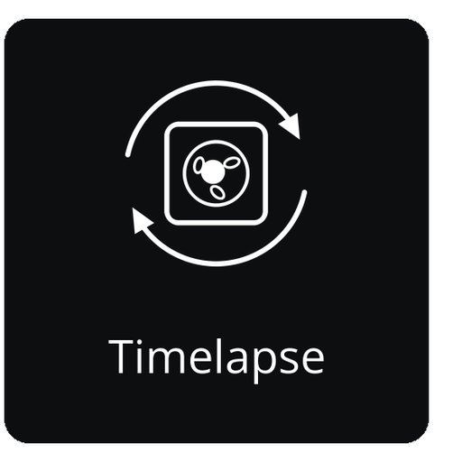
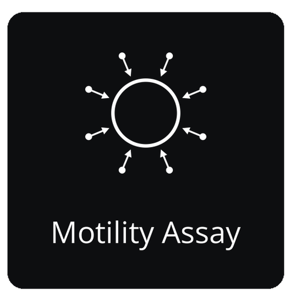
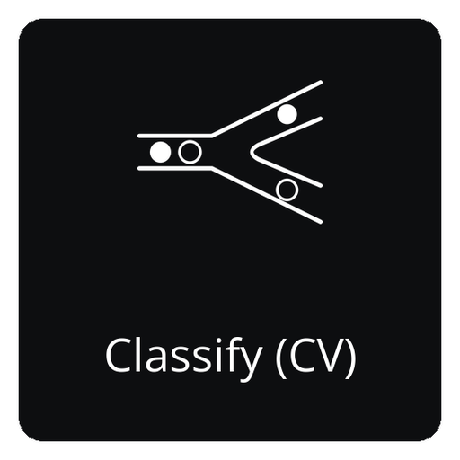
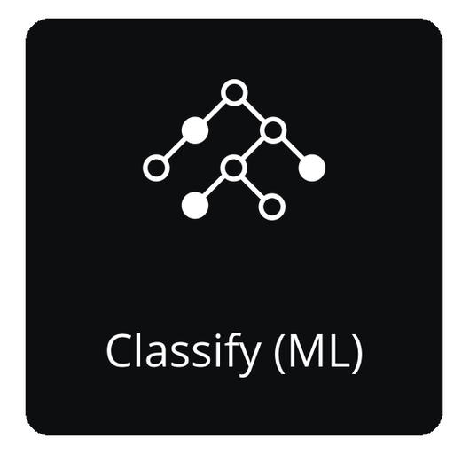
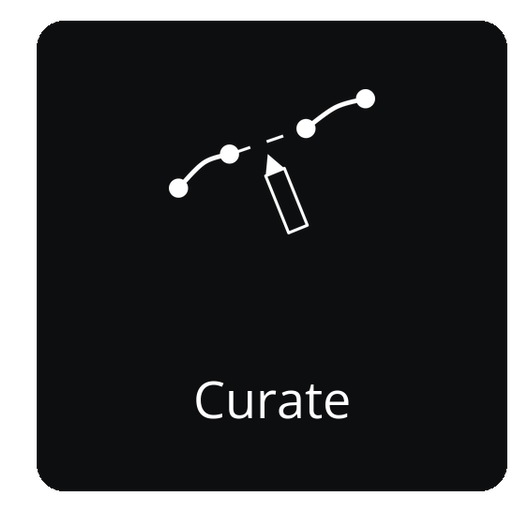
.. |App_align| image:: ../../../spacr/resources/icons/workflow/apps/align.png
   :width: 19.9%
   :alt: Open the Align & Stitch API
   :target: https://einarolafsson.github.io/spacr/api/spacr/align/index.html
   :align: middle
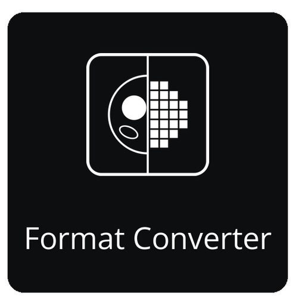
.. |App_foreign| image:: ../../../spacr/resources/icons/workflow/apps/foreign.png
   :width: 19.9%
   :alt: Open the Import Project API
   :target: https://einarolafsson.github.io/spacr/api/spacr/foreign/index.html
   :align: middle
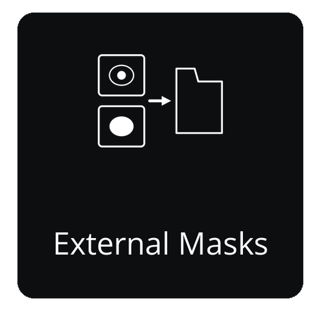
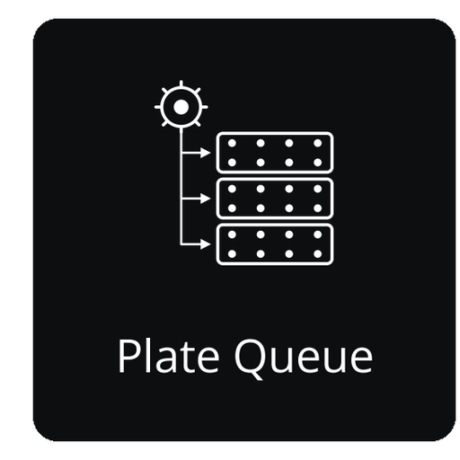
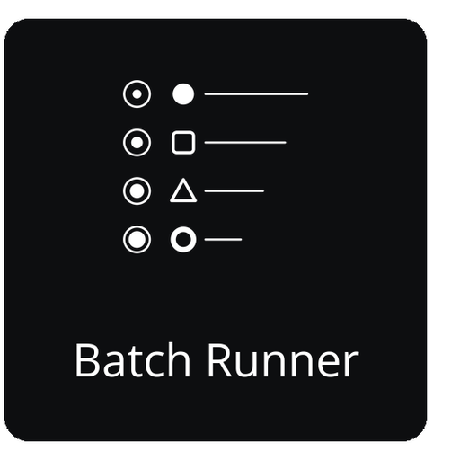
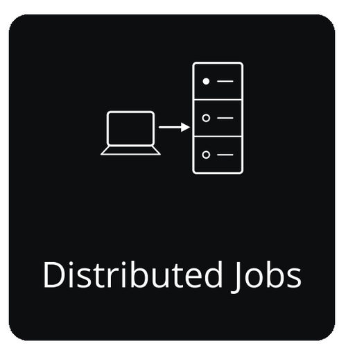
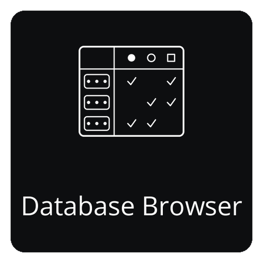
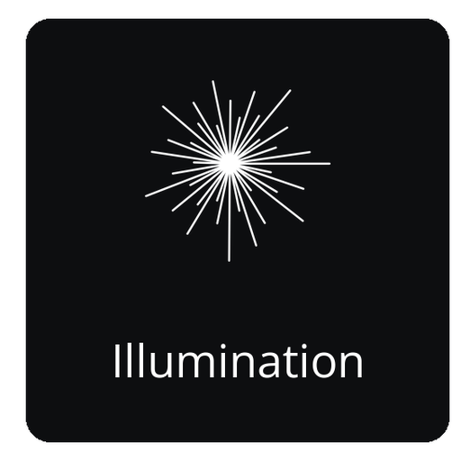
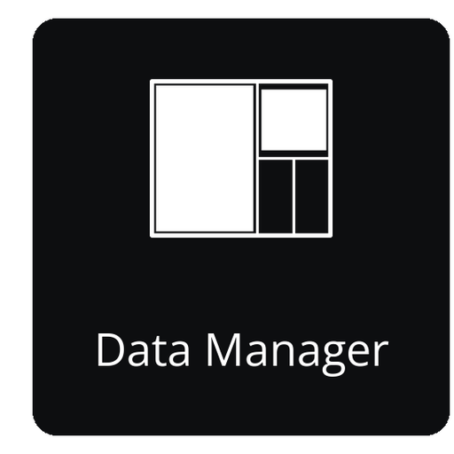
.. |App_make_masks| image:: ../../../spacr/resources/icons/workflow/apps/make_masks.png
   :width: 19.9%
   :alt: Open the Make Masks API
   :target: https://einarolafsson.github.io/spacr/api/spacr/qt/screens/make_masks/index.html
   :align: middle

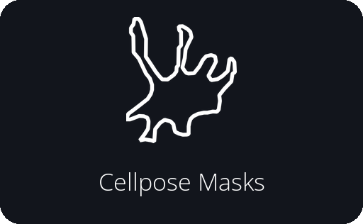
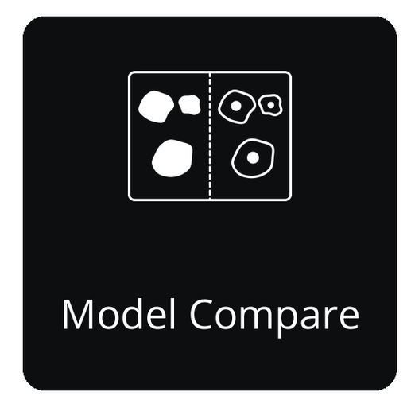
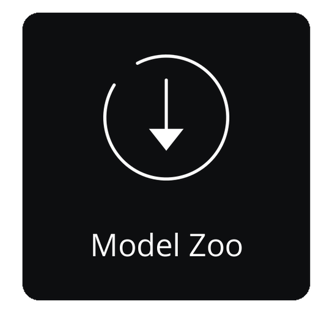
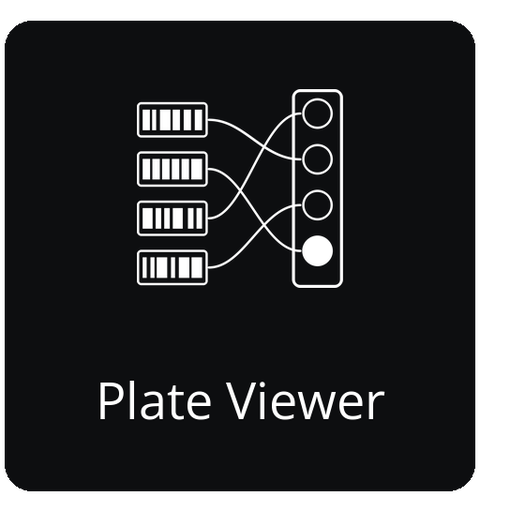
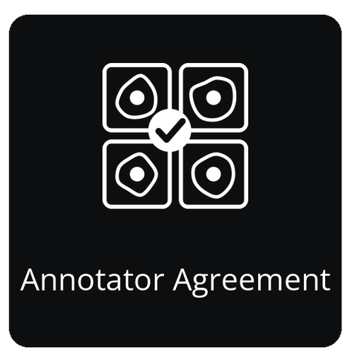
.. |App_umap| image:: ../../../spacr/resources/icons/workflow/apps/umap.png
   :width: 19.9%
   :alt: Open the Image UMAP API
   :target: https://einarolafsson.github.io/spacr/api/spacr/core/index.html
   :align: middle
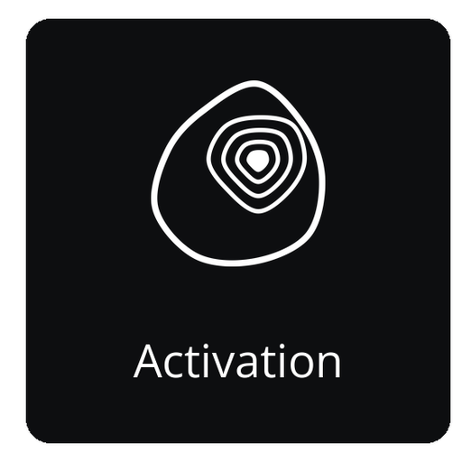

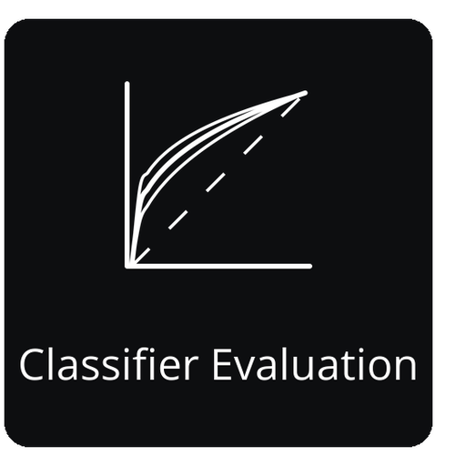

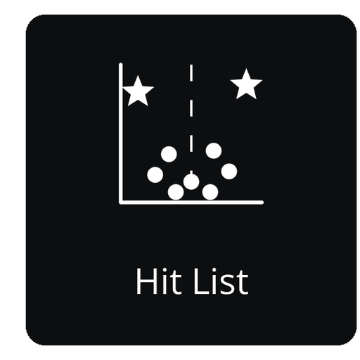
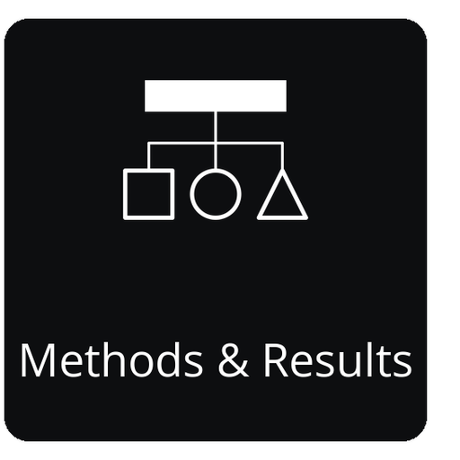

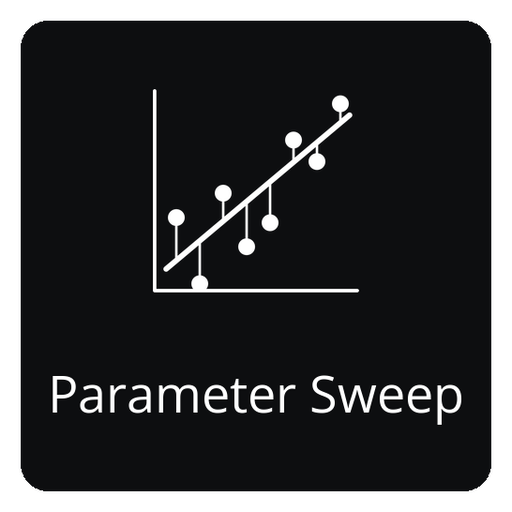
.. |App_run_compare| image:: ../../../spacr/resources/icons/workflow/apps/run_compare.png
   :width: 19.9%
   :alt: Open the Run Compare API
   :target: https://einarolafsson.github.io/spacr/api/spacr/qt/screens/run_compare/index.html
   :align: middle
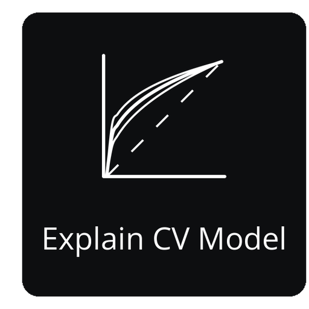

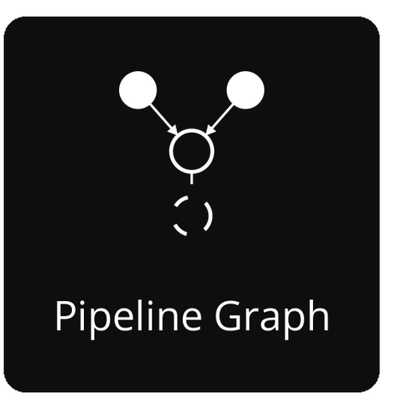
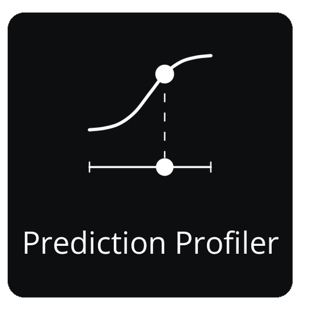
.. |App_qc_dashboard| image:: ../../../spacr/resources/icons/workflow/apps/qc_dashboard.png
   :width: 19.9%
   :alt: Open the QC Dashboard API
   :target: https://einarolafsson.github.io/spacr/api/spacr/qt/screens/qc_dashboard/index.html
   :align: middle
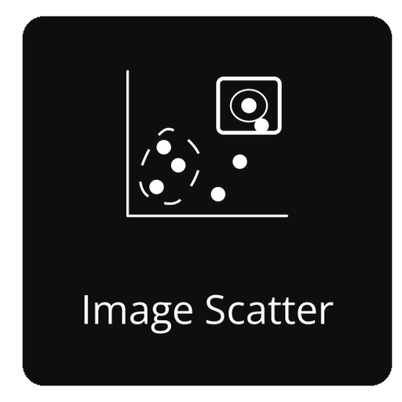
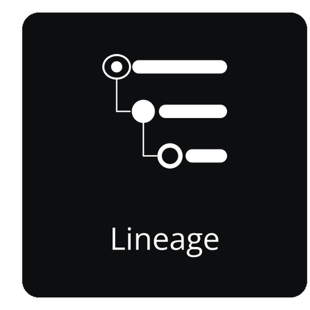
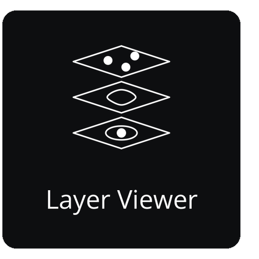
.. |App_graph_builder| image:: ../../../spacr/resources/icons/workflow/apps/graph_builder.png
   :width: 19.9%
   :alt: Open the Graph Builder API
   :target: https://einarolafsson.github.io/spacr/api/spacr/qt/screens/graph_builder/index.html
   :align: middle

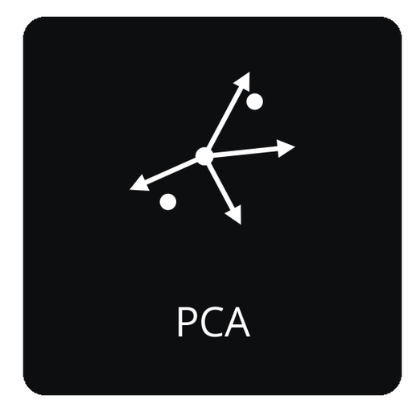
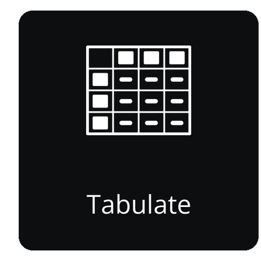
.. |App_analyze_plaques| image:: ../../../spacr/resources/icons/workflow/apps/analyze_plaques.png
   :width: 19.9%
   :alt: Open the Plaque Assay API
   :target: https://einarolafsson.github.io/spacr/api/spacr/submodules/index.html
   :align: middle
.. |App_recruitment| image:: ../../../spacr/resources/icons/workflow/apps/recruitment.png
   :width: 19.9%
   :alt: Open the Recruitment API
   :target: https://einarolafsson.github.io/spacr/api/spacr/submodules/index.html
   :align: middle
.. |App_invasion| image:: ../../../spacr/resources/icons/workflow/apps/invasion.png
   :width: 19.9%
   :alt: Open the Invasion Assay API
   :target: https://einarolafsson.github.io/spacr/api/spacr/submodules/index.html
   :align: middle
.. |App_replication| image:: ../../../spacr/resources/icons/workflow/apps/replication.png
   :width: 19.9%
   :alt: Open the Replication Assay API
   :target: https://einarolafsson.github.io/spacr/api/spacr/submodules/index.html
   :align: middle
.. |App_experiment_design| image:: ../../../spacr/resources/icons/workflow/apps/experiment_design.png
   :width: 19.9%
   :alt: Open the Experiment Design API
   :target: https://einarolafsson.github.io/spacr/api/spacr/qt/screens/experiment_design/index.html
   :align: middle
.. |App_power| image:: ../../../spacr/resources/icons/workflow/apps/power.png
   :width: 19.9%
   :alt: Open the Power / Design API
   :target: https://einarolafsson.github.io/spacr/api/spacr/qt/screens/power/index.html
   :align: middle

.. spacr-workflow-end

주요 경로는 Mask → 측정 → Annotate → 분류 →지도 바코드 → Regression입니다. 아래의 네트워크에는 spaCR 홈 화면에 사용되는 동일한 범주 및 순서의 다른 모든 응용 프로그램이 포함되어 있습니다.

spaCR 설치
-------------

데스크톱 애플리케이션
~~~~~~~~~~~~~~~~~~~~~~

데스크톱 설치에는 개인 Python 환경이 포함되어 있으므로 콘다와 기존 Python 설치가 필요하지 않습니다.

.. spacr-installer-links-begin

|InstallerLinux| |InstallerMacOS| |InstallerWindows| |InstallerLegacy|

.. |InstallerWindows| image:: ../../../spacr/resources/icons/platforms/windows.png
   :width: 64
   :alt: Windows 10/11용 spaCR 1.5.0.4 다운로드
   :target: https://github.com/EinarOlafsson/spacr/releases/download/v1.5.0.4/SpaCR-1.5.0.4-Windows-Online-Setup.exe
.. |InstallerMacOS| image:: ../../../spacr/resources/icons/platforms/macos.png
   :width: 64
   :alt: macOS 11+ (Intel 및 Apple Silicon)용 spaCR 1.5.0.4 다운로드
   :target: https://github.com/EinarOlafsson/spacr/releases/download/v1.5.0.4/SpaCR-1.5.0.4-macOS-Universal-Online.pkg
.. |InstallerLinux| image:: ../../../spacr/resources/icons/platforms/linux.png
   :width: 64
   :alt: 64비트 Linux용 spaCR 1.5.0.4 다운로드
   :target: https://github.com/EinarOlafsson/spacr/releases/download/v1.5.0.4/SpaCR-1.5.0.4-Linux-x86_64-Online.run
.. |InstallerLegacy| image:: ../../../spacr/resources/icons/platforms/legacy.png
   :width: 64
   :alt: 이전 spaCR 설치 프로그램
   :target: ../../source/installers.rst

.. spacr-installer-links-end

첫 번째 세 개의 아이콘이 현재 버전을 다운로드합니다. spaCR 아이콘은 전체 설치기 아카이브를 열어줍니다. 설치기 링크와 버전 된 파일 이름은 버전 작업 흐름에 의해 업데이트됩니다; 이전 설치기는 동일한 버전기록에 남아 있습니다.

On Linux, make the downloaded file executable and run it:

.. code-block:: bash

   chmod +x SpaCR-*-Linux-x86_64-Online.run
   ./SpaCR-*-Linux-x86_64-Online.run

macOS에서는 ``.pkg`` 파일을 여세요. 현재 베타는 공증되지 않았습니다. Gatekeeper가 차단하면 다음 항목을 선택하세요: **시스템 설정 → 개인정보 보호 및 보안 → 그래도 열기**.

업데이트, 제거, 오프라인 및 문제 해결 지침은 `설치 가이드 <../../source/installer_guide.rst>`_ 문서를 참조하십시오.

Python 설치
~~~~~~~~~~~~~~~~~~~

Python 3.12은 선택적 과학 패키지의 가장 광범위한 선택을 가지고 있습니다 :

.. code-block:: bash

   conda create -n spacr python=3.12 -y
   conda activate spacr
   python -m pip install --upgrade pip
   python -m pip install "spacr[qt]"
   spacr

spaCR supports Python **3.9 through 3.14**, except Python 3.14.1, which torchvision excludes. Linux is recommended for CUDA workflows; macOS and Windows are also supported.

For a server, cluster or CI runner, omit Qt:

.. code-block:: bash

   python -m pip install spacr
   spacr-run --list

선택적 통합 기능은 별도 extras로 설치합니다: ``spacr[zarr]``, ``spacr[omero]``, ``spacr[napari]``, ``spacr[czi,nd2,lif]``. 전체 extras 및 Python 버전 호환성 표는 `설치 가이드 <../../source/installer_guide.rst>`_ 문서를 참조하십시오.

명령줄 진입점
~~~~~~~~~~~~~~~~~~~~~~~~~

.. code-block:: bash

   spacr                                      # launch the Qt application
   spacr-doctor                               # diagnose the installation
   spacr-run --list                           # list headless modules
   spacr-run --describe MODULE                # inspect a module contract
   spacr-run MODULE --settings settings.csv   # execute a module
   spacr-run validate --module MODULE \
       --settings settings.csv                # validate before running
   spacr-repro RUN_DIR                        # replay a recorded run

문제를 해결할 때 환경 변수 ``SPACR_LOG_LEVEL=DEBUG`` 값을 설정합니다. 순환 로그 파일의 경로는 ``~/.spacr/logs/spacr.log`` 입니다. 클래식 Tk 인터페이스는 ``spacr-legacy`` 명령으로 사용할 수 있지만 더 이상 개발되지 않습니다.

할 수 있는 일
---------------

대부분의 스크린은 6 개의 모듈을 따릅니다 :

- **Mask** segments cells, nuclei, pathogens and organelles with Cellpose.
- **Measure** writes morphology, intensity, texture, spatial and colocalization features, together with object crops, to SQLite.
- **Annotate** 라벨은 키보드 드라이브 네트워크에서 재배되며 활성 학습 퀴를 지원합니다.
- **Classify** 는 이미지 또는 측정 기반 모델과 각 체크 포인트와 함께 성능을 기록합니다.
- **Map Barcodes** maps FASTQ reads to wells and gRNAs, with abundance, collision and coverage QC.
- **Regression** 가이드, 유전자, 상태 및 컨트롤 효과를 추정하는 모델 가족은 지속적이고 부분적이며 응답을 계산하는 데 적합합니다.

같은 프로젝트에서 플레이트를 설계하고, 검정력을 추정하고, 배치 효과를 보정하고, 분할 품질을 검사하고, 연결된 플롯과 이미지 크롭을 탐색하고, AnnData를 내보내고, 중단된 작업을 재개하고, 각 결과에 사용된 설정을 기록할 수도 있습니다.

다음 페이지를 선택하십시오 당신이 원하는 것에 따라 :

- `인터랙티브 튜토리얼 <https://einarolafsson.github.io/spacr/tutorials/>`_ — 설치에서 히트 조사를 통해 73 개의 지시된 작업 흐름.
- `Python API 빠른 시작 <../../source/python_api.rst>`_ - 스크립트, 노트북 또는 클러스터에서 튜브를 실행하고 검증합니다.
- `특징 가이드 <../../source/features.rst>`_ - 능력, 성숙성 및 선택적 통합.
- `정리된 API 참조 <https://einarolafsson.github.io/spacr/api/index.html>`_ - 작업에 따라 지원되는 입력 포인트, 전체 모듈 참조 1 레벨 더 깊습니다.
- `언어 & 번역 가이드 <../../source/localization.rst>`_ - 인터페이스 언어, 컨텍스트 지원 및 과학 출력 정책.

언어 및 번역
~~~~~~~~~~~~~~~~~~~~~~

인터페이스는 탐색 및 환경 설정에서 10개 언어를 지원합니다. AI 및 LIVE 컨트롤, 모듈 설명과 검토된 상황별 도움말도 번역됩니다. 다시 시작하지 않고 **spaCR → 환경 설정 → 언어** 메뉴에서 언어를 변경할 수 있습니다. 로그, 경로, 데이터베이스 값과 측정값은 번역하지 않으며 과학적 출력은 표준 영어로 유지됩니다. `상황별 도움말 정책 <../../source/localization.rst#contextual-help>`_ 문서를 참조하세요.

애니메이션 설정 안내
~~~~~~~~~~~~~~~~~~~~~~~~~

시각적 설명이 있는 설정은 도구 설명에 **Animation** 컨트롤을 제공합니다. 다음 리소스를 살펴보세요: `설정 애니메이션 갤러리 <https://einarolafsson.github.io/spacr/setting_animations.html>`_ 및 `설정 애니메이션 레지스트리 <https://einarolafsson.github.io/spacr/api/spacr/setting_animations/index.html>`_.

데이터
--------

참조 데이터세트
~~~~~~~~~~~~~~~~~~

참조 데이터는 다음 아이콘에서 열 수 있습니다:

|DataBioStudies| |DataHuggingFace| |DataNCBI| |DataSpaCRPower| |DataBioRxiv|

.. |DataBioStudies| image:: ../../../spacr/resources/icons/databanks/biostudies_button.png
   :width: 72
   :alt: BioStudies 현미경 데이터세트 열기
   :target: https://doi.org/10.6019/S-BIAD2135
.. |DataHuggingFace| image:: ../../../spacr/resources/icons/databanks/huggingface_button.png
   :width: 72
   :alt: Hugging Face 테스트 데이터세트 열기
   :target: https://huggingface.co/datasets/einarolafsson/toxo_mito
.. |DataNCBI| image:: ../../../spacr/resources/icons/databanks/ncbi_button.png
   :width: 72
   :alt: NCBI 시퀀싱 데이터세트 열기
   :target: https://www.ncbi.nlm.nih.gov/bioproject/?term=PRJNA1261935
.. |DataSpaCRPower| image:: ../../../spacr/resources/icons/databanks/spacrpower_button.png
   :width: 72
   :alt: spaCRPower 열기
   :target: https://github.com/maomlab/spaCRPower
.. |DataBioRxiv| image:: ../../../spacr/resources/icons/databanks/biorxiv_button.png
   :width: 72
   :alt: bioRxiv 사전 인쇄본 열기
   :target: https://www.biorxiv.org/content/10.64898/2026.07.08.737057v1

기여 및 지원
------------------------

Bug reports and focused feature requests are welcome through `GitHub 문제 <https://github.com/EinarOlafsson/spacr/issues>`_. When reporting a failure, include the spaCR version, operating system, Python version, module settings and the relevant log excerpt. ``spacr-doctor`` collects most of that for you.

라이선스
~~~~~~~~~

The current development branch is source-available under the `PolyForm 비상업적 라이센스 1.0.0 <https://github.com/EinarOlafsson/spacr/blob/main/LICENSE>`_. Commercial use requires a separate license from the copyright holder. Released versions through spaCR 1.4.9.9 remain available under the MIT License that accompanied those releases.

튜토리얼
~~~~~~~~~

The `상호 작용 spaCR 도서관 <https://einarolafsson.github.io/spacr/tutorials/>`_ contains narrated, captioned walkthroughs of installation and of each application workflow, in 73 lessons with 50 voices across eight languages.

spaCR 인용
~~~~~~~~~~~~

If spaCR contributes to your research, cite:

Olafsson EB, *et al.* 풀드 이미지 기반 CRISPR 스크린은 EAF1을 *T. gondii* 기생충의 ESCRT 기능 탈취 조절 인자로 규명합니다.

`BioRxiv 프리프린트 <https://www.biorxiv.org/content/10.64898/2026.07.08.737057v1>`_ · `소프트웨어 아카이브 <https://doi.org/10.5281/zenodo.21343317>`_

감사의 말
~~~~~~~~~~~~~~~

spaCR는 NumPy, pandas, scikit-image, scikit-learn, Cellpose, PyTorch 및 Qt를 비롯한 개방형 과학 소프트웨어를 기반으로 합니다. 다국어 문서와 인터페이스 카탈로그 작성에 사용된 모델은 `번역 모델 표기 <../TRANSLATION_MODELS.md>`_ 문서에서 확인할 수 있습니다.
