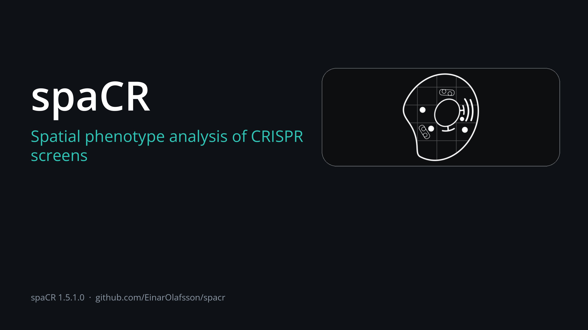

|Website| |Platforms| |Python| |Qt| |Test counts| |Coverage| |Release| |Issues| |Source| |Conda| |PyPI| |Conda Downloads| |PyPI Downloads| |Docs| |Tutorials| |Preprint| |DOI| |Cite| |License| |PyPI rank|

Webbplats: `einarolafsson.github.io/projects/spacr <https://einarolafsson.github.io/projects/spacr/>`_

.. |Website| image:: https://img.shields.io/badge/Website-spaCR-0A7BBB
   :target: https://einarolafsson.github.io/projects/spacr/
   :alt: spaCR website
.. |Docs| image:: https://img.shields.io/github/actions/workflow/status/EinarOlafsson/spacr/pages%2Fpages-build-deployment?label=API%20Documentation
   :target: https://einarolafsson.github.io/spacr/
   :alt: API-dokumentation
.. |Tutorials| image:: https://img.shields.io/badge/Tutorials-Interactive%20walkthrough-4A9EFF
   :target: https://einarolafsson.github.io/spacr/tutorials/
   :alt: Interaktiva handledningar
.. |PyPI| image:: https://img.shields.io/pypi/v/spacr
   :target: https://pypi.org/project/spacr/
   :alt: PyPI-version
.. |Python| image:: https://img.shields.io/badge/Python-3.9%E2%80%933.14-3776AB?logo=python&logoColor=white
   :target: https://pypi.org/project/spacr/
   :alt: Python 3.9 till 3.14
.. |Coverage| image:: https://codecov.io/gh/EinarOlafsson/spacr/branch/nightly/graph/badge.svg
   :target: https://app.codecov.io/github/EinarOlafsson/spacr
   :alt: Codecov coverage
.. |Test counts| image:: https://img.shields.io/endpoint?url=https%3A%2F%2Fraw.githubusercontent.com%2FEinarOlafsson%2Fspacr%2Fnightly%2Fdocs%2Fsource%2F_static%2Ftest-counts.json&cacheSeconds=300
   :target: https://github.com/EinarOlafsson/spacr/actions/workflows/tests.yml
   :alt: Testsvit
.. |Qt| image:: https://img.shields.io/badge/GUI-Qt%20%28PySide6%29-41CD52
   :target: https://einarolafsson.github.io/spacr/api/spacr/qt/index.html#module-spacr.qt
   :alt: Qt-gränssnitt
.. |Source| image:: https://img.shields.io/badge/GitHub-Source-181717?logo=github
   :target: https://github.com/EinarOlafsson/spacr
   :alt: Källkod på GitHub
.. |Issues| image:: https://img.shields.io/github/issues/EinarOlafsson/spacr
   :target: https://github.com/EinarOlafsson/spacr/issues
   :alt: GitHub-ärenden
.. |License| image:: https://img.shields.io/github/license/EinarOlafsson/spacr
   :target: https://github.com/EinarOlafsson/spacr/blob/main/LICENSE
   :alt: BSD 3-Clause-licens
.. |Preprint| image:: https://img.shields.io/badge/bioRxiv-2026.07.08.737057-BF2636
   :target: https://www.biorxiv.org/content/10.64898/2026.07.08.737057v1
   :alt: bioRxiv-preprint
.. |DOI| image:: https://img.shields.io/badge/DOI-10.5281%2Fzenodo.21343316-blue
   :target: https://doi.org/10.5281/zenodo.21343316
   :alt: Zenodo-DOI
.. |Release| image:: https://img.shields.io/github/v/release/EinarOlafsson/spacr?label=Installers
   :target: https://github.com/EinarOlafsson/spacr/releases/latest
   :alt: Senaste installationsprogrammen
.. |Conda| image:: https://anaconda.org/conda-forge/spacr/badges/version.svg
   :target: https://anaconda.org/conda-forge/spacr
   :alt: conda-forge-version
.. |Conda Downloads| image:: https://anaconda.org/conda-forge/spacr/badges/downloads.svg
   :target: https://anaconda.org/conda-forge/spacr
   :alt: conda-forge-nedladdningar
.. |Release date| image:: https://anaconda.org/conda-forge/spacr/badges/latest_release_date.svg
   :target: https://anaconda.org/conda-forge/spacr
   :alt: Datum för senaste conda-forge-versionen
.. |PyPI Downloads| image:: https://static.pepy.tech/personalized-badge/spacr?period=total&units=INTERNATIONAL_SYSTEM&left_color=GRAY&right_color=GREEN&left_text=downloads
   :target: https://pepy.tech/projects/spacr
   :alt: PyPI-nedladdningar
.. |Platforms| image:: https://img.shields.io/badge/Platforms-Linux%20%7C%20macOS%20%7C%20Windows-lightgrey
   :target: https://github.com/EinarOlafsson/spacr/blob/nightly/docs/source/installers.rst
   :alt: Linux, macOS och Windows
.. |Cite| image:: https://img.shields.io/badge/Cite-CITATION.cff-8A2BE2
   :target: https://github.com/EinarOlafsson/spacr/blob/main/CITATION.cff
   :alt: Citera spaCR
.. |PyPI rank| image:: https://img.shields.io/badge/dynamic/json?url=https%3A%2F%2Fsql-clickhouse.clickhouse.com%2F%3Fuser%3Ddemo%26param_package_name%3Dspacr%26param_days%3D30%26query%3DWITH%2B%2528%2BSELECT%2Bsum%2528count%2529%2BFROM%2Bpypi.pypi_downloads_per_day%2BWHERE%2Bproject%2B%253D%2B%257Bpackage_name%253AString%257D%2BAND%2Bdate%2B%253E%253D%2BtoDate%2528now%2528%2527UTC%2527%2529%2529%2B-%2B%257Bdays%253AUInt16%257D%2BAND%2Bdate%2B%253C%2BtoDate%2528now%2528%2527UTC%2527%2529%2529%2B%2529%2BAS%2Bdownloads%2BSELECT%2Bdownloads%2BAS%2Bpackage_downloads%252C%2BcountIf%2528n%2B%253E%253D%2Bdownloads%2529%2BAS%2Brank%252C%2Bcount%2528%2529%2BAS%2Btotal_packages%252C%2B100.0%2B%252A%2Brank%2B%252F%2BnullIf%2528total_packages%252C%2B0%2529%2BAS%2Bpercentile%252C%2Bif%2528%2Btotal_packages%2B%253D%2B0%2BOR%2Bdownloads%2B%253D%2B0%252C%2B%2527no%2Bdata%2527%252C%2Bconcat%2528%2B%2527top%2B%2527%252C%2BtoString%2528ceil%25281000.0%2B%252A%2Brank%2B%252F%2BnullIf%2528total_packages%252C%2B0%2529%2529%2B%252F%2B10%2529%252C%2B%2527%2525%2527%2B%2529%2B%2529%2BAS%2Bmessage%2BFROM%2B%2528%2BSELECT%2Bproject%252C%2Bsum%2528count%2529%2BAS%2Bn%2BFROM%2Bpypi.pypi_downloads_per_day%2BWHERE%2Bdate%2B%253E%253D%2BtoDate%2528now%2528%2527UTC%2527%2529%2529%2B-%2B%257Bdays%253AUInt16%257D%2BAND%2Bdate%2B%253C%2BtoDate%2528now%2528%2527UTC%2527%2529%2529%2BGROUP%2BBY%2Bproject%2B%2529%2BFORMAT%2BJSON&query=%24.data%5B0%5D.message&label=PyPI+rank+%2830d%29&color=brightgreen&cacheSeconds=86400
   :target: https://clickpy.clickhouse.com/dashboard/spacr
   :alt: spaCR:s PyPI-nedladdningsranking de senaste 30 hela dygnen

`← Föregående <../../source/_static/deck/pages/57.md>`_   `Nästa → <../../source/_static/deck/pages/02.md>`_

spaCR
=====

.. spacr-language-picker-begin

Språk: `🌐 Svenska ▾ <README.md>`_

.. spacr-language-picker-end

**Rumslig fenotypanalys av CRISPR-screeningar.**

spaCR segmenterar och mäter enskilda celler i mikroskopibilder, integrerar fenotyper per objekt med sekvenseringshärledd guideförekomst och uppskattar vilka gener som är associerade med fenotypiska förändringar. Med plattbilder och FASTQ-läsningar som utgångspunkt producerar programmet mätningar per objekt, tränade klassificerare, effektskattningar per guide och gen samt en rangordnad träfflista.

Segmenterings-, mät-, annoterings- och klassificeringsmodulerna körs även utan en sekvensarm.

Make Masks korrigerar segmenteringsmasker och annoterar oberoende, klassmärkta rektanglar med verktyget **Box** för YOLO-export. Rutorna har egna etiketter och egen historik utan att ändra källbilder eller masker.

Se `funktionsguiden <../../source/features.rst>`_ för varje verktyg.

Bilder, masker och bildutsnitt är filer på disk. Mätningar, annoteringar och modellprediktioner är tabeller i projektets SQLite-databas ``measurements.db``.

Körs som ett skrivbordsprogram eller utan grafiskt gränssnitt på en arbetsstation, server eller kluster.

Prova spaCR
~~~~~~~~~~~

.. code-block:: bash

   conda create -n spacr python=3.12 -y
   conda activate spacr
   python -m pip install spacr
   spacr

Använd **Ladda testdata…** i Import, Make Masks, Annotate eller en analysskärm för att hämta exempeldata. Från en terminal använder du ``spacr-download``.

Hårdvarustöd
~~~~~~~~~~~~~~~~

.. spacr-hardware-begin

.. list-table::
   :header-rows: 1
   :widths: 32 18 18 22

   * - Hardware
     - Cellpose 4
     - Torch
     - UMAP / clustering
   * - NVIDIA (CUDA)
     - 🟢 GPU
     - 🟢 GPU
     - 🟢 GPU
   * - AMD on Linux (ROCm)
     - 🟣 GPU
     - 🟣 GPU
     - 🔴 CPU
   * - AMD in an Intel Mac (Metal)
     - 🟣 GPU
     - 🟣 GPU
     - 🔴 CPU
   * - Apple Silicon (Metal)
     - 🟣 GPU
     - 🟣 GPU
     - 🔴 CPU
   * - Intel Arc/Xe (XPU)
     - 🟣 GPU
     - 🟣 GPU
     - 🔴 CPU
   * - No GPU
     - 🟢 CPU
     - 🟢 CPU
     - 🟢 CPU

Stödda (stabila)  och genomförda (beta) - CPU stöd endast

.. spacr-hardware-end

Installera spaCR
~~~~~~~~~~~~~~~~

Skrivbordsprogram
-------------------

Installatörerna buntar ihop sina egna Python. Conda krävs inte.

.. spacr-installer-links-begin

|InstallerLinux| |InstallerMacOS| |InstallerWindows| |InstallerLegacy|

.. spacr-installer-links-end

Gör den hämtade filen körbar i Linux och kör den:

.. code-block:: bash

   chmod +x SpaCR-*-Linux-x86_64-Online.run
   ./SpaCR-*-Linux-x86_64-Online.run

På macOS, öppna ``.pkg``. Nuvarande beta notariseras inte. Om Gatekeeper blockerar den, välj **Systeminställningar → Integritet & Säkerhet → Öppna ändå**.

Se `installationsguiden <../../source/installer_guide.rst>`_ för instruktioner om uppdatering, avinstallation, offlineanvändning och felsökning, och `systemkraven <../../source/system_requirements.rst>`_ för rekommendationer om arbetsstationer och servrar samt tabeller över GPU-kompatibilitet.

Installation från PyPI
----------------------

För PyPI-utgåvan installerar du spaCR med pip i en Conda-miljö. Python 3.12 ger det största urvalet av valfria vetenskapliga paket:

.. code-block:: bash

   conda create -n spacr python=3.12 -y
   conda activate spacr
   python -m pip install --upgrade pip
   python -m pip install spacr
   spacr

spaCR stöder Python **3.9 through 3.14**, utom Python 3.14.1, som torchvision utesluter. Linux rekommenderas för de tyngsta CUDA- och ROCm-arbetsflödena; macOS och Windows stöds också, och båda använder sina GPU:er — macOS via Metal, som täcker Apple Silicon och AMD-korten i Intel-Mac-datorer, och Windows via CUDA eller DirectML.

Standardinstallationen innehåller Qt-gränssnittet för skrivbordet. På en server, ett kluster eller en CI-körmiljö kan du köra kommandoradspipelines utan att öppna det:

.. code-block:: bash

   python -m pip install spacr
   spacr-run --list

Optional integrations are installed separately, for example ``spacr[zarr]``, ``spacr[omero]``, ``spacr[napari]`` and ``spacr[czi,nd2,lif]``. See the `installationsguide <../../source/installer_guide.rst>`_ for the complete extras and Python-version compatibility table.

Installation med conda-forge
----------------------------

Det officiella conda-forge-paketet installerar spaCR och dess skrivbordsberoenden i den aktiva miljön:

.. code-block:: bash

   conda create -n spacr python=3.12 -y
   conda activate spacr
   conda install conda-forge::spacr
   spacr

Installation med Docker
-----------------------

Kör spaCR:s kommandoradsbaserade bearbetningsflöden i en container med de publicerade `Docker-avbildningarna på GHCR <https://github.com/EinarOlafsson/spacr/pkgs/container/spacr>`_. Installera `Docker <https://docs.docker.com/get-started/get-docker/>`_ och lista sedan de tillgängliga flödena med denna publicerade CPU-avbildning:

.. code-block:: bash

   docker run --rm ghcr.io/einarolafsson/spacr:1.5.1.0 spacr-run --list

Motsvarande avbildning för NVIDIA-GPU:er är ``ghcr.io/einarolafsson/spacr:1.5.1.0-cuda12.4``. Båda avbildningarna är avsedda för Linux-containrar på x86-64. Se `installationsguiden för Docker <../../source/installer_guide.rst#container-images>`_ för GPU-förutsättningar, montering av data och modeller, inställningsfiler och fullständiga kommandon för bearbetningsflödena.

Installation från källkod
-------------------------

Klona kodförrådet och installera det i redigerbart läge, så att din arbetskopia *är* det installerade paketet och ändringar börjar gälla utan ominstallation::

    git clone https://github.com/EinarOlafsson/spacr.git
    cd spacr
    conda create -n spacr python=3.12 -y
    conda activate spacr
    pip install -e .
    spacr

Detta klonar ``main``, standardgrenen, som innehåller den senaste utgåvan. Utvecklingen sker på ``nightly``; lägg till ``--branch nightly`` för att klona den i stället. För en specifik utgåva::

    git clone --branch v1.5.0.5 https://github.com/EinarOlafsson/spacr.git

För att hämta senare ändringar kör du inifrån klonen::

    git pull
    pip install -e .

Installera om när beroenden eller kommandostarter ändras. Ändringar i Python-koden gäller direkt; ``spacr-doctor`` visar vilken installation som används.

Installation från källkod (lättviktig)
--------------------------------------

Bidragsgivare behöver versionshistoriken; välj ett alternativ nedan om du bara vill köra spaCR. Mätningarna gäller ``nightly`` vid ``05302fd5c`` den 2026-10-07 och gjordes med ``packaging/measure_clone_forms.sh``::

    # One commit instead of every version: 2048 MB downloaded, 140 s.
    # No history, so no git log, no git blame and no git bisect.
    # git pull still works, but stays shallow until git fetch --unshallow.
    git clone --depth 1 --branch nightly https://github.com/EinarOlafsson/spacr.git
    cd spacr && pip install -e .

    # Runtime files: 104 MB on disk, 6 s (Git: 38 MB; files: 66 MB).
    # No history, docs, tests, tools, features or example data.
    # --with-docs, --with-tests and --with-translations put those back;
    # --dir, --branch, --no-install and --help do the obvious things.
    # packaging/source_install_excludes.txt lists every skipped path.
    curl -fsSL https://raw.githubusercontent.com/EinarOlafsson/spacr/nightly/packaging/install_from_source.sh -o install_spacr.sh
    sh install_spacr.sh --branch nightly

Den fullständiga nightly-klonen laddade ner 9.25 GiB. Att lägga till ``--filter=blob:none`` till den grunda klonen minskar inte utcheckningen: dess Git-objektlager är fortfarande 2032 MB. Git rapporterar inte lata hämtningar av objekt, så ingen total nedladdning uppmättes. De versionshanterade filerna i nightly ger en utcheckning på 3416 MB (uppmätt 2026-10-08), utan Git-historiken. Nedladdningens storlek och tid varierar med grenen.

Kommandoradskommandon
~~~~~~~~~~~~~~~~~~~~~~~~~

.. code-block:: bash

   spacr                                      # launch the Qt application
   spacr-doctor                               # diagnose the installation
   spacr-run --list                           # list headless modules
   spacr-run --describe MODULE                # inspect a module contract
   spacr-run MODULE --settings settings.csv   # execute a module
   spacr-run validate --module MODULE \
       --settings settings.csv                # validate before running
   spacr-repro RUN_DIR                        # replay a recorded run
   spacr-download --list                      # what example data exists
   spacr-download measure annotate            # fetch example sets by name
   spacr-make-masks --folder DIR              # curate masks as a resumable queue
   spacr-make-masks --folder DIR --order easy --limit 50

``spacr-run --list`` listar moduler med kommandoradsposter för körning utan grafiskt gränssnitt. GUI-bundna moduler för annotering, kurering, jämförelse och utforskning utelämnas.

Kärnarbetsflöde
---------------

Det primära arbetsflödet består av sex moduler:

- **Mask** segmenterar celler, cellkärnor, patogener och organeller med Cellpose.
- **Measure** skriver morfologiska, intensitets-, textur-, rumsliga och kolokaliseringsmått samt objektutsnitt till SQLite.
- **Annotate** märker objektutsnitt i ett tangentbordsstyrt rutnät och stöder köer för aktiv inlärning.
- **Classify** tränar bild- eller mätningsbaserade modeller och sparar prestandan på undanhållna data med varje kontrollpunkt.
- **Map Barcodes** kopplar FASTQ-läsningar till brunnar och gRNA:er och rapporterar QC för förekomst, kollisioner och täckning.
- **Regression** skattar effekter för guider, gener, betingelser och kontroller med modellfamiljer för kontinuerliga data, andelar och antal.

spaCR-moduler
-------------

.. spacr-workflow-begin

Kärna
^^^^^

Core sequence from microscopy images through segmentation, measurements,
annotations, classification, barcode mapping and regression.

| |Module_mask|\ |Module_measure|\ |Module_annotate|\ |Module_classify_merged|\ |Module_map_barcodes|\ |Module_regression|

Data
^^^^

Import images and tables into spaCR projects and execute reproducible
multi-plate workflows.

| |Module_foreign|\ |Module_embeddings|\ |Module_run_compare|\ |Module_experiment_design|\ |Module_power|\ |Module_dose_response|
| |Module_qc_dashboard|

Verktyg
^^^^^^^

Point these at a project: edit masks by hand, stitch tiles, read an
embedding, draw a gate, build a plot, check quality.

| |Module_make_masks|\ |Module_align|\ |Module_umap|\ |Module_gate_editor|\ |Module_graph_builder|

Organism
^^^^^^^^

Organismspecifik bildanalys och kvantitativa resultat från biologiska analyser.

| |Module_toxoplasma|

.. |Module_mask| raw:: html

   

.. |Module_measure| raw:: html

   

.. |Module_annotate| raw:: html

   

.. |Module_classify_merged| raw:: html

   

.. |Module_map_barcodes| raw:: html

   

.. |Module_regression| raw:: html

   

.. |Module_foreign| raw:: html

   

.. |Module_embeddings| raw:: html

   

.. |Module_run_compare| raw:: html

   

.. |Module_experiment_design| raw:: html

   

.. |Module_power| raw:: html

   

.. |Module_dose_response| raw:: html

   

.. |Module_qc_dashboard| raw:: html

   

.. |Module_make_masks| raw:: html

   

.. |Module_align| raw:: html

   

.. |Module_umap| raw:: html

   

.. |Module_gate_editor| raw:: html

   

.. |Module_graph_builder| raw:: html

   

.. |Module_toxoplasma| raw:: html

   

.. spacr-workflow-end

Alla moduler med en ruta på startskärmen, i startskärmens ordning: först de sex pipelinemodulerna, sedan resten. Välj en ruta för att öppna modulens API-sida.

Övriga resurser
~~~~~~~~~~~~~~~

- `Interaktiva handledningar <https://einarolafsson.github.io/spacr/tutorials/>`_ — guidade arbetsflöden från installation till undersökning av träffar.
- `Snabbstart Python API <../../source/python_api.rst>`_ – kör och validera arbetsflöden från skript, anteckningsböcker eller ett kluster.
- `Handbok för funktioner <../../source/features.rst>`_ – kapacitet, mognad och valfria integrationer.
- `Kurerad API referens <https://einarolafsson.github.io/spacr/api/index.html>`_ – understödda ingångspunkter för uppgift, med den fullständiga modulreferensen en nivå djupare.
- `Språk- och översättningsguide <../../source/localization.rst>`_ – gränssnittsspråk, kontextuell hjälp och policy för vetenskaplig output.

Språk och översättning
~~~~~~~~~~~~~~~~~~~~~~

Gränssnittet stöder tio språk i navigering och inställningar. AI- och LIVE-kontroller, modulbeskrivningar och granskad kontexthjälp översätts också. Byt språk under **spaCR → Inställningar → Språk** utan att starta om. Loggar, sökvägar, databasvärden och mätningar översätts aldrig; vetenskapliga utdata förblir på kanonisk engelska. Se `policyn för kontexthjälp <../../source/localization.rst#contextual-help>`_.

De nio icke-engelska katalogerna är maskinskrivna och tekniskt recenserade snarare än lästa ända till slut av en infödd talare. De `Översynens tillämpningsområde <../REVIEW_SCOPE_2026-09-04.md>`_ skivor som språken har haft ett mänskligt pass och varje term kvar på engelska av beslut.

Animerad hjälp för inställningar
~~~~~~~~~~~~~~~~~~~~~~~~~~~~~~~~

Inställningar med en visuell förklaring har kontrollen **Animation** i verktygstipset. Bläddra i `galleriet med inställningsanimationer <https://einarolafsson.github.io/spacr/setting_animations.html>`_ eller `registret över inställningsanimationer <https://einarolafsson.github.io/spacr/api/spacr/setting_animations/index.html>`_.

Data
~~~~

Referensdatauppsättningar
~~~~~~~~~~~~~~~~~~~~~~~~~

|DataBioStudies| |DataHuggingFace| |DataNCBI| |DataSpaCRPower| |DataBioRxiv|

Modellbibliotek
~~~~~~~~~~~~~~~

spaCR skickar en katalog med utbildade modeller och hämtar dem på begäran. Öppna **Modellzoo** från startskärmen för att bläddra och installera dem, eller namnge en nyckel i en inställningsfil -- ``pathogen_model: toxoplasma_pv_v1`` -- och modellen laddas ner och kontrolleras första gången den behövs. Varje publicerad post innehåller en SHA-256; en post utan en nekas snarare än installeras, eftersom en trunkerad eller ersatt kontrollpunkt inte kan meddelas från den verkliga.

.. spacr-model-zoo-begin

.. list-table::
   :header-rows: 1
   :widths: 24 34 42

   * - Model
     - Training data
     - Hold-out performance
   * - ``toxoplasma_pv_v1``
       (Cellpose-SAM (cpsam_v2))
     - anti-Toxoplasma-biotin and DsRed PV lumen; 229 images from 2 datasets, 104 round-1 and 125 newly curated
     - F1 0.864 against 0.713 for stock cpsam on 11 held-out in-house wells, at IoU 0.5; literature hold-out pending
   * - ``toxoplasma_plaque_v1``
       (Cellpose-SAM (cpsam))
     - crystal violet plaque wells; 184 wells from 3 datasets, 95 in-house and 89 literature
     - F1 0.856 in-domain; 0.806 on literature (3-fold cross-validated, SD 0.020)
   * - ``toxoplasma_plaque_v2``
       (Cellpose-SAM (cpsam_v2))
     - 488 curated fields across four domains -- 298 wells cropped from published figures, 96 phone-camera wells, 67 PFA and 27 methanol-fixed whole-well microscope scans; 27,582 plaques
     - not scored against stock; on 81 held-out fields it ties round 3 on literature (0.819 vs 0.820) and beats it by 0.166 on phone-camera wells (0.415 vs 0.249)
   * - ``toxoplasma_well_detector_v1``
       (YOLO11n)
     - whole-plate and multi-well crystal violet images; 562 images from 1 dataset, 190 of them with no well in them
     - mAP50 0.993 on its own held-out split; on the test set shared with v2 it scores mAP50 0.8838, against v2's 0.9457
   * - ``toxoplasma_well_detector_v2``
       (YOLO26n (ultralytics 8.4.155))
     - plate images and literature figures; 1,070 train / 254 val / 129 test, split by PMC article so no paper is in two sets; training data at einarolafsson/toxoplasma-plaque-well-detector-dataset
     - mAP50 0.9457 and mAP50-95 0.8341 against v1's (yolo_welldetect_v3.pt) 0.8838 and 0.7630 on the SAME test set; stock YOLO has no plaque-well class, so v1 is the baseline
   * - ``toxoplasma_from_cellmask_v1``
       (Cellpose-SAM (cpsam_v2))
     - Toxoplasma PV masks predicted from the HOST CELL MASK channel alone; 2567 training and 463 held-out fields, split by well, hosts HFF/HeLa/THP1
     - F1 0.606 against 0.021 for stock cpsam_v2 on 463 well-grouped held-out fields, at IoU 0.5
   * - ``toxoplasma_pv_v2``
       (Cellpose-SAM (cpsam_v2))
     - anti-Toxoplasma-biotin and DsRed PV lumen; 556 curated images accumulated over five rounds
     - F1 0.817 +/- 0.036 by 5-fold cross-validation over 619 pairs; ~0.86 against 0.713 for stock on the 11 in-house held-out wells
   * - ``toxoplasma_pv_v3``
       (Cellpose-SAM (cpsam_v2))
     - the 556 curated PV fields of round 5, split 437 train / 108 validation / 11 test; training data at einarolafsson/toxoplasma-pv-segmentation-dataset
     - F1 0.860 against stock cpsam_v2's 0.765 on the 11 anchor wells at IoU 0.5; AJI 0.803 against 0.505
   * - ``toxoplasma_pv_v4``
       (Cellpose-SAM (cpsam_v2))
     - round 6's 556 curated fields plus 80 hand-curated fields of a new plate (Anu revision, Replication09182026 plate 1); 502 train / 123 validation / 11 test; training data at einarolafsson/toxoplasma-pv-segmentation-dataset-r7
     - F1 0.854 against stock cpsam_v2's 0.765 on the 11 anchor wells at IoU 0.5; AJI 0.776 against 0.505
   * - ``toxoplasma_pv_v5``
       (Cellpose-SAM (cpsam_v2, Cellpose 4.0.9))
     - 285 curated PV fields (lab fields and published-figure crops), 13,814 vacuoles; 202 train / 33 validation / 50 test grouped by acquisition and paper
     - F1 0.792 against stock cpsam_v2's 0.559 on the 50 held-out fields at IoU 0.5
   * - ``live_cell_v1``
       (Cellpose-SAM (cpsam_v2))
     - 11,007 transmitted-light fields from 14 public datasets, split by acquisition 6,778 train / 2,030 validation / 2,199 test; training data at einarolafsson/live-cell-segmentation-dataset
     - on the datasets stock cpsam_v2 never trained on, F1 0.960 against 0.885 at IoU 0.5; over all 2,199 test fields, 0.694 against 0.738, because stock trained on LIVECell and YeaZ and wins on LIVECell
   * - ``nuclei_from_cellmask_v1``
       (Cellpose-SAM (cpsam_v2))
     - nuclei predicted from the HOST CELL MASK channel alone; 453 well-grouped held-out fields, hosts HFF/HeLa/THP1
     - F1 0.888 against 0.201 for stock cpsam_v2 on 453 well-grouped held-out fields, at IoU 0.5
   * - ``cell_from_hoechst_v1``
       (Cellpose-SAM (cpsam_v2))
     - the HOST CELL outline predicted from the Hoechst (nuclear) channel alone; 2,578 training fields and 451 held-out test fields, split by well so no well is on both sides
     - F1 0.870 against stock cpsam_v2's 0.301 on 451 held-out fields at IoU 0.5 -- a delta of 0.569
   * - ``toxoplasma_from_hoechst_v1``
       (Cellpose-SAM (cpsam_v2))
     - Toxoplasma PV masks predicted from the HOECHST channel alone; 2567 training and 463 held-out fields, split by well, hosts HFF/HeLa/THP1
     - F1 0.569 against 0.002 for stock cpsam_v2 on 463 well-grouped held-out fields, at IoU 0.5
   * - ``toxoplasma_plaque_v3``
       (Cellpose-SAM (cpsam, Cellpose 4.0.9))
     - 496 curated plaque fields, including 34 reviewed empty negatives and 71 Gel Doc wells; 100 epochs; fixed physical-plate/source groups
     - Stock was not evaluated in this run; see the named incumbent comparison on the model card
   * - ``toxoplasma_plaque_v4``
       (Cellpose-SAM (cpsam, Cellpose 4.0.9))
     - 663 curated plaque fields from four domains (published-figure wells, Gel Doc wells, lab plates, staged literature crops), 32,717 plaques; 335 train / 65 validation / 263 test
     - F1 0.813 against stock cpsam 0.300 on the 263 held-out fields at IoU 0.5
   * - ``toxoplasma_well_detector_v3``
       (YOLO11n (fine-tuned from detector v3))
     - 452 reviewed training images; 124 validation images; physical plate and figure groups; 150 epochs; YOLO11n v3 initialization
     - Stock was not evaluated in this run; see the named incumbent comparison on the model card

.. spacr-model-zoo-end

Varje figur ovan mäts på bilder modellen aldrig såg i träning.

**Precision** är hur många av de objekt en modell rapporterade som är verkliga; **recall** (känslighet) är hur många av de verkliga objekten den hittade. Låg precision innebär falska detektioner; låg recall innebär missade objekt.

**F1** är deras harmoniska medelvärde. Var för sig kan de vara nästan perfekta: precision för en modell som rapporterar en enda otvetydig plack, recall för en som rapporterar varje mörk fläck. Vilket fel som väger tyngst beror på analysen: plackmodellen godkändes vid precision 0.858 och recall 0.811, före en tidigare omgång med 0.939 och 0.631.

**IoU** (intersection over union) dividerar överlappningsarean mellan det förutsagda objektet och referensobjektet med arean av deras union. Läs poäng tillsammans med tröskelvärdet: ”F1 0.864 vid IoU 0.5” räknar en vakuol som hittad när överlappningen når minst halva unionens area.

**mAP50** och **mAP50-95** bedömer brunnsdetektorn: genomsnittlig precision (mean average precision) vid IoU 0.5, och dess medelvärde över tio IoU-tröskelvärden från 0.5 till 0.95, som även bestraffar slarvigt placerade rutor.

**Cross-validated** (korsvaliderad), med en **SD**, anger medelvärde och standardavvikelse över veck: tre för ``toxoplasma_plaque_v1``, fem för ``toxoplasma_pv_v2``. En enskild uppdelning kan vilseleda: litteraturvärdet för ``toxoplasma_plaque_v1`` är 0.834 på en enda uppdelning med 19 brunnar och 0.806 över alla tre.

Modeller lagras på respektive författares eget Hugging Face-konto; ``spacr.model_zoo.publish_model`` laddar upp en modell och returnerar katalograden som ska läggas till.

Prestandadiagnostik
----------------------

Skapa en maskinvarurapport och bifoga den till ett prestandarelaterat ärende::

    python tools/spacr_hardware_report.py

Sparar till ``~/.spacr/reports`` och skriver ut sökvägen. ``--quick`` hoppar över de längre riktmärkena; ``--out PATH`` anger platsen.

Läser inga projektdata. Mäter tiden för importer, numeriska bibliotek, fönsterkonstruktion och animering, och rapporterar x86_64-emulering på Apple Silicon samt NumPys BLAS.

Kommandoradsreferens
----------------------

Varje kommando nedan installeras av ``pip install spacr``. Alla av dem accepterar ``--help``.

Lansering av ansökan
~~~~~~~~~~~~~~~~~~~~~~~~~

.. code-block:: bash

   spacr              # the desktop application
   spacr-tutorial     # the interactive tutorial library
   spacr-server       # no first-run setup screen, for unattended launches

``spacr-qt`` och ``spacr-nightly`` är alias till ``spacr``.

När spaCR inte kommer att starta
~~~~~~~~~~~~~~~~~~~~~~~~~~~~~~~~

.. code-block:: bash

   spacr-doctor       # diagnose the installation and say how to fix it
   safespacr          # the least spaCR that can still change a setting

``spacr-doctor`` skriver ut en rad per check, med ett kommando att köra för varje fel. Det rapporterar också som ``spacr`` är på sökvägen, vilket är vad en gammal redigerbar installera skuggor.

``safespacr`` läser varje inställning som dess standardvärde och stänger av bakgrunden, animationerna, utförlig loggning och förladdning. Använd det när en sparad inställning hindrar programmet från att starta. Inställningar som sparas i säkert läge skrivs som vanligt och finns kvar.

Drivmoduler utan grafiskt gränssnitt
~~~~~~~~~~~~~~~~~~~~~~~~~~~~~~~~~~~~

Ingen Qt, ingen visning – för kluster, servrar och CI.

.. code-block:: bash

   spacr-run --list                              # modules with a headless entry
   spacr-run --describe MODULE                   # what a module consumes and produces
   spacr-run validate --module MODULE \
       --settings settings.csv                   # check settings before spending the run
   spacr-run MODULE --settings settings.csv      # execute
   spacr-remote --help                           # submit and monitor SSH, Slurm or cloud jobs

``validate`` läser samma inställningar som körningen skulle läsa och listar varje problem, till exempel en saknad inställning eller en sökväg som inte finns, tillsammans med en åtgärd.

Inspektera en körning efteråt
~~~~~~~~~~~~~~~~~~~~~~~~~~~~~

Varje körning är journaliserad till ``~/.spacr/runs`` med dess inställningar, hashade ingångar, utgångar, varningar, versioner och frön.

.. code-block:: bash

   spacr-repro RUN_DIR        # replay a recorded run from its journal
   spacr-workspace RUN_DIR    # what that run had open: databases, montages, views

Granskning av data och installation
~~~~~~~~~~~~~~~~~~~~~~~~~~~~~~~~~~~

.. code-block:: bash

   spacr-db-audit DB      # SQLite health, integrity, locking, reader/writer probe
   spacr-leakage          # classifier train/test leakage audit
   spacr-plugins          # installed plugin registry and failure diagnostics

Miljö
~~~~~~~~~~~

.. code-block:: bash

   SPACR_LOG_LEVEL=DEBUG spacr      # verbose logging for one launch

Roterande loggar skrivs till ``~/.spacr/logs/spacr.log``. Bifoga filen till en felrapport.

Bidrag och support
~~~~~~~~~~~~~~~~~~~~~~~~

Skicka felrapporter och avgränsade funktionsförslag via `GitHub-ärenden <https://github.com/EinarOlafsson/spacr/issues>`_. Ange spaCR-version, operativsystem, Python-version, modulinställningar och relevant loggutdrag när du rapporterar ett fel. ``spacr-doctor`` samlar in det mesta av denna information; bifoga maskinvarurapporten vid prestandaproblem.

Licens
~~~~~~~~~

spaCR frisätts under `BSD 3-Clause-licens <https://github.com/EinarOlafsson/spacr/blob/main/LICENSE>`_.

Om spaCR bidrog till publicerade verk uppskattas en hänvisning och är inte ett villkor för licensen – se `Citera spaCR`_ nedan.

Handledningar
~~~~~~~~~~~~~

Det `interaktiva biblioteket med spaCR-handledningar <https://einarolafsson.github.io/spacr/tutorials/>`_ visar installation och användning av moduler steg för steg. Tillgänglig berättarröst och språk anges för varje lektion.

Citera spaCR
~~~~~~~~~~~~

Om spaCR bidrar till din forskning, citera:

Olafsson EB, *et al.* En poolad bildbaserad CRISPR screening identifierar EAF1 som en *T. gondii* modulator för ESCRT subversion.

`BioRxiv preprint <https://www.biorxiv.org/content/10.64898/2026.07.08.737057v1>`_ · `programvaruarkiv <https://doi.org/10.5281/zenodo.21343316>`_

Andra arbeten med hänvisning till spaCR
~~~~~~~~~~~~~~~~~~~~~~~~~~~~~~~~~~~~~~~

.. spacr-citing-papers-begin

* `Metabol anpassningsförmåga och näringsavlagring i Toxoplasma gondii: insikter från intag väg-deficen mutanter. <https://journals.asm.org/doi/full/10.1128/msphere.01011-24>`_
* `IRE1α främjar fagsomalt kalciumflöde för att öka makrofag fungicid aktivitet. <https://www.cell.com/cell-reports/fulltext/S2211-1247(25)00465-6>`_
* `Toxoplasma GRA8 engagerar värd ESCRT tillbehör protein ALG-2 och är nödvändig för parasit metabolisk integritet. <https://www.biorxiv.org/content/10.64898/2026.07.20.739547v1.abstract>`_
* `spaCR: Spatial fenotypanalys av CRISPR-Cas9-screeningar (preprint version 1). <https://www.researchsquare.com/article/rs-7368254/v1>`_

.. spacr-citing-papers-end

Tack
~~~~~~~~~~~~~~~

spaCR bygger på öppen vetenskaplig programvara, bland annat NumPy, pandas, scikit-image, scikit-learn, Cellpose, PyTorch och Qt. Se `information om översättningsmodellerna <../TRANSLATION_MODELS.md>`_ för modellerna som användes till den flerspråkiga dokumentationen och gränssnittskatalogerna.
