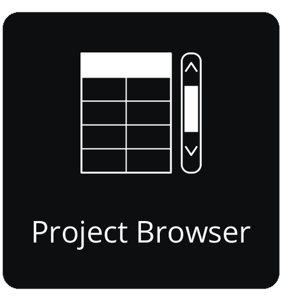
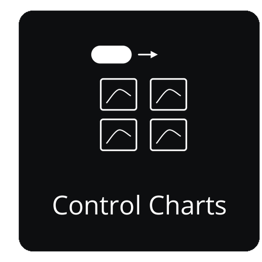
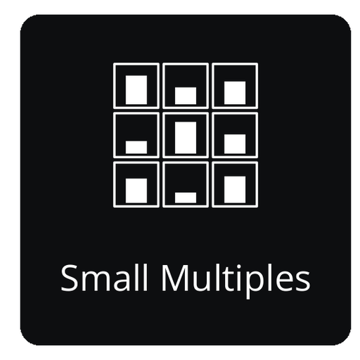
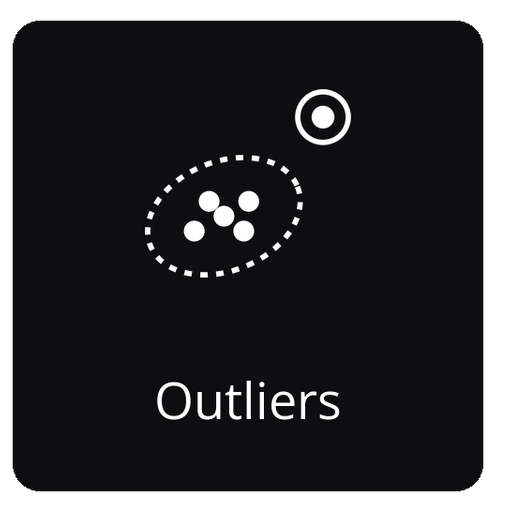

|Docs| |Tutorials| |PyPI| |Conda| |Python| |Tests| |Qt| |Source| |Issues| |License| |DOI|

.. |Docs| image:: https://github.com/EinarOlafsson/spacr/actions/workflows/pages/pages-build-deployment/badge.svg
   :target: https://einarolafsson.github.io/spacr/
   :alt: 文档
.. |Tutorials| image:: https://img.shields.io/badge/Tutorials-Interactive%20walkthrough-4A9EFF
   :target: https://einarolafsson.github.io/spacr/tutorials/
   :alt: 交互式教程
.. |PyPI| image:: https://img.shields.io/pypi/v/spacr
   :target: https://pypi.org/project/spacr/
   :alt: PyPI 版本
.. |Python| image:: https://img.shields.io/badge/Python-3.9%E2%80%933.14-3776AB?logo=python&logoColor=white
   :target: https://pypi.org/project/spacr/
   :alt: Python 3.9 至 3.14
.. |Tests| image:: https://github.com/EinarOlafsson/spacr/actions/workflows/tests.yml/badge.svg?branch=nightly
   :target: https://github.com/EinarOlafsson/spacr/actions/workflows/tests.yml
   :alt: 测试套件
.. |Qt| image:: https://img.shields.io/badge/GUI-Qt%20%28PySide6%29-41CD52
   :target: https://einarolafsson.github.io/spacr/
   :alt: Qt 界面
.. |Source| image:: https://img.shields.io/badge/GitHub-Source-181717?logo=github
   :target: https://github.com/EinarOlafsson/spacr
   :alt: GitHub 源代码
.. |Issues| image:: https://img.shields.io/github/issues/EinarOlafsson/spacr
   :target: https://github.com/EinarOlafsson/spacr/issues
   :alt: GitHub 问题
.. |License| image:: https://img.shields.io/github/license/EinarOlafsson/spacr
   :target: https://github.com/EinarOlafsson/spacr/blob/main/LICENSE
   :alt: BSD 3-Clause 许可证
.. |DOI| image:: https://img.shields.io/badge/DOI-10.5281%2Fzenodo.21343316-blue
   :target: https://doi.org/10.5281/zenodo.21343316
   :alt: Zenodo DOI
.. |Release| image:: https://img.shields.io/github/v/release/EinarOlafsson/spacr?label=Installers
   :target: https://github.com/EinarOlafsson/spacr/releases/latest
   :alt: 最新安装程序
.. |Conda| image:: https://anaconda.org/conda-forge/spacr/badges/version.svg
   :target: https://anaconda.org/conda-forge/spacr
   :alt: conda-forge 版本

.. image:: ../../../spacr/resources/icons/logo_spacr_readme.png
   :alt: spaCR
   :width: 920

spaCR
=====

语言: `English <../../../README.rst>`_ · `Svenska <README.sv.rst>`_ ·
`Deutsch <README.de.rst>`_ ·
`Español <README.es.rst>`_ ·
`简体中文 <README.zh_CN.rst>`_ ·
`Português <README.pt.rst>`_ ·
`हिन्दी <README.hi.rst>`_ ·
`한국어 <README.ko.rst>`_ ·
`Íslenska <README.is.rst>`_ ·
`Français <README.fr.rst>`_

**CRISPR 筛选的空间表型分析。**

spaCR 对高内涵显微镜图像中的单细胞进行分割和测量，将逐对象表型与测序得到的向导 RNA 丰度整合，并估计哪些基因与表型变化相关。以孔板图像和 FASTQ 读段为输入，它生成逐对象测量值、训练后的分类器、逐向导 RNA 和逐基因效应估计值，以及按优先级排序的命中结果列表。

对于基于图像的混合 CRISPR 筛选，spaCR 提供从图像分割到命中结果优先级排序的工作流程。对于不包含测序筛选的高内涵显微镜研究，分割、测量、标注和分类模块可独立使用。

图像、掩膜、图像裁剪、测量值、标注、预测、条形码和孔位标识符都存储在同一个 SQLite 项目中，因此结果中的数值可以追溯到其来源对象。

spaCR 可作为桌面应用程序运行，也可在工作站、服务器或集群上以无图形界面模式运行。两种方式使用相同的模块；模块支持 CUDA 时会自动启用。

工作流程概览
--------------------

.. spacr-workflow-begin

|Workflow_mask|\ |Workflow_arrow|\ |Workflow_measure|\ |Workflow_arrow|\ |Workflow_annotate|\ |Workflow_arrow|\ |Workflow_classify_merged|\ |Workflow_arrow|\ |Workflow_map_barcodes|\ |Workflow_arrow|\ |Workflow_regression|

.. |Workflow_mask| image:: ../../../spacr/resources/icons/workflow/mask.png
   :width: 14.5%
   :alt: 打开 Mask API
   :target: https://einarolafsson.github.io/spacr/api/spacr/core/index.html
   :align: middle
.. |Workflow_measure| image:: ../../../spacr/resources/icons/workflow/measure.png
   :width: 14.5%
   :alt: 打开 Measure API
   :target: https://einarolafsson.github.io/spacr/api/spacr/measure/index.html
   :align: middle
.. |Workflow_annotate| image:: ../../../spacr/resources/icons/workflow/annotate.png
   :width: 14.5%
   :alt: 打开 Annotate API
   :target: https://einarolafsson.github.io/spacr/api/spacr/qt/screens/annotate/index.html
   :align: middle
.. |Workflow_classify_merged| image:: ../../../spacr/resources/icons/workflow/classify_merged.png
   :width: 14.5%
   :alt: 打开 Classify API
   :target: https://einarolafsson.github.io/spacr/api/spacr/classify/index.html
   :align: middle
.. |Workflow_map_barcodes| image:: ../../../spacr/resources/icons/workflow/map_barcodes.png
   :width: 14.5%
   :alt: 打开 Map Barcodes API
   :target: https://einarolafsson.github.io/spacr/api/spacr/sequencing/index.html
   :align: middle
.. |Workflow_regression| image:: ../../../spacr/resources/icons/workflow/regression.png
   :width: 14.5%
   :alt: 打开 Regression API
   :target: https://einarolafsson.github.io/spacr/api/spacr/ml/index.html
   :align: middle
.. |Workflow_arrow| image:: ../../../spacr/resources/icons/workflow/arrow.png
   :width: 2.5%
   :align: middle

**数据**

|App_align|\ |App_convert|\ |App_foreign|\ |App_external_masks|\ |App_queue|

|App_batch|\ |App_distributed_jobs|\ |App_db_browser|\ |App_make_masks|\ |App_data_manager|

|App_project_browser|

**结果与质控**

|App_plate_view|\ |App_umap|\ |App_train_compare|\ |App_run_history|\ |App_report|

|App_run_compare|\ |App_investigate_hit|\ |App_control_chart|

**探索**

|App_pipeline_graph|\ |App_profiler|\ |App_qc_dashboard|\ |App_lineage|\ |App_layer_viewer|

|App_graph_builder|\ |App_tabulate|\ |App_feature_dict|\ |App_trellis|\ |App_gate_editor|

|App_feature_explorer|\ |App_outliers|

**实验分析**

|App_analyze_plaques|\ |App_recruitment|\ |App_invasion|\ |App_replication|

**设计**

|App_experiment_design|\ |App_power|\ |App_dose_response|

.. |App_align| image:: ../../../spacr/resources/icons/workflow/apps/align.png
   :width: 19.9%
   :alt: 打开 Align & Stitch API
   :target: https://einarolafsson.github.io/spacr/api/spacr/align/index.html
   :align: middle
.. |App_convert| image:: ../../../spacr/resources/icons/workflow/apps/convert.png
   :width: 19.9%
   :alt: 打开 Format Converter API
   :target: https://einarolafsson.github.io/spacr/api/spacr/convert/index.html
   :align: middle
.. |App_foreign| image:: ../../../spacr/resources/icons/workflow/apps/foreign.png
   :width: 19.9%
   :alt: 打开 Import Project API
   :target: https://einarolafsson.github.io/spacr/api/spacr/foreign/index.html
   :align: middle
.. |App_external_masks| image:: ../../../spacr/resources/icons/workflow/apps/external_masks.png
   :width: 19.9%
   :alt: 打开 External Masks API
   :target: https://einarolafsson.github.io/spacr/api/spacr/external_masks/index.html
   :align: middle
.. |App_queue| image:: ../../../spacr/resources/icons/workflow/apps/queue.png
   :width: 19.9%
   :alt: 打开 Plate Queue API
   :target: https://einarolafsson.github.io/spacr/api/spacr/qt/plate_queue/index.html
   :align: middle
.. |App_batch| image:: ../../../spacr/resources/icons/workflow/apps/batch.png
   :width: 19.9%
   :alt: 打开 Batch Runner API
   :target: https://einarolafsson.github.io/spacr/api/spacr/batch/index.html
   :align: middle
.. |App_distributed_jobs| image:: ../../../spacr/resources/icons/workflow/apps/distributed_jobs.png
   :width: 19.9%
   :alt: 打开 Distributed Jobs API
   :target: https://einarolafsson.github.io/spacr/api/spacr/remote_execution/index.html
   :align: middle
.. |App_db_browser| image:: ../../../spacr/resources/icons/workflow/apps/db_browser.png
   :width: 19.9%
   :alt: 打开 Database Browser API
   :target: https://einarolafsson.github.io/spacr/api/spacr/qt/screens/db_browser/index.html
   :align: middle
.. |App_make_masks| image:: ../../../spacr/resources/icons/workflow/apps/make_masks.png
   :width: 19.9%
   :alt: 打开 Make Masks API
   :target: https://einarolafsson.github.io/spacr/api/spacr/qt/screens/make_masks/index.html
   :align: middle
.. |App_data_manager| image:: ../../../spacr/resources/icons/workflow/apps/data_manager.png
   :width: 19.9%
   :alt: 打开 Data Manager API
   :target: https://einarolafsson.github.io/spacr/api/spacr/data_manager/index.html
   :align: middle

.. |App_plate_view| image:: ../../../spacr/resources/icons/workflow/apps/plate_view.png
   :width: 19.9%
   :alt: 打开 Plate Viewer API
   :target: https://einarolafsson.github.io/spacr/api/spacr/plate_qc/index.html
   :align: middle
.. |App_umap| image:: ../../../spacr/resources/icons/workflow/apps/umap.png
   :width: 19.9%
   :alt: 打开 Image UMAP API
   :target: https://einarolafsson.github.io/spacr/api/spacr/core/index.html
   :align: middle
.. |App_train_compare| image:: ../../../spacr/resources/icons/workflow/apps/train_compare.png
   :width: 19.9%
   :alt: 打开 Training Runs API
   :target: https://einarolafsson.github.io/spacr/api/spacr/train_compare/index.html
   :align: middle
.. |App_run_history| image:: ../../../spacr/resources/icons/workflow/apps/run_history.png
   :width: 19.9%
   :alt: 打开 Run History API
   :target: https://einarolafsson.github.io/spacr/api/spacr/run_journal/index.html
   :align: middle
.. |App_report| image:: ../../../spacr/resources/icons/workflow/apps/report.png
   :width: 19.9%
   :alt: 打开 Report API
   :target: https://einarolafsson.github.io/spacr/api/spacr/report/index.html
   :align: middle
.. |App_run_compare| image:: ../../../spacr/resources/icons/workflow/apps/run_compare.png
   :width: 19.9%
   :alt: 打开 Run Compare API
   :target: https://einarolafsson.github.io/spacr/api/spacr/qt/screens/run_compare/index.html
   :align: middle
.. |App_investigate_hit| image:: ../../../spacr/resources/icons/workflow/apps/investigate_hit.png
   :width: 19.9%
   :alt: 打开 Investigate Hit API
   :target: https://einarolafsson.github.io/spacr/api/spacr/hit_investigation/index.html
   :align: middle

.. |App_pipeline_graph| image:: ../../../spacr/resources/icons/workflow/apps/pipeline_graph.png
   :width: 19.9%
   :alt: 打开 Pipeline Graph API
   :target: https://einarolafsson.github.io/spacr/api/spacr/qt/screens/pipeline_graph/index.html
   :align: middle
.. |App_profiler| image:: ../../../spacr/resources/icons/workflow/apps/profiler.png
   :width: 19.9%
   :alt: 打开 Prediction Profiler API
   :target: https://einarolafsson.github.io/spacr/api/spacr/qt/screens/profiler/index.html
   :align: middle
.. |App_qc_dashboard| image:: ../../../spacr/resources/icons/workflow/apps/qc_dashboard.png
   :width: 19.9%
   :alt: 打开 QC Dashboard API
   :target: https://einarolafsson.github.io/spacr/api/spacr/qt/screens/qc_dashboard/index.html
   :align: middle
.. |App_lineage| image:: ../../../spacr/resources/icons/workflow/apps/lineage.png
   :width: 19.9%
   :alt: 打开 Lineage API
   :target: https://einarolafsson.github.io/spacr/api/spacr/qt/screens/lineage/index.html
   :align: middle
.. |App_layer_viewer| image:: ../../../spacr/resources/icons/workflow/apps/layer_viewer.png
   :width: 19.9%
   :alt: 打开 Layer Viewer API
   :target: https://einarolafsson.github.io/spacr/api/spacr/qt/layer_viewer/index.html
   :align: middle
.. |App_graph_builder| image:: ../../../spacr/resources/icons/workflow/apps/graph_builder.png
   :width: 19.9%
   :alt: 打开 Graph Builder API
   :target: https://einarolafsson.github.io/spacr/api/spacr/qt/screens/graph_builder/index.html
   :align: middle
.. |App_tabulate| image:: ../../../spacr/resources/icons/workflow/apps/tabulate.png
   :width: 19.9%
   :alt: 打开 Tabulate API
   :target: https://einarolafsson.github.io/spacr/api/spacr/qt/screens/tabulate/index.html
   :align: middle

.. |App_gate_editor| image:: ../../../spacr/resources/icons/workflow/apps/gate_editor.png
   :width: 19.9%
   :alt: 打开 Gate Editor API
   :target: https://einarolafsson.github.io/spacr/api/spacr/qt/screens/gate_editor/index.html
   :align: middle

.. |App_analyze_plaques| image:: ../../../spacr/resources/icons/workflow/apps/analyze_plaques.png
   :width: 19.9%
   :alt: 打开 Plaque Assay API
   :target: https://einarolafsson.github.io/spacr/api/spacr/submodules/index.html
   :align: middle
.. |App_recruitment| image:: ../../../spacr/resources/icons/workflow/apps/recruitment.png
   :width: 19.9%
   :alt: 打开 Recruitment API
   :target: https://einarolafsson.github.io/spacr/api/spacr/submodules/index.html
   :align: middle
.. |App_invasion| image:: ../../../spacr/resources/icons/workflow/apps/invasion.png
   :width: 19.9%
   :alt: 打开 Invasion Assay API
   :target: https://einarolafsson.github.io/spacr/api/spacr/submodules/index.html
   :align: middle
.. |App_replication| image:: ../../../spacr/resources/icons/workflow/apps/replication.png
   :width: 19.9%
   :alt: 打开 Replication Assay API
   :target: https://einarolafsson.github.io/spacr/api/spacr/submodules/index.html
   :align: middle
.. |App_experiment_design| image:: ../../../spacr/resources/icons/workflow/apps/experiment_design.png
   :width: 19.9%
   :alt: 打开 Experiment Design API
   :target: https://einarolafsson.github.io/spacr/api/spacr/qt/screens/experiment_design/index.html
   :align: middle
.. |App_power| image:: ../../../spacr/resources/icons/workflow/apps/power.png
   :width: 19.9%
   :alt: 打开 Power / Design API
   :target: https://einarolafsson.github.io/spacr/api/spacr/qt/screens/power/index.html
   :align: middle
.. |App_dose_response| image:: ../../../spacr/resources/icons/workflow/apps/dose_response.png
   :width: 19.9%
   :alt: 打开 Dose–Response API
   :target: https://einarolafsson.github.io/spacr/api/spacr/qt/screens/dose_response/index.html
   :align: middle

.. spacr-workflow-end

选择一个工作流程模块以打开其 API 页面。网格包含其余所有应用，其分类和顺序与 spaCR 主屏幕一致。

安装 spaCR
-------------

桌面应用程序
~~~~~~~~~~~~~~~~~~~

桌面安装器包含私人 Python 环境,因此不需要 conda 和现有 Python 安装。

.. spacr-installer-links-begin

|InstallerLinux| |InstallerMacOS| |InstallerWindows| |InstallerLegacy|

.. |InstallerWindows| image:: ../../../spacr/resources/icons/platforms/windows.png
   :width: 64
   :alt: 下载适用于 Windows 10/11 的 spaCR 1.5.0.4
   :target: https://github.com/EinarOlafsson/spacr/releases/download/v1.5.0.4/SpaCR-1.5.0.4-Windows-Online-Setup.exe
.. |InstallerMacOS| image:: ../../../spacr/resources/icons/platforms/macos.png
   :width: 64
   :alt: 下载适用于 macOS 11+（Intel 和 Apple Silicon）的 spaCR 1.5.0.4
   :target: https://github.com/EinarOlafsson/spacr/releases/download/v1.5.0.4/SpaCR-1.5.0.4-macOS-Universal-Online.pkg
.. |InstallerLinux| image:: ../../../spacr/resources/icons/platforms/linux.png
   :width: 64
   :alt: 下载适用于 64 位 Linux 的 spaCR 1.5.0.4
   :target: https://github.com/EinarOlafsson/spacr/releases/download/v1.5.0.4/SpaCR-1.5.0.4-Linux-x86_64-Online.run
.. |InstallerLegacy| image:: ../../../spacr/resources/icons/platforms/legacy.png
   :width: 64
   :alt: 旧版 spaCR 安装程序
   :target: ../../source/installers.rst

.. spacr-installer-links-end

第一三个图标下载当前版本. spaCR 图标打开完整的安装档案. 安装链接和版本的文件名由发布工作流更新; 以前的安装者仍然在同一发布档案中。

在 Linux 上，将下载的文件设为可执行文件并运行：

.. code-block:: bash

   chmod +x SpaCR-*-Linux-x86_64-Online.run
   ./SpaCR-*-Linux-x86_64-Online.run

在 macOS 中,打开 ``.pkg``. 目前的 beta 没有通知; 如果 Gatekeeper 阻止它,请选择 **系统设置 → 隐私和安全 → 打开 无论如何**。

请参见 `安装导游 <../../source/installer_guide.rst>`_ 更新、删除、离线和解决问题的指示。

使用 conda-forge 安装
~~~~~~~~~~~~~~~~~~~~~~~~

官方 conda-forge 软件包会将 spaCR 及其桌面应用依赖项安装到当前环境中：

.. code-block:: bash

   conda create -n spacr python=3.12 -y
   conda activate spacr
   conda install conda-forge::spacr
   spacr

使用 PyPI 安装
~~~~~~~~~~~~~~~~~

如需使用 PyPI 版本，请在 Conda 环境中通过 pip 安装 spaCR。Python 3.12 可选择的科学计算扩展包最为丰富：

.. code-block:: bash

   conda create -n spacr python=3.12 -y
   conda activate spacr
   python -m pip install --upgrade pip
   python -m pip install "spacr[qt]"
   spacr

spaCR 支持 Python **3.9 至 3.14**，但不支持 torchvision 排除的 Python 3.14.1。建议在 Linux 上运行 CUDA 工作流程；同时也支持 macOS 和 Windows。

在服务器、集群或 CI 运行器上安装时，请省略 Qt：

.. code-block:: bash

   python -m pip install spacr
   spacr-run --list

可选集成单独安装,例如 ``spacr[zarr]``、 ``spacr[omero]``、``spacr[napari]`` 和 ``spacr[czi,nd2,lif]``. 查看完整的附件和 Python 版本兼容性表的 `安装导游 <../../source/installer_guide.rst>`_。

命令行入口
~~~~~~~~~~~~~~~~~~~~~~~~~

.. code-block:: bash

   spacr                                      # launch the Qt application
   spacr-doctor                               # diagnose the installation
   spacr-run --list                           # list headless modules
   spacr-run --describe MODULE                # inspect a module contract
   spacr-run MODULE --settings settings.csv   # execute a module
   spacr-run validate --module MODULE \
       --settings settings.csv                # validate before running
   spacr-repro RUN_DIR                        # replay a recorded run

排查问题时，请设置 ``SPACR_LOG_LEVEL=DEBUG``。轮转日志写入 ``~/.spacr/logs/spacr.log``。

``spacr-run --list`` 会列出具有无界面命令行入口的模块。仅在 GUI 中提供的标注、数据整理、比较和探索模块不会列出。

您可以做什么
---------------

主要工作流程由六个模块组成：

- **Mask** 使用 Cellpose 分割细胞、细胞核、病原体和细胞器。
- **Measure** 将形态、强度、纹理、空间和共定位特征以及对象图像裁剪写入 SQLite。
- **Annotate** 在键盘驱动的网格中标注图像裁剪，并支持主动学习队列。
- **Classify** 训练基于图像或测量值的模型，并在每个检查点记录留出数据上的性能。
- **Map Barcodes** 将 FASTQ 读段映射到孔位和 gRNA，并提供丰度、碰撞和覆盖度质控。
- **Regression** 使用适合连续值、比例和计数响应的模型族估计向导 RNA、基因、条件和对照效应。

同一项目还可以设计实验孔板、估算统计功效、校正批次效应、检查分割质量、浏览关联图表和图像裁剪、导出 AnnData、继续中断的工作，并记录生成各项结果时使用的设置。

可从宿主界面使用的模块
~~~~~~~~~~~~~~~~~~~~~~~~~~~~~~~~~~~

20 个模块集成在相关宿主界面中，而不是作为单独的 Home 磁贴显示。每个模块都从其宿主界面的顶部标题栏打开，并使用当前项目。Mask、Measure、Annotate、Classify、Map Barcodes、Regression、Image UMAP 和 Make Masks 提供这些集成模块。它们的帮助和 API 文档仍可访问；具有流程入口的模块仍可在无界面模式下运行。`功能指南 <../../source/features.rst>`_ 列出了每个集成模块及其宿主界面。

Make Masks
~~~~~~~~~~

Make Masks 位于 **Data** 下，用于手动校正分割掩膜。其顶部标题栏还提供 Cellpose 工作流程的入口。画布包含九种工具：**Brush**、**Erase**、**Erase object**、**Wand +**、**Wand −**、**Draw**、**Divide**、**Zoom** 和 **Recrop**。Draw 根据任意形状的闭合轮廓创建一个填充标签。Divide 沿用户指定的线分离合并对象，同时保留其他所有对象标签。

Recrop 可从待整理的多对象图像中提取单对象视野。在一个对象周围绘制边界框后，相应的图像和掩膜区域会写入一个新视野；该视野会安排在当前视野之后处理，同时原始多对象视野会从数据整理队列中移除。Recrop 改变的是当前视野，而不是标签像素。

在 Make Masks 中运行 Cellpose-SAM 时，掩膜旁会显示两项中间输出：**细胞概率图**和**流场**。掩膜由概率图上的阈值确定；流一致性检查可以排除推导流与预测流场不一致的对象。评估错误或不完整的掩膜时，请检查这些输出，以区分细胞概率偏低和流不一致。

对象和设置
~~~~~~~~~~~~~~~~~~~~

spaCR 支持细胞、细胞核和病原体对象、由这些对象的掩膜推导出的细胞质，以及 0 至 26 个细胞器槽位。每个细胞器槽位都有独立的通道、直径、形态预设和检测方法。

设置面板仅在控件适用时显示控件。超过已配置数量的细胞器槽位会被隐藏，未分配通道的对象不会参与运行，形态特异性控件仅在所选方法需要时显示。**3D** 和 **Time** 开关定义数据维度：``z_stack`` 启用体积设置，``timelapse`` 启用跟踪设置，同时启用两者时会显示四维设置。

选择下一个页面,根据你想做的事情:

- `互动教程 <https://einarolafsson.github.io/spacr/tutorials/>`_ — 从安装到成功调查的73个导向工作流。
- `Python API 快速启动 <../../source/python_api.rst>`_ - 从脚本、笔记本或集群运行和验证流程。
- `功能指南 <../../source/features.rst>`_ - 能力、成熟度和可选集成。
- `清理 API 参考 <https://einarolafsson.github.io/spacr/api/index.html>`_ - 按任务支持输入点,完整的模块参考一个级别更深。
- `语言与翻译指南 <../../source/localization.rst>`_ — 界面语言、上下文帮助和科学输出政策。

语言与翻译
~~~~~~~~~~~~~~~~~~~~~~

界面的导航和首选项支持十种语言。AI 和 LIVE 控件、模块说明以及经过审核的上下文帮助也会翻译。无需重启，即可在 **spaCR → 首选项 → 语言** 中更改语言。日志、路径、数据库值和测量结果不会被翻译；科学输出始终使用规范英语。请参阅 `上下文帮助政策 <../../source/localization.rst#contextual-help>`_。

动画设置指南
~~~~~~~~~~~~~~~~~~~~~~~~~

带有视觉说明的设置会在工具提示中提供 **Animation** 控件。浏览 `设置动画图库 <https://einarolafsson.github.io/spacr/setting_animations.html>`_ 或 `设置动画注册表 <https://einarolafsson.github.io/spacr/api/spacr/setting_animations/index.html>`_。

数据
----

参考数据集
~~~~~~~~~~~~~~~~~~

|DataBioStudies| |DataHuggingFace| |DataNCBI| |DataSpaCRPower| |DataBioRxiv|

.. |DataBioStudies| image:: ../../../spacr/resources/icons/databanks/biostudies_button.png
   :width: 72
   :alt: 打开 BioStudies 显微镜数据集
   :target: https://doi.org/10.6019/S-BIAD2135
.. |DataHuggingFace| image:: ../../../spacr/resources/icons/databanks/huggingface_button.png
   :width: 72
   :alt: 打开 Hugging Face 测试数据集
   :target: https://huggingface.co/datasets/einarolafsson/toxo_mito
.. |DataNCBI| image:: ../../../spacr/resources/icons/databanks/ncbi_button.png
   :width: 72
   :alt: 打开 NCBI 测序数据集
   :target: https://www.ncbi.nlm.nih.gov/bioproject/?term=PRJNA1261935
.. |DataSpaCRPower| image:: ../../../spacr/resources/icons/databanks/spacrpower_button.png
   :width: 72
   :alt: 打开 spaCRPower
   :target: https://github.com/maomlab/spaCRPower
.. |DataBioRxiv| image:: ../../../spacr/resources/icons/databanks/biorxiv_button.png
   :width: 72
   :alt: 打开 bioRxiv 预印本
   :target: https://www.biorxiv.org/content/10.64898/2026.07.08.737057v1

性能诊断
----------------------

生成硬件报告并将其附到性能相关问题中::

    python tools/spacr_hardware_report.py

该命令会输出报告，并在 ``~/.spacr/reports`` 下保存一份副本；最后一行会标明保存路径。``--quick`` 会省略耗时较长的基准测试，``--out PATH`` 可指定其他输出位置。

该报告不会打开项目，也不会读取项目数据。它记录导入与数值库计时、显示缩放、当前首选项、主窗口和模块界面的构建过程以及动画性能。它创建的唯一输出是报告文件。

该报告还会识别处理器架构模拟（例如在 Apple Silicon 上运行的 x86_64 Python 构建）以及 NumPy 使用的 BLAS 实现。二者均可能显著影响性能。

贡献与支持
------------------------

请通过 `GitHub Issues <https://github.com/EinarOlafsson/spacr/issues>`_ 提交错误报告和范围明确的功能请求。报告故障时，请提供 spaCR 版本、操作系统、Python 版本、模块设置和相关日志片段。``spacr-doctor`` 会收集其中的大部分信息；报告性能问题时还应附上硬件报告。

许可
~~~~~~~~~

spaCR 是依据 `BSD 3-Clause License <https://github.com/EinarOlafsson/spacr/blob/main/LICENSE>`_ 发布的开源软件，与 CellProfiler、napari 和 Cellpose 使用相同的许可证。可用于任何用途，包括商业用途。1.5.0.0 至 1.5.0.4 的发行版曾采用 PolyForm Noncommercial License 1.0.0，1.4.9.9 及更早版本采用 MIT License；这些发行版仍适用其发布时附带的许可证。

教程
~~~~~~~~~

`spaCR 交互式教程库 <https://einarolafsson.github.io/spacr/tutorials/>`_ 提供安装和各应用工作流程的配音、字幕教程，共有 73 节课程、50 种语音，涵盖八种语言。

引用 spaCR
~~~~~~~~~~~~

如果 spaCR 对您的研究有所帮助，请引用：

Olafsson EB, *et al.* 一张以图像为基础的 CRISPR 筛选将 EAF1 定义为 *T. gondii* ESCRT 模块化器。

`生物Rxiv 预印 <https://www.biorxiv.org/content/10.64898/2026.07.08.737057v1>`_ · `软件档案 <https://doi.org/10.5281/zenodo.21343316>`_

致谢
~~~~~~~~~~~~~~~

spaCR 构建于开放科学软件之上，包括 NumPy、pandas、scikit-image、scikit-learn、Cellpose、PyTorch 和 Qt。有关多语言文档和界面目录所使用的模型，请参阅`翻译模型署名 <../TRANSLATION_MODELS.md>`_。
