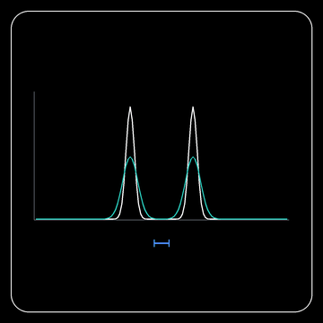

Process images with a point-spread function
===========================================

Use :mod:`spacr.point_spread` from Python to convolve an image with a
point-spread function (PSF), or to deconvolve it with Richardson–Lucy.
Prepare a two-dimensional image or three-dimensional volume and a measured
PSF sampled at the same pixel or voxel spacing. Supply intensity images;
keep object-label masks separate.

Use the desktop controls
------------------------

In **Make Masks**, open the enhancement controls and select **Convolve (blur)**
or **Deconvolve (Richardson–Lucy)** under **Point spread function**. Enter the
image pixel height and width in micrometres. Choose **Measured kernel
(TIFF/NPY)** and load your calibrated two-dimensional PSF, or choose
**Gaussian approximation** and enter the Y/X full widths at half maximum.
For a measured kernel, enter its pixel spacing too; it must match the image.

Wait for the kernel to load, then use **Compare** to inspect its effect.
Set **Deconvolution iterations** when using Richardson–Lucy and choose
**Apply** to use the result for detection. Start with a modest iteration
count and inspect noise as well as object boundaries. **Reload** rereads a
kernel file after you change it. **Off** disables PSF processing.

White shows a fixed input profile; teal shows the convolved result. The blue
bar indicates the Gaussian kernel's full width at half maximum. Increasing
that width spreads the signal and reduces peak intensity while preserving
the integrated intensity. This illustrates convolution with a Gaussian
approximation. For your microscope, enter measured calibration values and
inspect the resulting image with **Compare**.

For a batch in **Mask** or **Timelapse**, open the **Point Spread Function**
settings category. Set ``psf_operation`` to ``convolve`` or ``deconvolve`` and
``psf_image_sampling_um`` to your calibrated ``[Y, X]`` pixel spacing.
For ``psf_source="measured"``, select ``psf_path`` and matching
``psf_kernel_sampling_um``. For ``psf_source="gaussian"``, supply
``psf_fwhm_um`` instead. ``psf_iterations`` controls deconvolution work.

Run preprocessing to rebuild the segmentation inputs after changing these
settings. One kernel is applied independently to each selected segmentation
channel, after illumination correction and before normalization. Check that
its calibration is appropriate for all selected channels. The batch operates
on two-dimensional projected fields; time-series frames are processed
independently. Original image intensities remain unchanged for measurement.
Keep ``psf/segmentation_application.json`` with the results: it identifies the
kernel and processing settings. Reusing existing preprocessing requires an
exact completed match. See :func:`spacr.psf_pipeline.prepare_psf`.

Inspect Mask Live preview
-------------------------

After setting up the PSF, open **Live** in Mask and choose a representative
field. The preview applies the selected kernel before background thresholding
and model normalization. Inspect the mask boundaries and processing details,
then try another field before running the batch. Raw-intensity object filters
continue to use the original intensities.

Live preview normalizes the selected field and does not apply the full
pipeline's illumination correction. A full Mask run may normalize across a
batch, so review its saved masks as well as the preview. Changing settings
requires a new detection; processing details describe the accepted result.

Choose the intensities used by Measure
--------------------------------------

In **Measure**, open **Point Spread Function** and set
``psf_measurement_source``. Keep ``original`` for the standard measurement
intensities, including Measure's normal rescaling and preprocessing, without
additional PSF processing. Choose ``processed`` to measure intensities after
convolution or deconvolution, then configure ``psf_operation``, the kernel
source and its calibration.

For a two-dimensional field, enter image sampling and Gaussian widths in
``[Y, X]`` order. For a volume, use ``[Z, Y, X]`` and a matching
three-dimensional kernel. Volume sampling must agree with Measure's voxel
calibration or anisotropy settings. A measured kernel must have the same
sampling as the image. Use a kernel appropriate for every selected intensity
channel.

Run Measure and inspect the resulting object-feature tables in
``measurements.db``. PSF processing changes the intensity stream used for
quantitative features; source files and exported crops retain their usual
behavior. The ``intensity_rescale`` table records the selected source and PSF
processing details. Keep the database with the settings and kernel file.

To compare different kernels or original and processed measurements, use
separate projects or output databases. An existing database cannot mix
measurements made with different PSF configurations. Restore the recorded
configuration when resuming a run. See
:func:`spacr.psf_measurement.prepare_measurement_psf` for the Python settings
contract.

Load the image and PSF
----------------------

The example below reads a single-channel image and a measured PSF from TIFF
files. Replace the example spacing of 0.11 µm with your calibrated Y and X
pixel spacing. A three-dimensional input uses Z, Y and X spacing in that
order. The PSF must have odd spatial dimensions, a central origin and
nonnegative signal after background removal.

.. code-block:: python

   import json
   from pathlib import Path
   import tifffile
   from spacr.point_spread import load_psf, apply_psf

   spacing = (0.11, 0.11)
   image = tifffile.imread("cell_channel.tif")
   kernel = load_psf("measured_psf.tif", sampling_um=spacing)

Choose the operation and save the result
----------------------------------------

Set ``operation="deconvolve"`` to perform Richardson–Lucy deconvolution.
Start with a modest iteration count and compare the result with the input;
more iterations can amplify noise. ``operation="convolve"`` instead blurs
the image with the PSF. It does not use the iteration count.

.. code-block:: python

   result = apply_psf(
       image,
       kernel,
       operation="deconvolve",
       image_sampling_um=spacing,
       iterations=10,
   )
   tifffile.imwrite("cell_channel_deconvolved.tif", result.image)
   Path("cell_channel_deconvolved.json").write_text(
       json.dumps(result.provenance, indent=2), encoding="utf-8"
   )

The output preserves the image shape and uses float32 values in the original
intensity units. Inspect its range before converting it to an integer image.
Keep the JSON record with the result; it contains the kernel identity,
sampling and processing settings.

For multichannel images, set ``channel_axis`` explicitly: ``-1`` selects a
final channel dimension, while ``0`` selects a first channel dimension.
Each intensity channel is processed independently. Image and PSF sampling
must match; the function rejects mismatched spacing.

Use a calculated approximation
------------------------------

If your workflow calls for a Gaussian approximation, construct it with
:func:`spacr.point_spread.gaussian_psf`. Supply the full width at half maximum
in micrometres and the image spacing. These are example values to replace
with the values appropriate to your analysis:

.. code-block:: python

   from spacr.point_spread import gaussian_psf

   kernel = gaussian_psf(
       fwhm_um=(0.30, 0.30), sampling_um=spacing, ndim=2
   )

Pass this kernel to ``apply_psf`` as above. A Gaussian kernel is an
approximation; retain that distinction when comparing it with a measured
PSF. See :func:`spacr.point_spread.apply_psf` for cancellation, progress
callbacks and the complete parameter reference.
