Setting animation gallery
=========================

spaCR includes short, deterministic GIFs for settings whose effect is
easier to understand visually. In the desktop interface a purple dot
above the teal API dot opens the corresponding animation immediately
above the setting. The midpoint between both dots remains aligned with
the setting label.

The diagrams use a shared biological grammar: white fibroblast or
motile immune-cell outlines, blue nuclei with unequal nucleoli, teal
Toxoplasma tachyzoites inside an outline-only parasitophorous vacuole,
and soft-magenta Golgi cisternae. Filled regions are translucent and
the rounded field perimeter remains white on black.

The cell, nucleus and nucleoli, two-parasite vacuole, and Golgi use
the reviewed, artist-authored SVG paths checked into ``tools/``.
Qt renders those exact Bezier paths at high resolution before each
animation frame is composited, keeping the outlines smooth at small
sizes. Source-template SHA-256 hashes are recorded in the manifest.

Animations are resolved by exact setting key through
:mod:`spacr.setting_animations`; the assets and manifest are generated
reproducibly by ``tools/generate_setting_animations.py``.

Mask filtering
--------------

.. _setting-animation-cell-remove-border-objects:

Cell — Remove border objects
~~~~~~~~~~~~~~~~~~~~~~~~~~~~

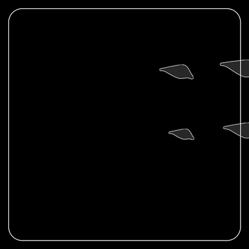

**Settings:** ``cell_remove_border_objects``, ``remove_border_cells``

.. _setting-animation-cell-min-area:

Cell — Minimum object area
~~~~~~~~~~~~~~~~~~~~~~~~~~

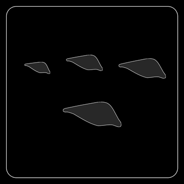

**Settings:** ``cell_min_area``, ``cell_min_size``

.. _setting-animation-cell-max-area:

Cell — Maximum object area
~~~~~~~~~~~~~~~~~~~~~~~~~~

**Settings:** ``cell_max_area``

.. _setting-animation-cell-min-intensity-percentile:

Cell — Minimum intensity percentile
~~~~~~~~~~~~~~~~~~~~~~~~~~~~~~~~~~~

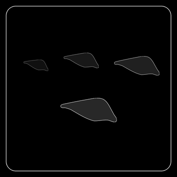

**Settings:** ``cell_min_intensity_percentile``

.. _setting-animation-cell-max-intensity-percentile:

Cell — Maximum intensity percentile
~~~~~~~~~~~~~~~~~~~~~~~~~~~~~~~~~~~

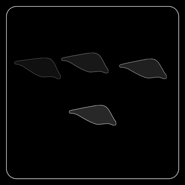

**Settings:** ``cell_max_intensity_percentile``

.. _setting-animation-nucleus-remove-border-objects:

Nucleus — Remove border objects
~~~~~~~~~~~~~~~~~~~~~~~~~~~~~~~

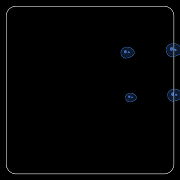

**Settings:** ``nucleus_remove_border_objects``, ``remove_border_nuclei``

.. _setting-animation-nucleus-min-area:

Nucleus — Minimum object area
~~~~~~~~~~~~~~~~~~~~~~~~~~~~~

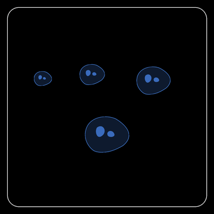

**Settings:** ``nucleus_min_area``, ``nucleus_min_size``

.. _setting-animation-nucleus-max-area:

Nucleus — Maximum object area
~~~~~~~~~~~~~~~~~~~~~~~~~~~~~

**Settings:** ``nucleus_max_area``

.. _setting-animation-nucleus-min-intensity-percentile:

Nucleus — Minimum intensity percentile
~~~~~~~~~~~~~~~~~~~~~~~~~~~~~~~~~~~~~~

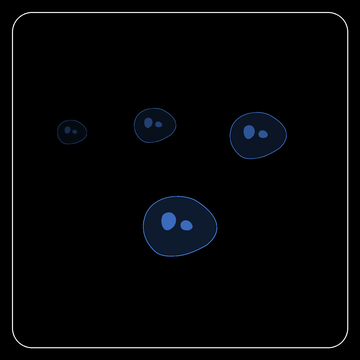

**Settings:** ``nucleus_min_intensity_percentile``

.. _setting-animation-nucleus-max-intensity-percentile:

Nucleus — Maximum intensity percentile
~~~~~~~~~~~~~~~~~~~~~~~~~~~~~~~~~~~~~~

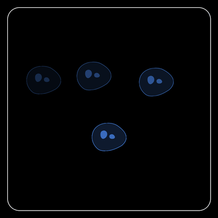

**Settings:** ``nucleus_max_intensity_percentile``

.. _setting-animation-pathogen-remove-border-objects:

Pathogen — Remove border objects
~~~~~~~~~~~~~~~~~~~~~~~~~~~~~~~~

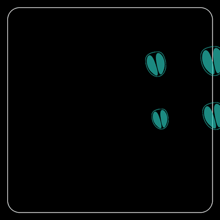

**Settings:** ``pathogen_remove_border_objects``, ``remove_border_pathogens``

.. _setting-animation-pathogen-min-area:

Pathogen — Minimum object area
~~~~~~~~~~~~~~~~~~~~~~~~~~~~~~

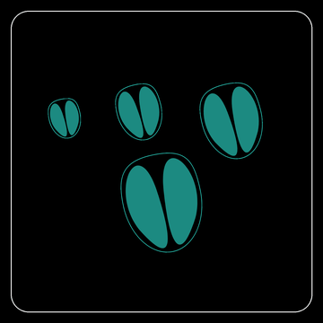

**Settings:** ``pathogen_min_area``, ``pathogen_min_size``

.. _setting-animation-pathogen-max-area:

Pathogen — Maximum object area
~~~~~~~~~~~~~~~~~~~~~~~~~~~~~~

**Settings:** ``pathogen_max_area``

.. _setting-animation-pathogen-min-intensity-percentile:

Pathogen — Minimum intensity percentile
~~~~~~~~~~~~~~~~~~~~~~~~~~~~~~~~~~~~~~~

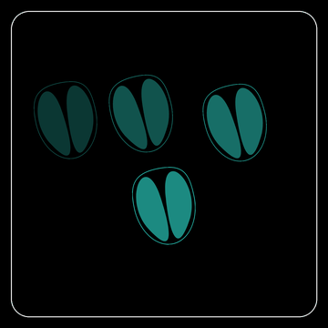

**Settings:** ``pathogen_min_intensity_percentile``

.. _setting-animation-pathogen-max-intensity-percentile:

Pathogen — Maximum intensity percentile
~~~~~~~~~~~~~~~~~~~~~~~~~~~~~~~~~~~~~~~

**Settings:** ``pathogen_max_intensity_percentile``

.. _setting-animation-organelle-remove-border-objects:

Organelle — Remove border objects
~~~~~~~~~~~~~~~~~~~~~~~~~~~~~~~~~

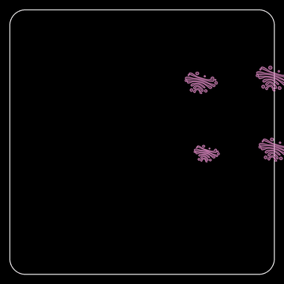

**Settings:** ``organelle_remove_border_objects``, ``organelle_remove_border``, ``remove_border_organelles``

.. _setting-animation-organelle-min-area:

Organelle — Minimum object area
~~~~~~~~~~~~~~~~~~~~~~~~~~~~~~~

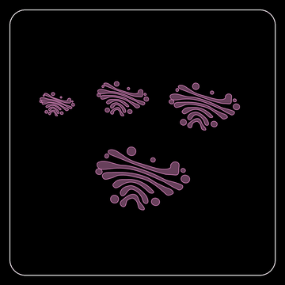

**Settings:** ``organelle_min_area``, ``organelle_min_size``

.. _setting-animation-organelle-max-area:

Organelle — Maximum object area
~~~~~~~~~~~~~~~~~~~~~~~~~~~~~~~

**Settings:** ``organelle_max_area``, ``organelle_max_size``

.. _setting-animation-organelle-min-intensity-percentile:

Organelle — Minimum intensity percentile
~~~~~~~~~~~~~~~~~~~~~~~~~~~~~~~~~~~~~~~~

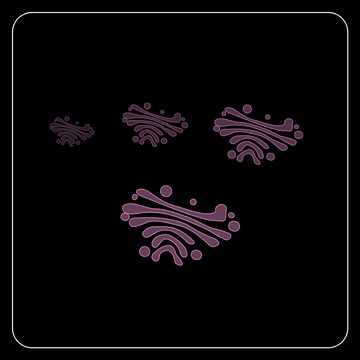

**Settings:** ``organelle_min_intensity_percentile``

.. _setting-animation-organelle-max-intensity-percentile:

Organelle — Maximum intensity percentile
~~~~~~~~~~~~~~~~~~~~~~~~~~~~~~~~~~~~~~~~

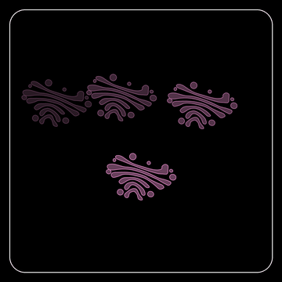

**Settings:** ``organelle_max_intensity_percentile``

Mask repair
-----------

.. _setting-animation-merge-edge-pathogen-cells:

Merge edge-pathogen cells
~~~~~~~~~~~~~~~~~~~~~~~~~

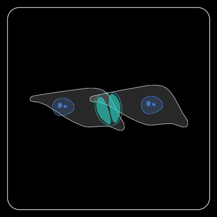

**Settings:** ``merge_edge_pathogen_cells``

.. _setting-animation-adjust-cells:

Adjust fragmented cells
~~~~~~~~~~~~~~~~~~~~~~~

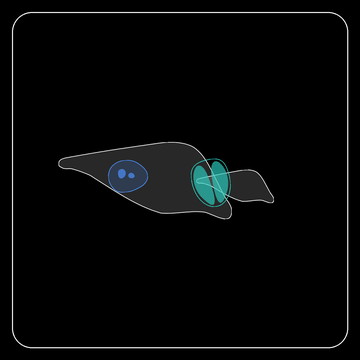

**Settings:** ``adjust_cells``

.. _setting-animation-cell-perimeter-fraction:

Cell perimeter merge
~~~~~~~~~~~~~~~~~~~~

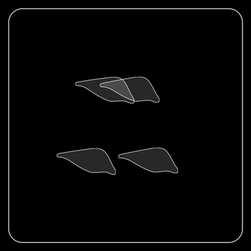

**Settings:** ``cell_perimeter_fraction``

.. _setting-animation-cell-intensity-merge:

Cell intensity merge
~~~~~~~~~~~~~~~~~~~~

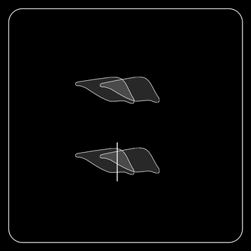

**Settings:** ``cell_intensity_merge``, ``cell_intensity_threshold_method``, ``cell_intensity_percentile``

.. _setting-animation-cell-intensity-split:

Cell watershed split
~~~~~~~~~~~~~~~~~~~~

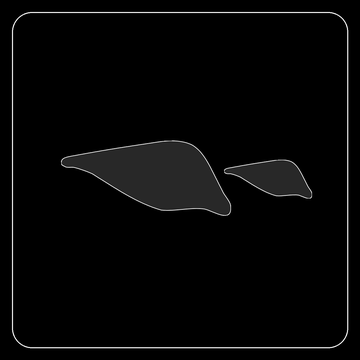

**Settings:** ``cell_intensity_split``, ``cell_area_multiplier``, ``cell_min_distance``, ``cell_min_object_area``

.. _setting-animation-nucleus-perimeter-fraction:

Nucleus perimeter merge
~~~~~~~~~~~~~~~~~~~~~~~

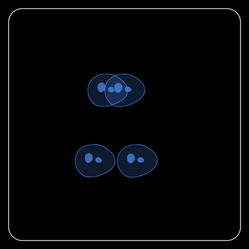

**Settings:** ``nucleus_perimeter_fraction``

.. _setting-animation-nucleus-intensity-merge:

Nucleus intensity merge
~~~~~~~~~~~~~~~~~~~~~~~

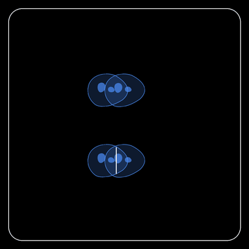

**Settings:** ``nucleus_intensity_merge``, ``nucleus_intensity_threshold_method``, ``nucleus_intensity_percentile``

.. _setting-animation-nucleus-intensity-split:

Nucleus watershed split
~~~~~~~~~~~~~~~~~~~~~~~

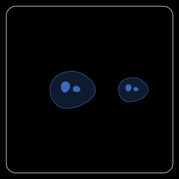

**Settings:** ``nucleus_intensity_split``, ``nucleus_area_multiplier``, ``nucleus_min_distance``, ``nucleus_min_object_area``

.. _setting-animation-pathogen-perimeter-fraction:

Pathogen perimeter merge
~~~~~~~~~~~~~~~~~~~~~~~~

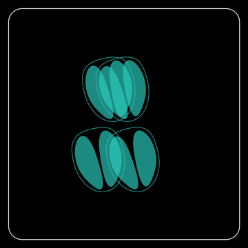

**Settings:** ``pathogen_perimeter_fraction``

.. _setting-animation-pathogen-intensity-merge:

Pathogen intensity merge
~~~~~~~~~~~~~~~~~~~~~~~~

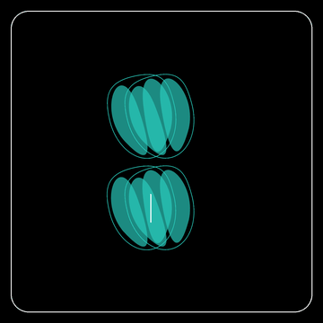

**Settings:** ``pathogen_intensity_merge``, ``pathogen_intensity_threshold_method``, ``pathogen_intensity_percentile``

.. _setting-animation-pathogen-intensity-split:

Pathogen watershed split
~~~~~~~~~~~~~~~~~~~~~~~~

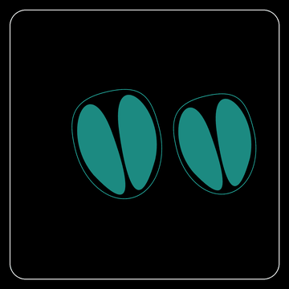

**Settings:** ``pathogen_intensity_split``, ``pathogen_area_multiplier``, ``pathogen_min_distance``, ``pathogen_min_object_area``

.. _setting-animation-organelle-perimeter-fraction:

Organelle perimeter merge
~~~~~~~~~~~~~~~~~~~~~~~~~

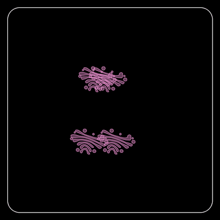

**Settings:** ``organelle_perimeter_fraction``

.. _setting-animation-organelle-intensity-merge:

Organelle intensity merge
~~~~~~~~~~~~~~~~~~~~~~~~~

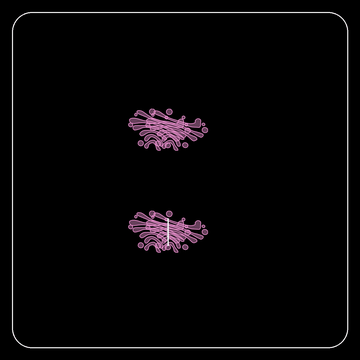

**Settings:** ``organelle_intensity_merge``, ``organelle_intensity_threshold_method``, ``organelle_intensity_percentile``

.. _setting-animation-organelle-intensity-split:

Organelle watershed split
~~~~~~~~~~~~~~~~~~~~~~~~~

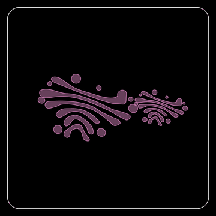

**Settings:** ``organelle_intensity_split``, ``organelle_area_multiplier``, ``organelle_min_distance``, ``organelle_min_object_area``

.. _setting-animation-fill-in:

Fill holes in masks
~~~~~~~~~~~~~~~~~~~

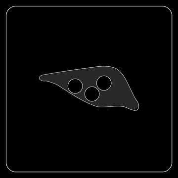

**Settings:** ``fill_in``

Segmentation
------------

.. _setting-animation-cell-CP-prob:

Cell probability threshold
~~~~~~~~~~~~~~~~~~~~~~~~~~

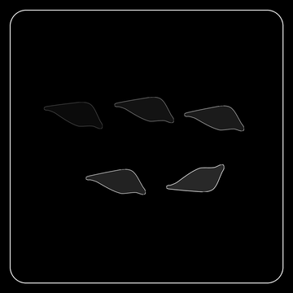

**Settings:** ``cell_CP_prob``

.. _setting-animation-cell-FT:

Cell flow threshold
~~~~~~~~~~~~~~~~~~~

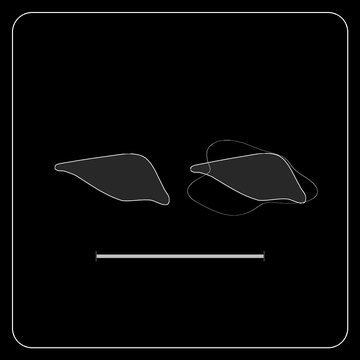

**Settings:** ``cell_FT``

.. _setting-animation-cell-diameter:

Cell diameter
~~~~~~~~~~~~~

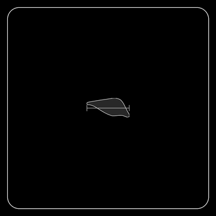

**Settings:** ``cell_diameter``

.. _setting-animation-nucleus-CP-prob:

Nucleus probability threshold
~~~~~~~~~~~~~~~~~~~~~~~~~~~~~

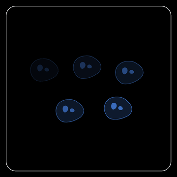

**Settings:** ``nucleus_CP_prob``

.. _setting-animation-nucleus-FT:

Nucleus flow threshold
~~~~~~~~~~~~~~~~~~~~~~

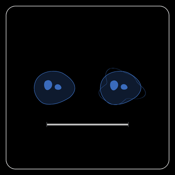

**Settings:** ``nucleus_FT``

.. _setting-animation-nucleus-diameter:

Nucleus diameter
~~~~~~~~~~~~~~~~

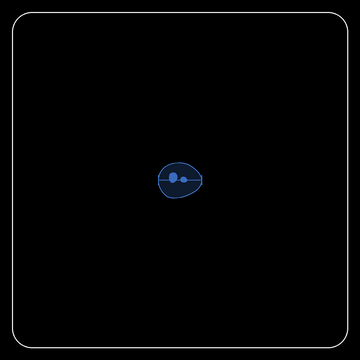

**Settings:** ``nucleus_diameter``

.. _setting-animation-pathogen-CP-prob:

Pathogen probability threshold
~~~~~~~~~~~~~~~~~~~~~~~~~~~~~~

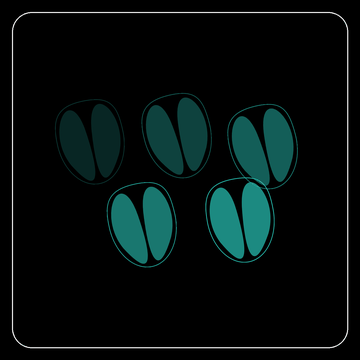

**Settings:** ``pathogen_CP_prob``

.. _setting-animation-pathogen-FT:

Pathogen flow threshold
~~~~~~~~~~~~~~~~~~~~~~~

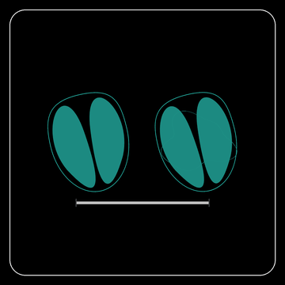

**Settings:** ``pathogen_FT``

.. _setting-animation-pathogen-diameter:

Pathogen diameter
~~~~~~~~~~~~~~~~~

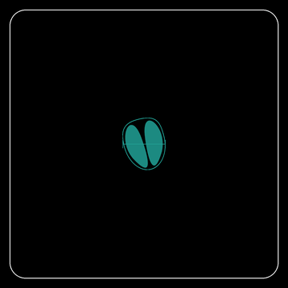

**Settings:** ``pathogen_diameter``

.. _setting-animation-organelle-diameter:

Organelle diameter
~~~~~~~~~~~~~~~~~~

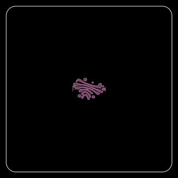

**Settings:** ``organelle_diameter``

.. _setting-animation-organelle-CP-prob:

Organelle probability threshold
~~~~~~~~~~~~~~~~~~~~~~~~~~~~~~~

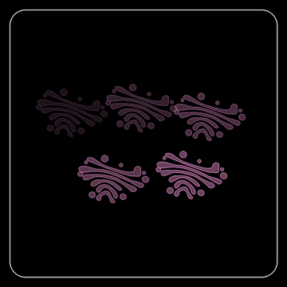

**Settings:** ``organelle_CP_prob``

.. _setting-animation-organelle-FT:

Organelle flow threshold
~~~~~~~~~~~~~~~~~~~~~~~~

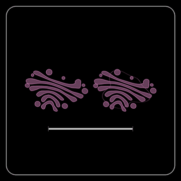

**Settings:** ``organelle_FT``

Image preprocessing
-------------------

.. _setting-animation-remove-background-cell:

Cell background subtraction
~~~~~~~~~~~~~~~~~~~~~~~~~~~

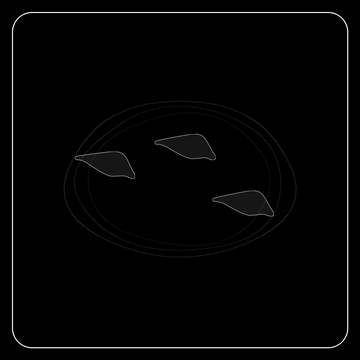

**Settings:** ``remove_background_cell``, ``cell_background``

.. _setting-animation-cell-Signal-to-noise:

Cell signal-to-noise
~~~~~~~~~~~~~~~~~~~~

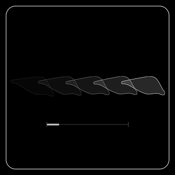

**Settings:** ``cell_Signal_to_noise``

.. _setting-animation-remove-background-nucleus:

Nucleus background subtraction
~~~~~~~~~~~~~~~~~~~~~~~~~~~~~~

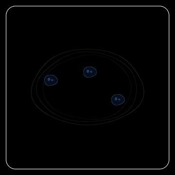

**Settings:** ``remove_background_nucleus``, ``nucleus_background``

.. _setting-animation-nucleus-Signal-to-noise:

Nucleus signal-to-noise
~~~~~~~~~~~~~~~~~~~~~~~

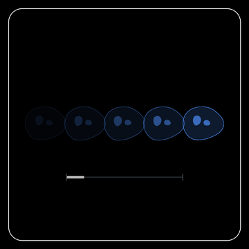

**Settings:** ``nucleus_Signal_to_noise``

.. _setting-animation-remove-background-pathogen:

Pathogen background subtraction
~~~~~~~~~~~~~~~~~~~~~~~~~~~~~~~

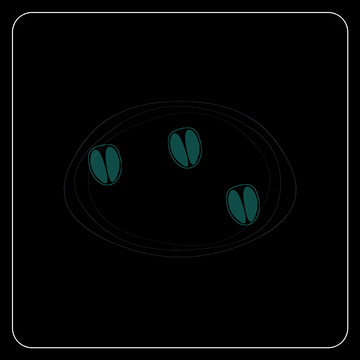

**Settings:** ``remove_background_pathogen``, ``pathogen_background``

.. _setting-animation-pathogen-Signal-to-noise:

Pathogen signal-to-noise
~~~~~~~~~~~~~~~~~~~~~~~~

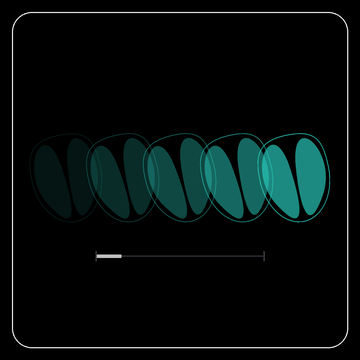

**Settings:** ``pathogen_Signal_to_noise``

.. _setting-animation-normalization-percentiles:

Image normalization percentiles
~~~~~~~~~~~~~~~~~~~~~~~~~~~~~~~

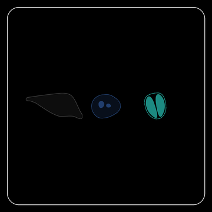

**Settings:** ``normalization_percentiles``, ``normalize``, ``normalize_plots``

Organelle preprocessing
-----------------------

.. _setting-animation-organelle-fill-holes:

Fill small organelle holes
~~~~~~~~~~~~~~~~~~~~~~~~~~

**Settings:** ``organelle_fill_holes``

.. _setting-animation-organelle-watershed-spots:

Split touching organelle spots
~~~~~~~~~~~~~~~~~~~~~~~~~~~~~~

**Settings:** ``organelle_watershed_spots``

.. _setting-animation-organelle-skeletonize:

Skeletonize organelle networks
~~~~~~~~~~~~~~~~~~~~~~~~~~~~~~

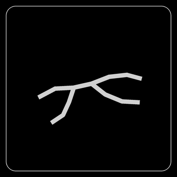

**Settings:** ``organelle_skeletonize``

.. _setting-animation-organelle-rolling-ball:

Rolling-ball background correction
~~~~~~~~~~~~~~~~~~~~~~~~~~~~~~~~~~

**Settings:** ``organelle_rolling_ball``, ``organelle_rolling_ball_radius``

.. _setting-animation-organelle-clahe:

Organelle local contrast (CLAHE)
~~~~~~~~~~~~~~~~~~~~~~~~~~~~~~~~

**Settings:** ``organelle_clahe``, ``organelle_clahe_clip_limit``

.. _setting-animation-organelle-mask-within-cells:

Mask organelles within cells
~~~~~~~~~~~~~~~~~~~~~~~~~~~~

**Settings:** ``organelle_mask_within_cells``

.. _setting-animation-organelle-log-threshold:

Organelle segmentation threshold
~~~~~~~~~~~~~~~~~~~~~~~~~~~~~~~~

**Settings:** ``organelle_log_threshold``, ``organelle_unet_threshold``

Plot appearance
---------------

.. _setting-animation-outline-thickness:

Mask outline thickness
~~~~~~~~~~~~~~~~~~~~~~

**Settings:** ``outline_thickness``

Crop output
-----------

.. _setting-animation-use-bounding-box:

Keep bounding-box context
~~~~~~~~~~~~~~~~~~~~~~~~~

**Settings:** ``use_bounding_box``

.. _setting-animation-dialate-pngs:

Dilate crop masks
~~~~~~~~~~~~~~~~~

**Settings:** ``dialate_pngs``, ``dialate_png_ratios``

.. _setting-animation-crop-mode:

Choose crop target
~~~~~~~~~~~~~~~~~~

**Settings:** ``crop_mode``

.. _setting-animation-png-size:

Crop canvas size
~~~~~~~~~~~~~~~~

**Settings:** ``png_size``

Measurement
-----------

.. _setting-animation-cytoplasm:

Derive cytoplasm compartment
~~~~~~~~~~~~~~~~~~~~~~~~~~~~

**Settings:** ``cytoplasm``

.. _setting-animation-radial-dist:

Radial-distance shells
~~~~~~~~~~~~~~~~~~~~~~

**Settings:** ``radial_dist``, ``distance_gaussian_sigma``

.. _setting-animation-uninfected:

Keep or remove uninfected cells
~~~~~~~~~~~~~~~~~~~~~~~~~~~~~~~

**Settings:** ``uninfected``

Tracking & volumetric
---------------------

.. _setting-animation-timelapse-remove-transient:

Remove transient tracks
~~~~~~~~~~~~~~~~~~~~~~~

**Settings:** ``timelapse_remove_transient``, ``timelapse_frame_limits``

.. _setting-animation-timelapse-displacement:

Maximum linking displacement
~~~~~~~~~~~~~~~~~~~~~~~~~~~~

**Settings:** ``timelapse_displacement``, ``ultrack_max_distance``, ``t_max_displacement_px``, ``t_max_displacement_um``

.. _setting-animation-timelapse-memory:

Tracking memory
~~~~~~~~~~~~~~~

**Settings:** ``timelapse_memory``

.. _setting-animation-t-link-threshold:

Timepoint overlap threshold
~~~~~~~~~~~~~~~~~~~~~~~~~~~

**Settings:** ``t_link_threshold``

.. _setting-animation-stitch-threshold:

Z-plane stitch threshold
~~~~~~~~~~~~~~~~~~~~~~~~

**Settings:** ``stitch_threshold``

.. _setting-animation-z-projection:

Z projection
~~~~~~~~~~~~

**Settings:** ``z_projection``, ``all_to_mip``, ``pick_slice``

.. _setting-animation-t-project-for-tracking:

Project volumes for tracking
~~~~~~~~~~~~~~~~~~~~~~~~~~~~

**Settings:** ``t_project_for_tracking``

.. _setting-animation-straightness-filter:

Remove overly straight tracks
~~~~~~~~~~~~~~~~~~~~~~~~~~~~~

**Settings:** ``straightness_filter``, ``straightness_threshold``

.. _setting-animation-zscore-thresh:

Smooth per-track outliers
~~~~~~~~~~~~~~~~~~~~~~~~~

**Settings:** ``zscore_thresh``

.. _setting-animation-ultrack-division-weight:

Cell-division linking
~~~~~~~~~~~~~~~~~~~~~

**Settings:** ``ultrack_division_weight``

.. _setting-animation-ultrack-contour-sigma:

Contour smoothing
~~~~~~~~~~~~~~~~~

**Settings:** ``ultrack_contour_sigma``

Image UMAP
----------

.. _setting-animation-n-neighbors:

UMAP neighborhood size
~~~~~~~~~~~~~~~~~~~~~~

**Settings:** ``n_neighbors``

.. _setting-animation-min-dist:

UMAP minimum distance
~~~~~~~~~~~~~~~~~~~~~

**Settings:** ``min_dist``

.. _setting-animation-plot-images:

Show object images
~~~~~~~~~~~~~~~~~~

**Settings:** ``plot_images``

.. _setting-animation-remove-image-canvas:

Remove image canvas
~~~~~~~~~~~~~~~~~~~

**Settings:** ``remove_image_canvas``

.. _setting-animation-plot-outlines:

Show cluster outlines
~~~~~~~~~~~~~~~~~~~~~

**Settings:** ``plot_outlines``

.. _setting-animation-plot-points:

Show embedding points
~~~~~~~~~~~~~~~~~~~~~

**Settings:** ``plot_points``

.. _setting-animation-smooth-lines:

Smooth cluster outlines
~~~~~~~~~~~~~~~~~~~~~~~

**Settings:** ``smooth_lines``

.. _setting-animation-remove-cluster-noise:

Remove cluster noise
~~~~~~~~~~~~~~~~~~~~

**Settings:** ``remove_cluster_noise``

.. _setting-animation-plot-by-cluster:

Sample images by cluster
~~~~~~~~~~~~~~~~~~~~~~~~

**Settings:** ``plot_by_cluster``

.. _setting-animation-dot-size:

Embedding point size
~~~~~~~~~~~~~~~~~~~~

**Settings:** ``dot_size``

.. _setting-animation-img-zoom:

Embedding image zoom
~~~~~~~~~~~~~~~~~~~~

**Settings:** ``img_zoom``

.. _setting-animation-eps:

Density clustering radius
~~~~~~~~~~~~~~~~~~~~~~~~~

**Settings:** ``eps``, ``min_samples``, ``clustering``

Alignment & stitching
---------------------

.. _setting-animation-overlap:

Tile overlap
~~~~~~~~~~~~

**Settings:** ``overlap``

.. _setting-animation-blend:

Tile seam blending
~~~~~~~~~~~~~~~~~~

**Settings:** ``blend``
