# Thirty Home-screen arrangements

Candidates for review. **Nothing here is installed** — no file under
`spacr/qt/` was changed to produce them.

Every screen below is built out of the **real Qt widgets** (`HTile`,
`Card`, `Section`, `Divider`, `UsageBar`, `ElidingLabel`, and the real
`Sidebar`/`StartupPage` in variant 01) and the **real app registry**
(`spacr.qt.app.APPS`, all 29 apps, unmodified names and blurbs), then
grabbed with `QWidget.grab()` under `QT_QPA_PLATFORM=offscreen`. Where a
variant needs something spaCR does not have yet — a recent-runs strip, a
resume banner, a guided quick-start, a project status bar, a what's-new
panel, a big illustrated tile — that widget was built for real in
`_generators/parts.py`. So whatever you pick is known-buildable.

**Canvas: 1440x900**, the realistic laptop case, including the app's
menu strip and status bar so the space a variant actually gets is what
is drawn. Variants that also show the app sidebar say so.

**Themes:** `dark.png` and `light.png` in every folder, plus `space.png`. The
Space renders use that theme's *offline* sky — the deep-space gradient
it falls back to when no generated star image is cached — because the
generated image is per-user and would make these renders
non-reproducible.

**Numbers in the panels are fixed mock values** (`_generators/common.py`,
`MOCK`) — plate counts, run history, disk and GPU. A screen that renders
differently every run cannot be reviewed.

Re-render, or tweak one and re-render just that one:

```bash
R=spacr/resources/home/versions/_generators/render.py
python $R                        # all thirty, every theme
python $R --only 7 --themes dark # just variant 7, just dark
python $R --md-only              # rewrite this file after a prose edit
python $R --check                # audit the PNGs already on disk
```

The variants live in `_generators/variants.py`, one function each; the
widgets they are assembled from live in `_generators/parts.py`.

## The contact sheet

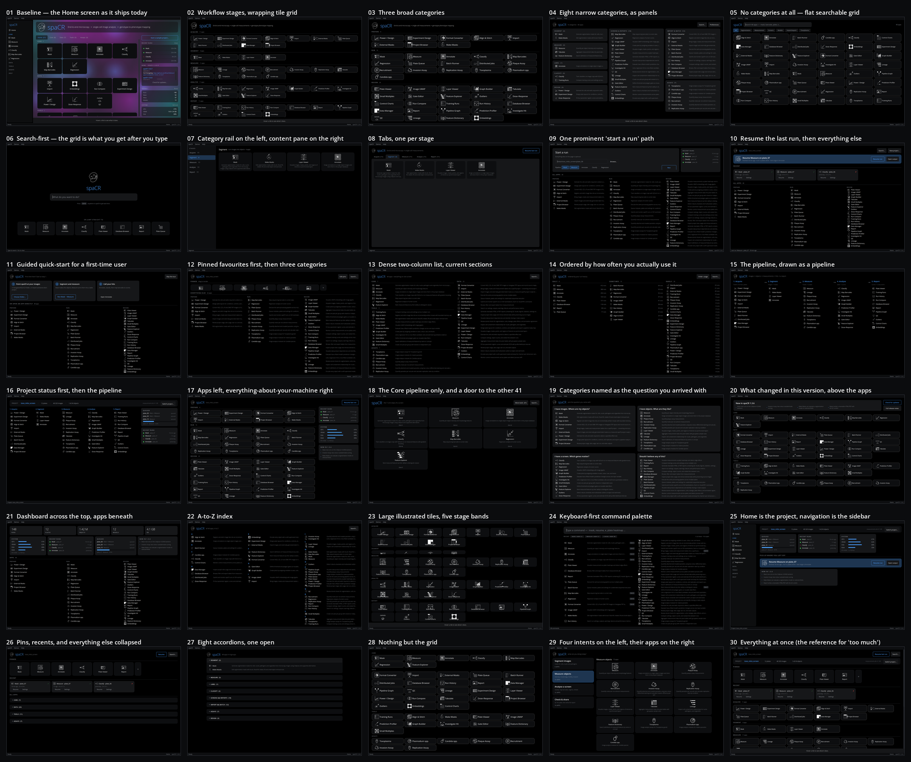

## Findings that apply to every variant

1. **The sidebar does not fit at 1440x900.** `Sidebar` stacks 29 app
   rows plus five headings plus the title in a plain `QVBoxLayout` with
   no scroll area; it asks for roughly 1356 px of height and gets
   850. Variants 01 and 25 render it, and the last few apps
   are simply unreachable on a laptop. A fix is proposed at the bottom
   of this file.
2. **The shipped home page needs a vertical scrollbar** before the
   third section is fully on screen, plus a horizontal scrollbar inside
   each section row (variant 01). Twenty-eight of the thirty variants
   below fit 1440x900 with no scrollbar at all — the two that do not are
   the shipped baseline (01) and the deliberately maximal control (30) —
   so scrolling the Home screen is a choice, not a constraint.
3. **The hint bar exists because descriptions are hidden.** Any variant
   that shows the one-line description on the row itself (04, 07, 08,
   09, 10, 13, 19, 22, 24, 29) does not need it.
4. **`HTile` cannot do more than five columns on this screen.** Its name
   is drawn at the 17 px "subtitle" size, so the longest app name
   ("Annotator Agreement") needs 255 px of tile — 5 x 265 px fits 1440,
   6 does not, and at six columns the name silently elides. Variants
   02, 05, 17, 20 and 30 restyle that one label to 12-13 px to get six
   columns; 03, 07, 08, 23 and 28 keep the shipped size and use five or
   fewer. Both are legitimate, but it is a real constraint on any
   tile-grid answer.

---


### 01 · Baseline — the Home screen as it ships today

`v01_baseline-today/`

[dark](v01_baseline-today/dark.png) [light](v01_baseline-today/light.png) [space](v01_baseline-today/space.png)

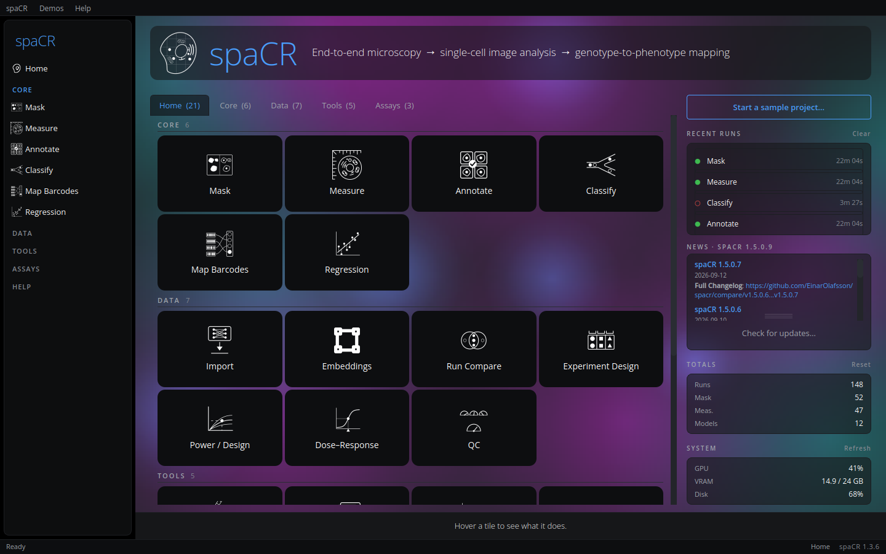

**Changes.** Nothing. This is the shipped screen, rendered with the same harness as the other twenty-nine so the comparison is fair: the real Sidebar plus the real StartupPage, five sections in horizontal tile scrollers, the insights dashboard and the reserved 'featured' surface.

**Adds.** Nothing.

**Removes.** Nothing.

**The argument for it.** It is the thing every other variant has to beat, and it shows two problems at 1440x900 without anyone having to argue for them: the sidebar's 29 items + 5 headings ask for 1356 px of height and get 850, so the last three apps are cut off with no way to scroll to them; and the page itself needs a vertical scrollbar plus a horizontal one per section, so only two of the five sections are fully visible at once.

*Note.* Live GPU/disk/journal readings are frozen to fixed values for the render; everything else is the shipped widget.

*Layout audit: every theme — clipped (6), overflow (1), scrollbars (4)*


### 02 · Workflow stages, wrapping tile grid

`v02_stages-grid/`

[dark](v02_stages-grid/dark.png) [light](v02_stages-grid/light.png) [space](v02_stages-grid/space.png)

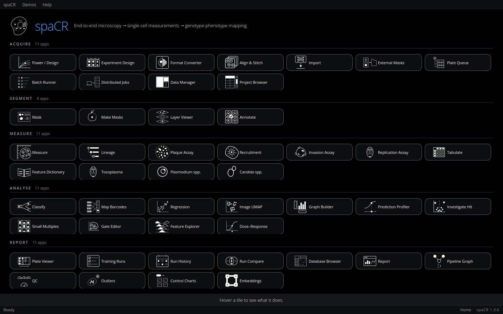

**Changes.** Categories are renamed from kinds-of-thing to stages of a run — Acquire, Segment, Measure, Analyse, Report — and each one is a wrapping grid instead of a horizontal scroller, so no app is hidden off the right edge.

**Adds.** Nothing.

**Removes.** The insights dashboard and the empty 'Reserved for featured content' box. The hint bar stays.

**The argument for it.** Same five-row shape people already know, but the names answer 'where am I in my run?' instead of 'what kind of code is this?', and all 29 apps are visible at once with 200 px of vertical slack left over.

*Layout audit: clean — no elided or clipped text, no scrollbar, fits 1440x900.*


### 03 · Three broad categories

`v03_three-broad/`

[dark](v03_three-broad/dark.png) [light](v03_three-broad/light.png) [space](v03_three-broad/space.png)

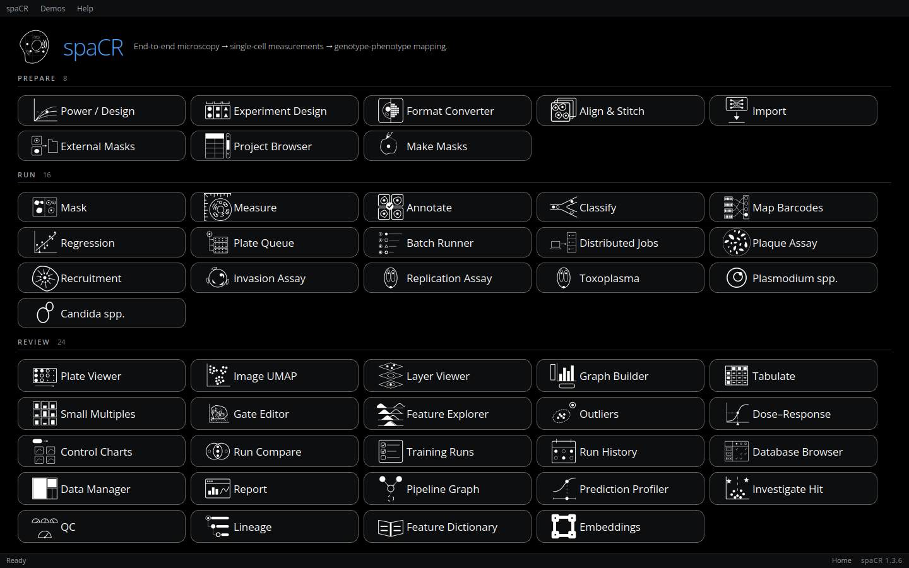

**Changes.** Five categories collapse to three — Prepare, Run, Review — which is the smallest split that still means something. Tiles are wider and the whole page is one column.

**Adds.** Nothing.

**Removes.** The insights dashboard, the reserved surface, the hint bar, and the hero shrinks to one line.

**The argument for it.** Three headings is the most a person actually holds in their head while scanning. It is also the fewest headings that never needs a scroll: everything is above the fold with room to spare.

*Layout audit: clean — no elided or clipped text, no scrollbar, fits 1440x900.*


### 04 · Eight narrow categories, as panels

`v04_eight-narrow/`

[dark](v04_eight-narrow/dark.png) [light](v04_eight-narrow/light.png) [space](v04_eight-narrow/space.png)

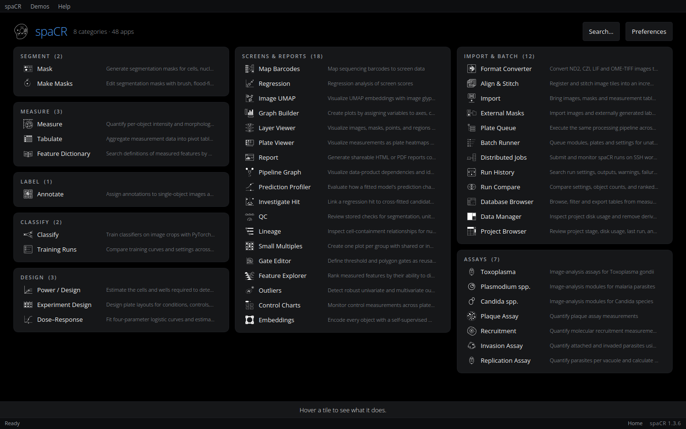

**Changes.** Eight tightly-drawn categories (Segment, Train models, Measure, Label, Classify, Screens & reports, Import & batch, Toxoplasma) laid out as a 3x3 board of panels, each listing its apps as compact rows with their one-line descriptions on the same row.

**Adds.** Per-category counts in the headings.

**Removes.** Tiles entirely — every app is a one-line row. Also the hero, the dashboard and the reserved surface.

**The argument for it.** Narrow categories are the only ones you can name honestly: 'Segment' is three apps and it is obvious which three. The cost is that two categories only hold two apps, which the current design guidance says is not worth a heading.

*Layout audit: clean — no elided or clipped text, no scrollbar, fits 1440x900.*


### 05 · No categories at all — flat searchable grid

`v05_flat-search/`

[dark](v05_flat-search/dark.png) [light](v05_flat-search/light.png) [space](v05_flat-search/space.png)

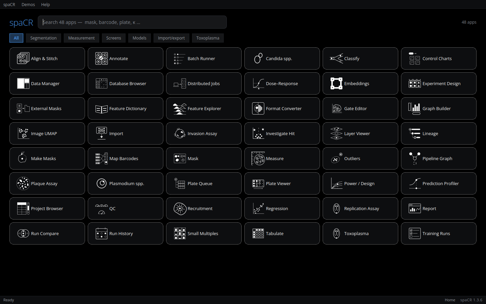

**Changes.** There are no sections. All 29 apps sit in one alphabetical grid under a search field, with filter chips as the only grouping and no default filter applied.

**Adds.** A search field and a row of filter chips.

**Removes.** Every category heading, the dashboard, the reserved surface, the hint bar.

**The argument for it.** Nobody agrees on the categories, and a flat grid is the only arrangement that cannot be wrong. 29 items is small enough to scan, and the search field is faster than any hierarchy once you know the name.

*Layout audit: clean — no elided or clipped text, no scrollbar, fits 1440x900.*


### 06 · Search-first — the grid is what you get after you type

`v06_search-only/`

[dark](v06_search-only/dark.png) [light](v06_search-only/light.png) [space](v06_search-only/space.png)

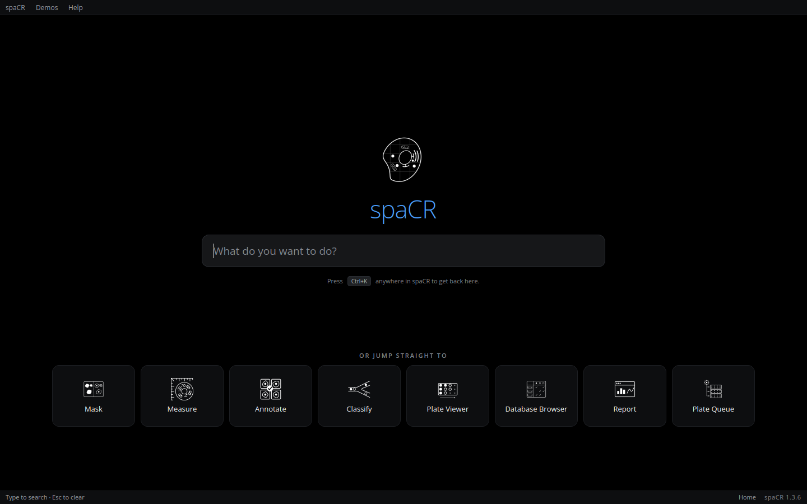

**Changes.** The home screen is a search box and almost nothing else. The app grid does not exist until you type; before that you get eight most-used apps as a 'jump to' row.

**Adds.** A large centred search field and a keyboard hint.

**Removes.** All 29 tiles, all categories, the hero, the dashboard, the reserved surface, the hint bar. 21 of the 29 apps have no presence on the screen at all until you search.

**The argument for it.** The most honest reading of 'too much on the home page' is to put nothing on it. Every app is one keystroke away and the eight that matter are already there.

*Layout audit: clean — no elided or clipped text, no scrollbar, fits 1440x900.*


### 07 · Category rail on the left, content pane on the right

`v07_rail-and-pane/`

[dark](v07_rail-and-pane/dark.png) [light](v07_rail-and-pane/light.png) [space](v07_rail-and-pane/space.png)

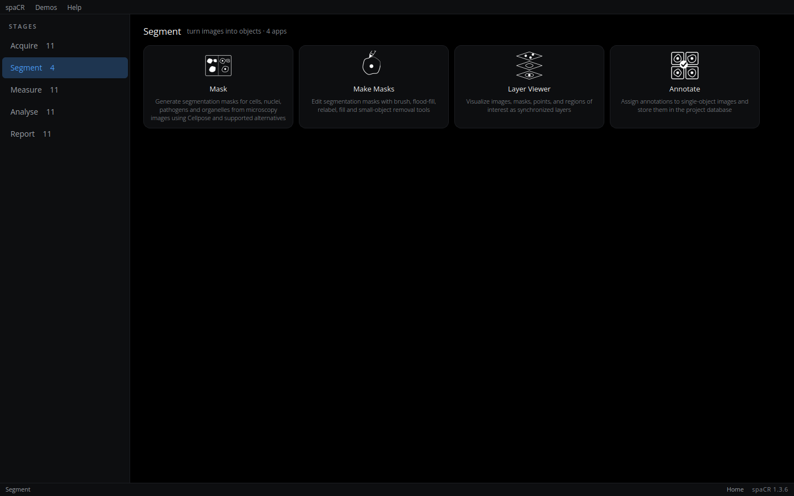

**Changes.** Categories move off the page and into a left rail; the pane shows one category at a time as large tiles with their one-line descriptions visible, not hidden behind a hover.

**Adds.** A category rail with per-category counts; the descriptions become permanently visible.

**Removes.** The app sidebar (the rail replaces it), the five stacked section headings, the dashboard, the reserved surface, the hint bar — the hint bar exists only because descriptions were hidden, and here they are not.

**The argument for it.** It is the only arrangement where every app's description is readable without hovering, which is what the hint bar was a workaround for. One click of cost, and the page can never overflow no matter how many apps get added.

*Layout audit: clean — no elided or clipped text, no scrollbar, fits 1440x900.*


### 08 · Tabs, one per stage

`v08_tabs/`

[dark](v08_tabs/dark.png) [light](v08_tabs/light.png) [space](v08_tabs/space.png)

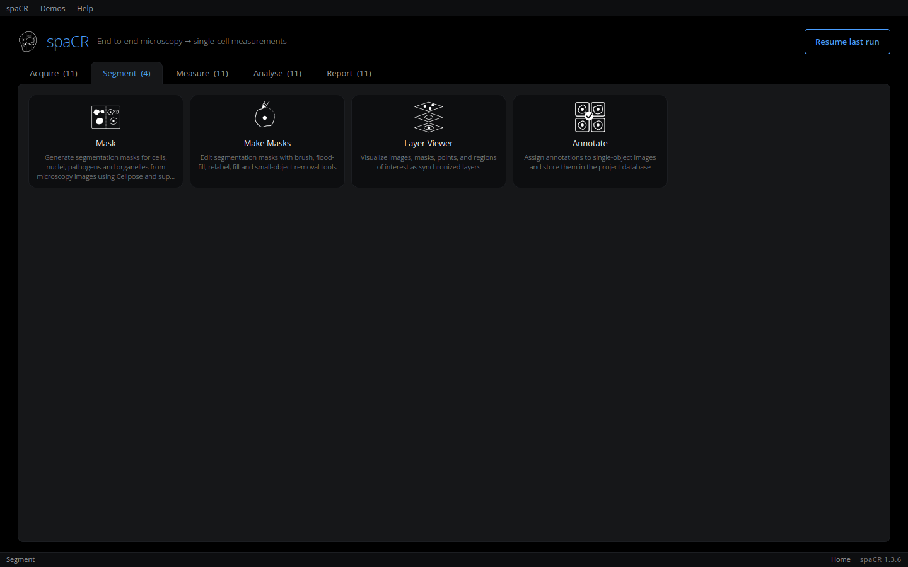

**Changes.** The five categories become a real tab bar. Only the active stage's apps are on screen, as large tiles with visible descriptions.

**Adds.** A tab bar; descriptions become permanently visible.

**Removes.** Four fifths of the apps at any moment, plus the dashboard, the reserved surface and the hint bar.

**The argument for it.** Tabs put the categories on one line instead of five, which buys back about 380 px of vertical space, and a tab bar is a control everyone already knows how to use.

*Layout audit: clean — no elided or clipped text, no scrollbar, fits 1440x900.*


### 09 · One prominent 'start a run' path

`v09_start-a-run/`

[dark](v09_start-a-run/dark.png) [light](v09_start-a-run/light.png) [space](v09_start-a-run/space.png)

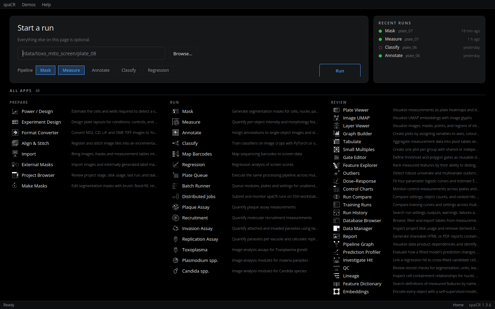

**Changes.** The top half of the screen is a single task: choose a folder, tick the stages you want, press Run. Everything else drops to a secondary compact list underneath.

**Adds.** A start-a-run panel with a source field, pipeline chips and a Run button — the home screen can launch a pipeline without opening an app first.

**Removes.** Tiles, the five section headings as headings (they become column captions), the dashboard, the reserved surface.

**The argument for it.** Ninety per cent of home-screen visits end in 'run Mask then Measure on this folder'. This is the only variant where that takes zero navigation.

*Layout audit: clean — no elided or clipped text, no scrollbar, fits 1440x900.*


### 10 · Resume the last run, then everything else

`v10_resume-first/`

[dark](v10_resume-first/dark.png) [light](v10_resume-first/light.png) [space](v10_resume-first/space.png)

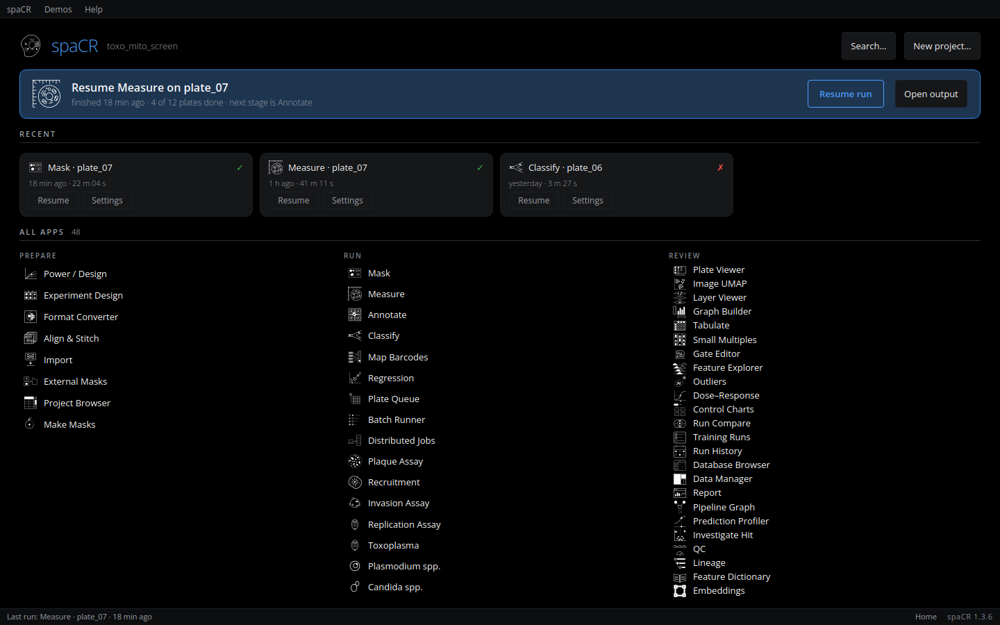

**Changes.** The screen opens on what you were doing, not on what spaCR can do. A resume banner and the last three runs come first; the apps are a dense three-column list below.

**Adds.** A resume-last-run banner (names the plate, the stage and what comes next) and a recent-runs strip with Resume / Settings on each card.

**Removes.** Tiles, the hero, the dashboard, the reserved surface, the hint bar.

**The argument for it.** A returning user's actual question is 'where was I?', and no version of the current screen answers it. The apps are still all there, just no longer the loudest thing.

*Layout audit: clean — no elided or clipped text, no scrollbar, fits 1440x900.*


### 11 · Guided quick-start for a first-time user

`v11_quick-start/`

[dark](v11_quick-start/dark.png) [light](v11_quick-start/light.png) [space](v11_quick-start/space.png)

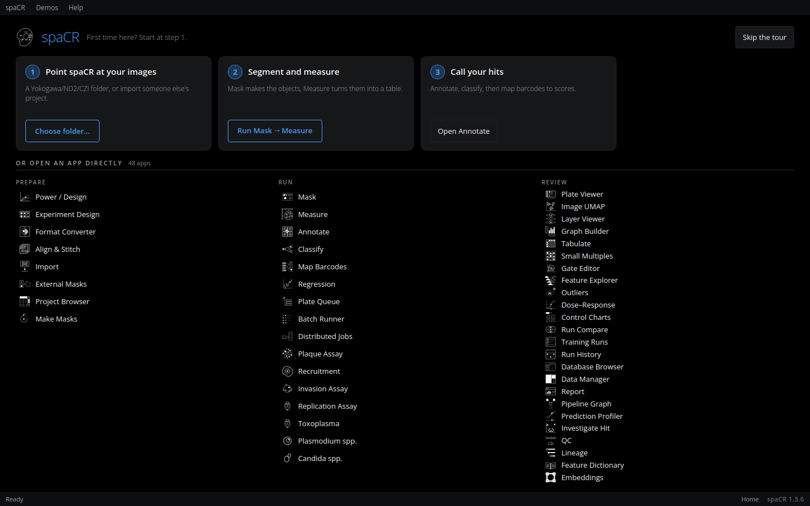

**Changes.** The page is a three-step path — point at images, segment and measure, call your hits — with a real button on each step. The app list is demoted to one compact row per category underneath.

**Adds.** A three-card guided quick-start with working actions (Choose folder / Run Mask → Measure / Open Annotate).

**Removes.** The hero, the dashboard, the reserved surface. Tiles become one-line rows.

**The argument for it.** A new user faced with 29 tiles has no idea which three matter. This tells them, and it is dismissible — after the first successful run the strip can collapse to a single line.

*Layout audit: clean — no elided or clipped text, no scrollbar, fits 1440x900.*


### 12 · Pinned favourites first, then three categories

`v12_pinned-first/`

[dark](v12_pinned-first/dark.png) [light](v12_pinned-first/light.png) [space](v12_pinned-first/space.png)

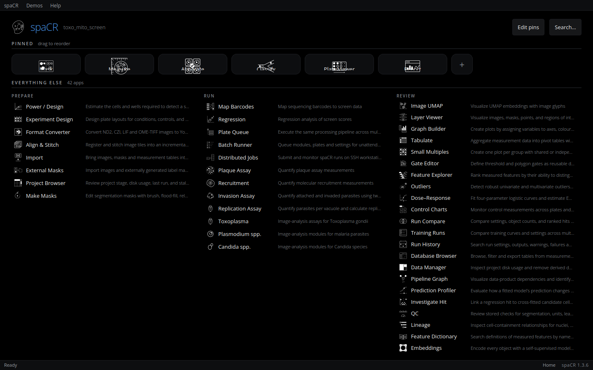

**Changes.** Ordering, not grouping: the six apps this user pinned sit at the top as large tiles, and the rest follow in three broad categories as compact rows.

**Adds.** A pinned row with a '+' slot, so the user curates their own top of page.

**Removes.** The hero, the dashboard, the reserved surface, the hint bar.

**The argument for it.** Whatever the categories are, everyone uses four or five apps and ignores the rest. Let the user say which, and the argument about the taxonomy stops mattering.

*Layout audit: clean — no elided or clipped text, no scrollbar, fits 1440x900.*


### 13 · Dense two-column list, today's five categories

`v13_dense-two-column/`

[dark](v13_dense-two-column/dark.png) [light](v13_dense-two-column/light.png) [space](v13_dense-two-column/space.png)

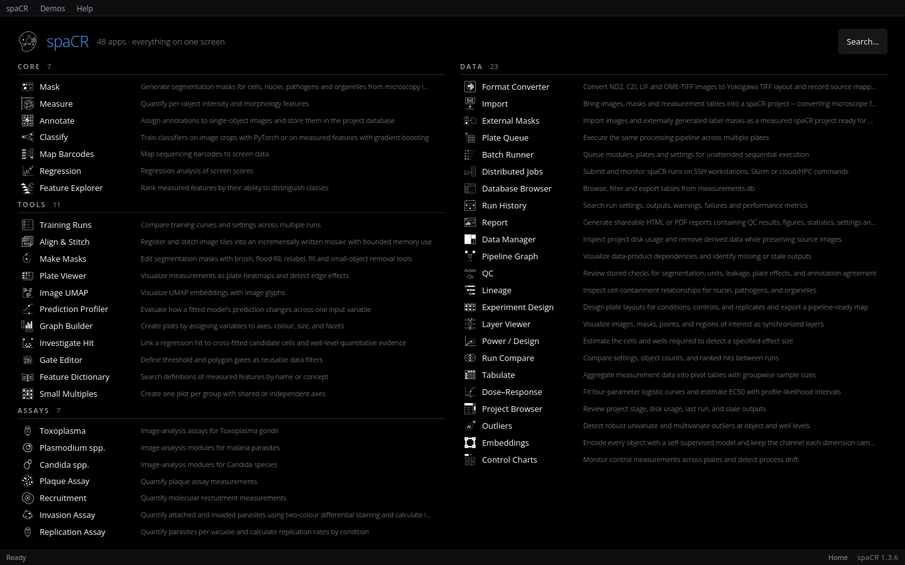

**Changes.** No tiles anywhere. Today's five categories are kept verbatim, but every app is a 30 px row with its icon, its name and its description on one line, in two columns.

**Adds.** Descriptions are permanently visible.

**Removes.** Tiles, the hero, the dashboard, the reserved surface, the hint bar.

**The argument for it.** It is the densest honest layout: all 29 apps *and* all 29 descriptions above the fold at 1440x900, with roughly 200 px still free. Nothing is hidden, nothing needs a hover.

*Layout audit: clean — no elided or clipped text, no scrollbar, fits 1440x900.*


### 14 · Ordered by how often you actually use it

`v14_by-frequency/`

[dark](v14_by-frequency/dark.png) [light](v14_by-frequency/light.png) [space](v14_by-frequency/space.png)

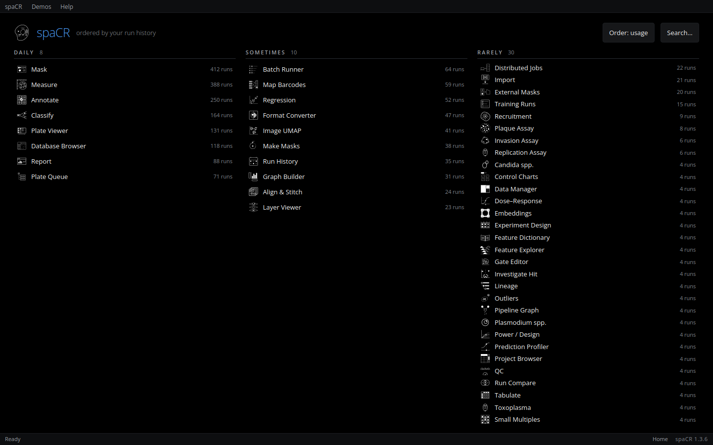

**Changes.** Ordering replaces grouping. One flat list, most-used first, with each app's run count beside it. Three tiers marked 'daily', 'sometimes' and 'rarely' are the only headings.

**Adds.** Per-app run counts drawn from the run journal.

**Removes.** All five categories, the hero, the dashboard, the reserved surface, the hint bar.

**The argument for it.** The taxonomy argument is unwinnable; usage is measurable. It also self-corrects — a new app that people use rises without anyone editing a table.

*Note.* Run counts are illustrative values in the generator, not real telemetry.

*Layout audit: clean — no elided or clipped text, no scrollbar, fits 1440x900.*


### 15 · The pipeline, drawn as a pipeline

`v15_pipeline-flow/`

[dark](v15_pipeline-flow/dark.png) [light](v15_pipeline-flow/light.png) [space](v15_pipeline-flow/space.png)

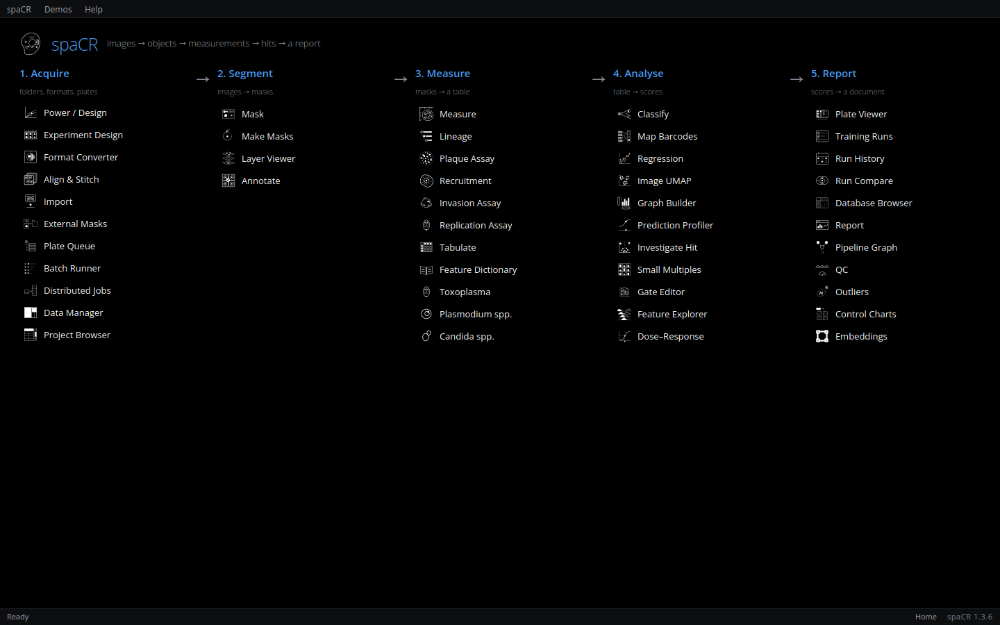

**Changes.** Five stage columns read left to right with arrows between them, so the home screen is a picture of the workflow rather than a list of categories.

**Adds.** Arrows between stages, and a per-stage caption saying what goes in and what comes out.

**Removes.** Tiles, the hero, the dashboard, the reserved surface, the hint bar.

**The argument for it.** The categories in a pipeline tool *are* an order, and no vertical stack of headings shows that. A new user can read the whole method off the home screen.

*Layout audit: clean — no elided or clipped text, no scrollbar, fits 1440x900.*


### 16 · Project status first, then the pipeline

`v16_status-first/`

[dark](v16_status-first/dark.png) [light](v16_status-first/light.png) [space](v16_status-first/space.png)

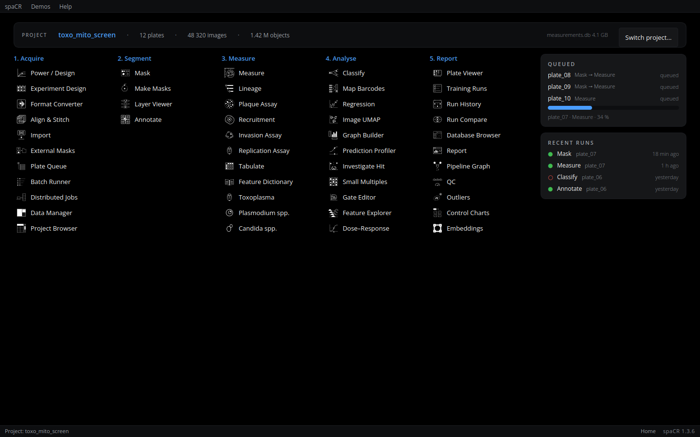

**Changes.** A project bar names the open dataset and its size at the top of every home visit; the pipeline stages follow as columns.

**Adds.** A dataset/plate status strip (project, plates, images, objects, database size, switch-project), plus a queue panel showing what runs next.

**Removes.** The hero, the dashboard, the reserved surface, the hint bar.

**The argument for it.** spaCR is always pointed at *something*, and today the home screen never says what. Nearly every support question starts with 'which folder were you on?'.

*Layout audit: clean — no elided or clipped text, no scrollbar, fits 1440x900.*


### 17 · Apps left, everything-about-your-machine right

`v17_split-apps-aside/`

[dark](v17_split-apps-aside/dark.png) [light](v17_split-apps-aside/light.png) [space](v17_split-apps-aside/space.png)

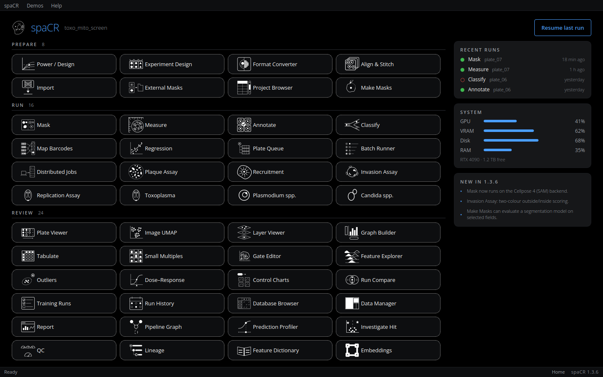

**Changes.** A hard vertical split. The left two thirds are apps and nothing else; the right third is state — recent runs, system, what changed.

**Adds.** A persistent right-hand aside carrying recent runs, disk/GPU state and a what's-new panel.

**Removes.** The horizontally-scrolling section rows, the reserved surface, the hint bar. The insights dashboard is not removed but relocated to the aside, where it stops pushing the apps down the page.

**The argument for it.** The current dashboard's problem is not that it exists, it is that it sits *under* the apps and so nothing fits. Put it beside them and both halves work.

*Layout audit: clean — no elided or clipped text, no scrollbar, fits 1440x900.*


### 18 · Nine apps, and a door to the other twenty

`v18_core-nine-only/`

[dark](v18_core-nine-only/dark.png) [light](v18_core-nine-only/light.png) [space](v18_core-nine-only/space.png)

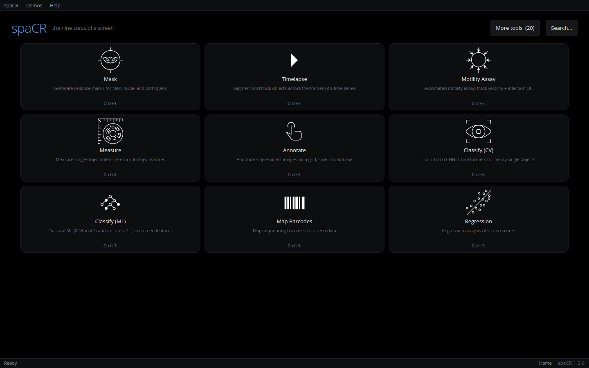

**Changes.** The home screen shows only the nine Core-pipeline apps, as large illustrated tiles with their descriptions. Everything else lives behind one button.

**Adds.** A 'More tools' door with a count.

**Removes.** Twenty apps: Align & Stitch, Format Converter, Import Project, Plate Queue, Batch Runner, Database Browser, Make Masks, Train Cellpose, Cellpose Masks, Model Compare, Model Zoo, Plate Viewer, Annotator Agreement, Image UMAP, Activation, Training Runs, Report, Plaque Assay, Recruitment, Invasion Assay. Also the dashboard, the reserved surface and the hint bar.

**The argument for it.** This is what 'too much on the home page' looks like taken seriously. Nine tiles, each big enough to read, each one a thing you would actually do today — and the other twenty are one click away, not gone.

*Layout audit: clean — no elided or clipped text, no scrollbar, fits 1440x900.*


### 19 · Categories named as the question you arrived with

`v19_by-question/`

[dark](v19_by-question/dark.png) [light](v19_by-question/light.png) [space](v19_by-question/space.png)

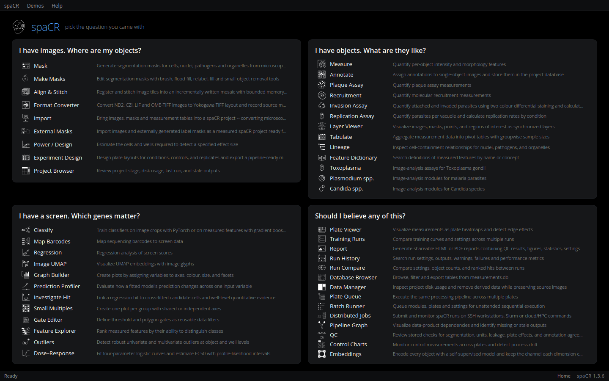

**Changes.** Four categories, each phrased as a question a biologist actually asks — 'I have images. Where are my objects?', 'I have objects. What are they like?', 'I have a screen. Which genes matter?', 'Should I believe any of this?'.

**Adds.** Nothing beyond the wording.

**Removes.** The five kind-of-thing headings, the hero, the dashboard, the reserved surface, the hint bar.

**The argument for it.** Names are the cheapest thing to change and the thing people actually navigate by. 'Segmentation models' is a category of code; 'Where are my objects?' is a category of intent, and the same five apps sit under it.

*Layout audit: clean — no elided or clipped text, no scrollbar, fits 1440x900.*


### 20 · What changed in this version, above the apps

`v20_whats-new/`

[dark](v20_whats-new/dark.png) [light](v20_whats-new/light.png) [space](v20_whats-new/space.png)

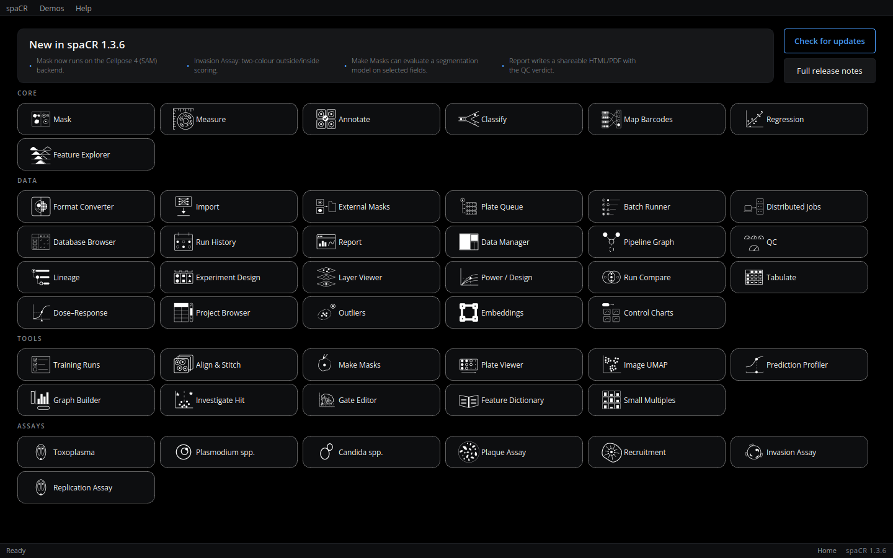

**Changes.** A release panel runs along the top; the apps sit beneath it as a five-column grid with today's five categories reduced to inline captions.

**Adds.** A 'New in 1.3.6' panel with links straight into the apps that changed, and an update check.

**Removes.** The hero, the dashboard, the reserved surface, the hint bar.

**The argument for it.** spaCR ships often and nobody reads the changelog. The home screen is the only page every user sees every session, and four bullets is a cheap rent to charge it.

*Layout audit: clean — no elided or clipped text, no scrollbar, fits 1440x900.*


### 21 · Dashboard across the top, apps beneath

`v21_dashboard-first/`

[dark](v21_dashboard-first/dark.png) [light](v21_dashboard-first/light.png) [space](v21_dashboard-first/space.png)

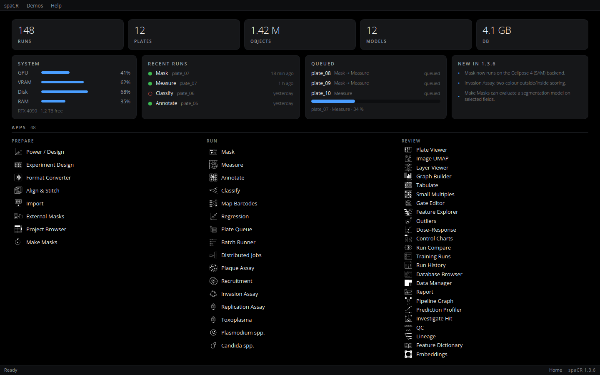

**Changes.** The insights dashboard is promoted to the top of the page and widened into a stat row plus three panels; the apps become a compact three-column list under it.

**Adds.** Big-number stat tiles (runs, plates, objects, models), a queue panel and a system panel built on the real UsageBar widget.

**Removes.** Tiles, the hero, the reserved surface, the hint bar.

**The argument for it.** If the dashboard is worth having at all it is worth reading first — today it sits below the fold and is effectively invisible. This variant is the honest test of whether anyone wants it.

*Layout audit: clean — no elided or clipped text, no scrollbar, fits 1440x900.*


### 22 · A-to-Z index

`v22_a-to-z/`

[dark](v22_a-to-z/dark.png) [light](v22_a-to-z/light.png) [space](v22_a-to-z/space.png)

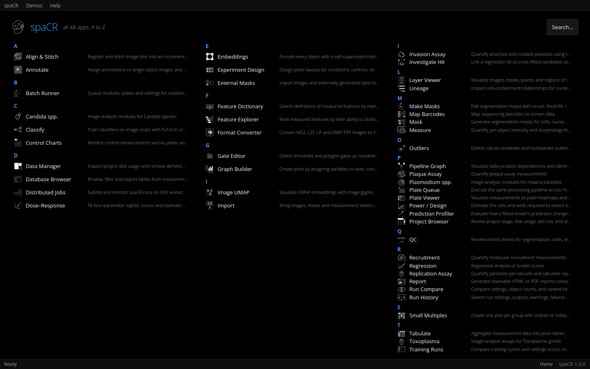

**Changes.** No categories, no ranking: an alphabetical index with letter headers, three columns, descriptions on every row.

**Adds.** Letter headers.

**Removes.** All five categories, the hero, the dashboard, the reserved surface, the hint bar.

**The argument for it.** Alphabetical is the only order that never needs maintaining and never surprises anyone. If a user knows the app's name — and after a week they all do — it is the fastest possible lookup.

*Layout audit: clean — no elided or clipped text, no scrollbar, fits 1440x900.*


### 23 · Large illustrated tiles, five stage bands

`v23_illustrated-tiles/`

[dark](v23_illustrated-tiles/dark.png) [light](v23_illustrated-tiles/light.png) [space](v23_illustrated-tiles/space.png)

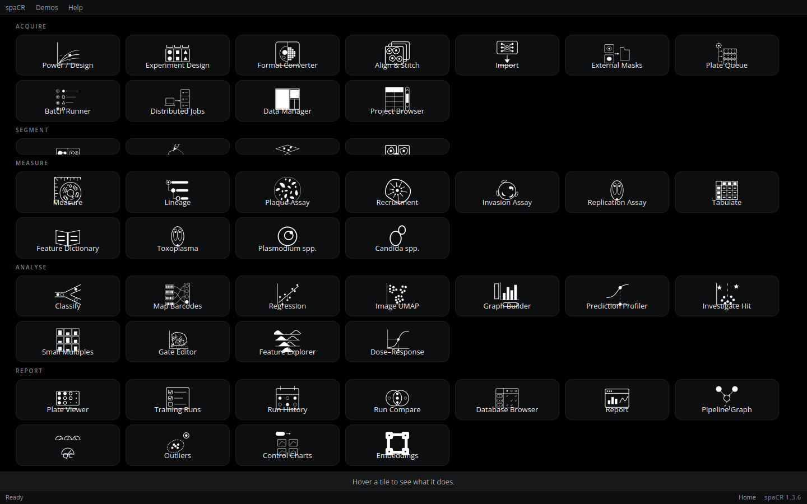

**Changes.** Tiles get much bigger and the icon does the work: seven per row, icon over name, grouped in five stage bands.

**Adds.** Nothing.

**Removes.** Descriptions from the surface (they stay in the tooltip and the hint bar), the dashboard, the reserved surface.

**The argument for it.** This is the launcher reading of the home screen — a big, quiet, recognisable target per app. It is also the variant that most rewards the icon work happening in parallel; with weak icons it is the worst of the thirty.

*Layout audit: clean — no elided or clipped text, no scrollbar, fits 1440x900.*


### 24 · Keyboard-first command palette

`v24_command-palette/`

[dark](v24_command-palette/dark.png) [light](v24_command-palette/light.png) [space](v24_command-palette/space.png)

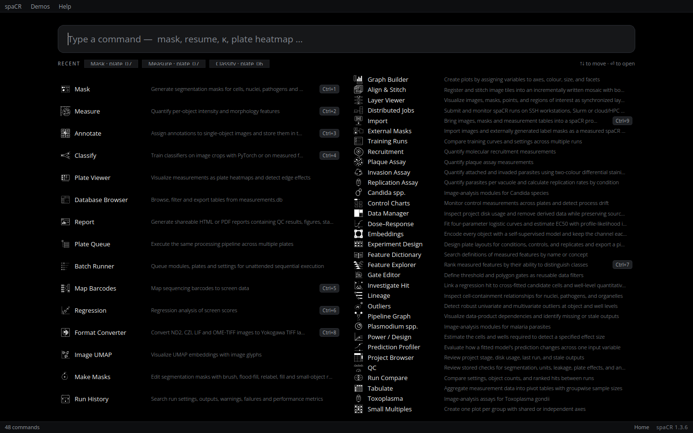

**Changes.** The home screen *is* the command palette: a query field over a two-column result list, every row carrying its keyboard shortcut, ordered by usage rather than category.

**Adds.** Visible Ctrl+1..9 shortcuts on the nine core apps, and a recent-commands block at the top of the list.

**Removes.** All categories, tiles, the hero, the dashboard, the reserved surface, the hint bar.

**The argument for it.** Everyone who uses spaCR daily ends up wanting Ctrl+K. Making the home screen the palette means the beginner and the expert are using the same surface, and the shortcuts teach themselves.

*Layout audit: clean — no elided or clipped text, no scrollbar, fits 1440x900.*


### 25 · Home is the project, navigation is the sidebar

`v25_project-home/`

[dark](v25_project-home/dark.png) [light](v25_project-home/light.png) [space](v25_project-home/space.png)

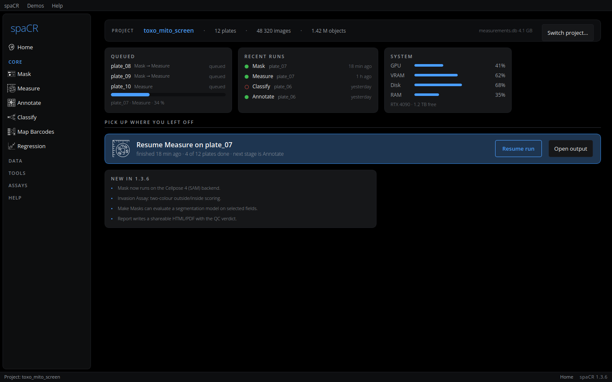

**Changes.** The home screen stops being a launcher altogether. The sidebar already lists every app; home becomes the page about your data — project, queue, recent runs, system, what changed.

**Adds.** A project header with the dataset's size and database, a queue panel, a recent-runs list, a system panel, a what's-new panel.

**Removes.** Every app tile and every category from the home surface — all 29 apps are reachable only from the sidebar or Ctrl+K.

**The argument for it.** Two navigation surfaces listing the same 29 apps is one too many, and the sidebar is the one that is available from every screen. Deleting the duplicate is the largest simplification available.

*Note.* Shows the real Sidebar, and therefore shows that it does not fit in 900 px — it needs a scroll area before this variant is viable.

*Layout audit: every theme — clipped (6), overflow (1)*


### 26 · Pins, recents, and everything else collapsed

`v26_pins-recent-accordion/`

[dark](v26_pins-recent-accordion/dark.png) [light](v26_pins-recent-accordion/light.png) [space](v26_pins-recent-accordion/space.png)

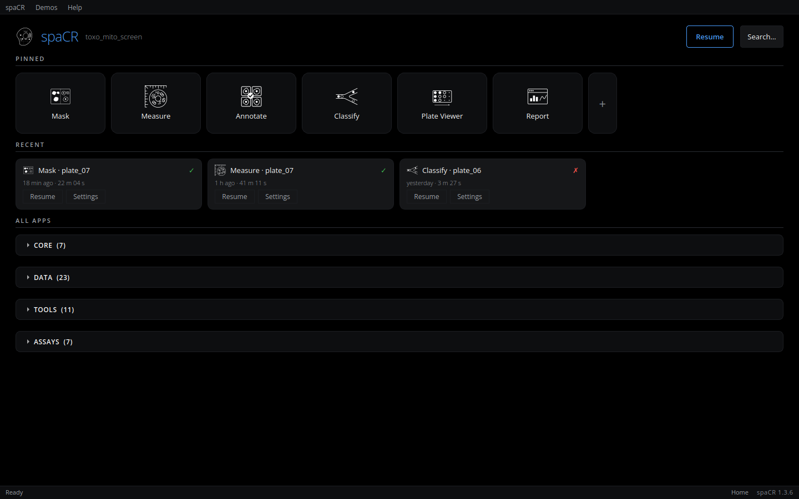

**Changes.** Two strips the user cares about sit open — pinned apps and recent runs — and the whole 29-app taxonomy collapses into five closed accordion rows underneath.

**Adds.** A pinned strip and a recent-runs strip; the categories become the real collapsible Section widget from the settings screens.

**Removes.** Every app that is not pinned disappears from the surface until a section is opened; the hero, the dashboard, the reserved surface.

**The argument for it.** It makes the page's default state small without deleting anything, and it reuses a widget spaCR already ships, so there is nothing new to design.

*Layout audit: clean — no elided or clipped text, no scrollbar, fits 1440x900.*


### 27 · Eight accordions, one open

`v27_accordion-eight/`

[dark](v27_accordion-eight/dark.png) [light](v27_accordion-eight/light.png) [space](v27_accordion-eight/space.png)

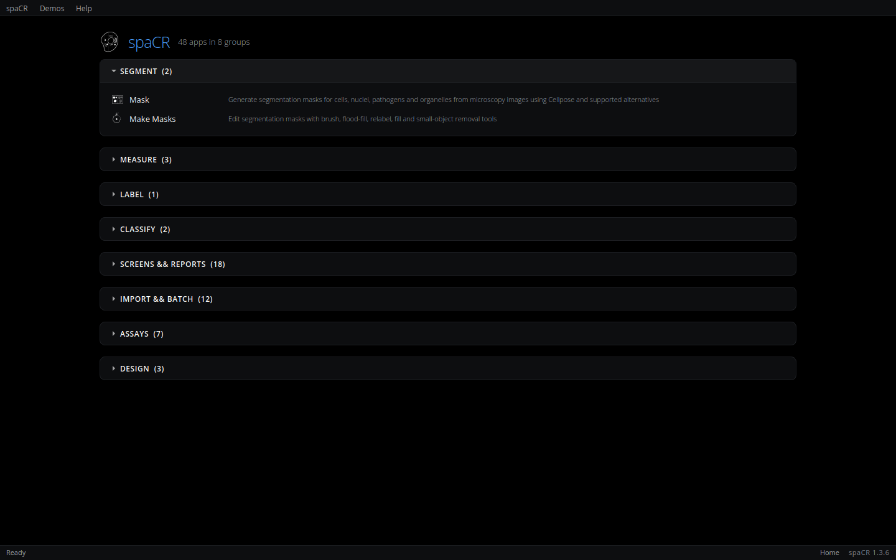

**Changes.** Nothing but headings, in eight narrow categories, using the shipped collapsible Section widget. One is open; the rest are one line each.

**Adds.** Per-category counts, and the memory of which section you last had open.

**Removes.** Tiles, the hero, the dashboard, the reserved surface, the hint bar. Twenty-six of the 29 apps are one click away rather than on screen.

**The argument for it.** The whole taxonomy fits in about 300 px, so the home screen can be small *and* complete. It also scales: a ninth category costs 34 px, not a whole row.

*Layout audit: clean — no elided or clipped text, no scrollbar, fits 1440x900.*


### 28 · Nothing but the grid

`v28_grid-no-chrome/`

[dark](v28_grid-no-chrome/dark.png) [light](v28_grid-no-chrome/light.png) [space](v28_grid-no-chrome/space.png)

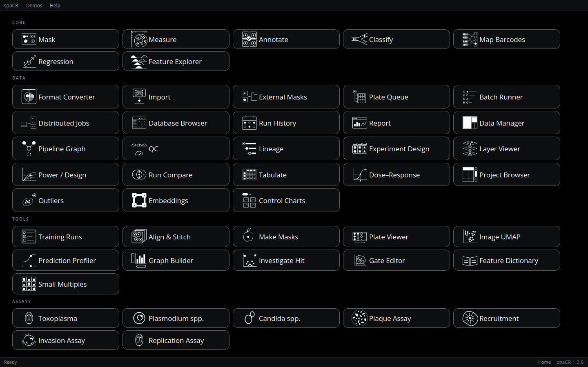

**Changes.** The page starts at the tiles. Categories survive only as four-word captions between the bands; there is no hero, no logo, no footer, no panels.

**Adds.** Nothing at all.

**Removes.** The hero and wordmark, the insights dashboard, the reserved surface, the hint bar, and every heading rule.

**The argument for it.** Measured against the complaint that started this — too much on the home page — this is the answer with the least on it that still shows all 29 apps. Everything on screen is clickable.

*Layout audit: clean — no elided or clipped text, no scrollbar, fits 1440x900.*


### 29 · Four intents on the left, their apps on the right

`v29_intent-wizard/`

[dark](v29_intent-wizard/dark.png) [light](v29_intent-wizard/light.png) [space](v29_intent-wizard/space.png)

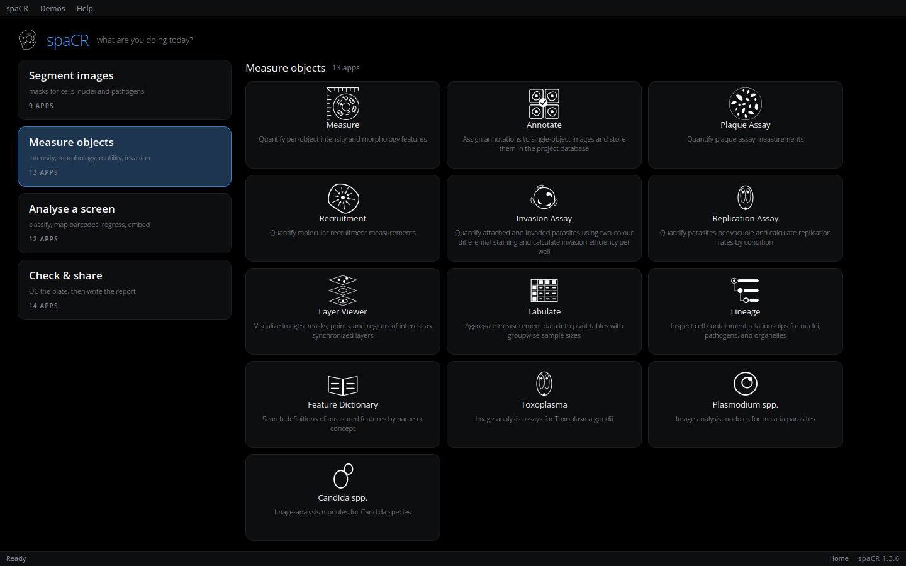

**Changes.** Four large intent buttons stack down the left; picking one fills the right pane with that intent's apps as tiles with descriptions. It is the rail-and-pane idea with four buttons instead of a list.

**Adds.** Intent buttons carrying a count and a one-line explanation.

**Removes.** The five kind-of-thing categories, the hero, the dashboard, the reserved surface, the hint bar.

**The argument for it.** Four targets is the fewest a person has to choose between, and each is big enough to hit without aiming. Good for the occasional user; probably slow for a daily one.

*Layout audit: clean — no elided or clipped text, no scrollbar, fits 1440x900.*


### 30 · Everything at once (the reference for 'too much')

`v30_kitchen-sink/`

[dark](v30_kitchen-sink/dark.png) [light](v30_kitchen-sink/light.png) [space](v30_kitchen-sink/space.png)

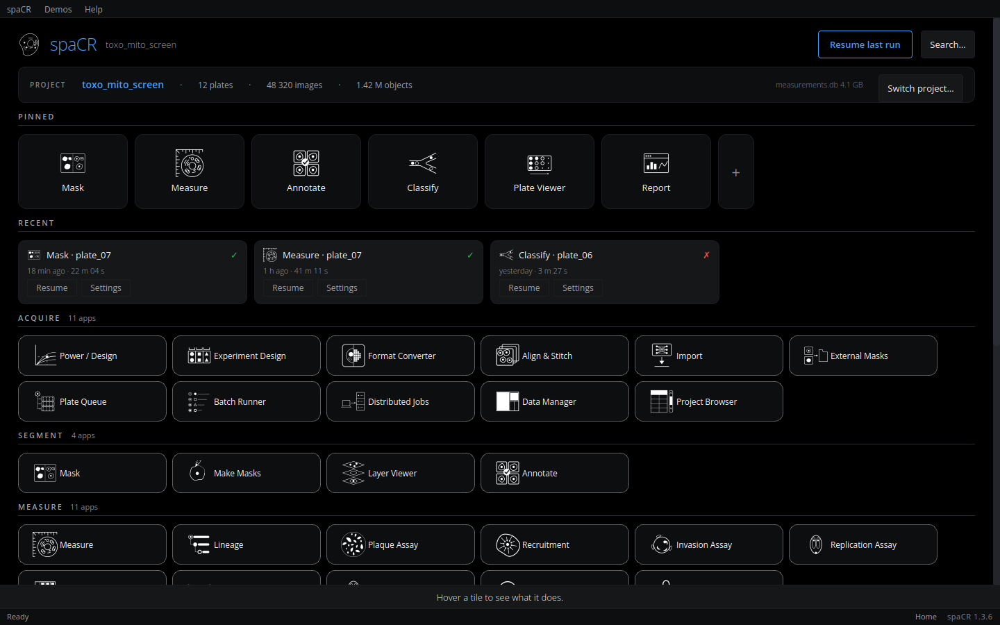

**Changes.** Every element proposed anywhere in this set is on one page at the same time: brand bar with resume, project status, pinned row, recent runs, five stage bands of tiles, system, queue, what's new, hint bar.

**Adds.** All of it.

**Removes.** Nothing.

**The argument for it.** Not a proposal — a control at the other end from variant 18. It shows exactly how far past 900 px the maximal reading of 'add elements' goes: the page needs a scrollbar before the pinned row is fully visible, which is the same failure the current screen has, only louder.

*Note.* Deliberately scrolls; the render shows the top 900 px only.

*Layout audit: every theme — scrollbars (1)*


---

## Notes on size

Everything above is drawn at 1440x900 and nothing depends on a larger
window, with these exceptions:

* **07 rail-and-pane**, **08 tabs** and **29 intent-wizard** show one
  category at a time with four to five tiles per row. On a wider screen
  they simply fit more per row; on a narrower one the grid rewraps.
* **13 dense-two-column** and **19 by-question** are two columns of
  ~660 px. Below about 1200 px they would want to become one column.
* **24 command-palette** and **27 accordion-eight** are deliberately
  inset (a fixed centre column), so they look the same at any width
  above 1100 px.
* **30 kitchen-sink** does not fit at any realistic size — that is its
  point.

## The product change these renders argue for

`spacr/qt/app.py` belongs to another effort right now, so this is
written down rather than applied. It is independent of which variant
wins — variants 01 and 25 both show the symptom, and any future variant
that keeps the sidebar inherits it.

```diff
--- a/spacr/qt/app.py
+++ b/spacr/qt/app.py
@@
-from PySide6.QtWidgets import (
-    QApplication,
-    QLabel,
+from PySide6.QtWidgets import (
+    QApplication,
+    QLabel,
+    QScrollArea,
@@ class Sidebar(QWidget):
-        layout = QVBoxLayout(self)
-        layout.setContentsMargins(0, 0, 0, 0)
-        layout.setSpacing(0)
+        # 29 app rows + 5 headings + the title ask for ~1356 px. On a
+        # 1440x900 laptop the column gets ~850, and because a plain
+        # QVBoxLayout does not scroll the last three apps (Plaque
+        # Assay, Recruitment, Invasion Assay) cannot be reached at all.
+        outer = QVBoxLayout(self)
+        outer.setContentsMargins(0, 0, 0, 0)
+        outer.setSpacing(0)
+        scroll = QScrollArea()
+        scroll.setWidgetResizable(True)
+        scroll.setFrameShape(QScrollArea.NoFrame)
+        scroll.setHorizontalScrollBarPolicy(Qt.ScrollBarAlwaysOff)
+        inner = QWidget()
+        layout = QVBoxLayout(inner)
+        layout.setContentsMargins(0, 0, 0, 0)
+        layout.setSpacing(0)
+        scroll.setWidget(inner)
+        outer.addWidget(scroll, 1)
```

## One trap for whoever implements the winner

`QPushButton.setFixedSize()` does **not** survive the app stylesheet.
`theme.stylesheet()` carries `QPushButton { min-height: 22px }`, and
`QStyleSheetStyle` re-applies that rule's geometry to the widget on
polish, wiping the minimum that `setFixedSize` had set. A 116 px tile
then reports a 40 px minimum to its parent layout and gets squashed to
48 px — text and icon still painted, just cropped, with no warning
anywhere. Two of these variants hit it before it was found. The fix is
to report the size through `sizeHint()`/`minimumSizeHint()` instead;
see `FixedButton` in `_generators/parts.py`. (`HTile` is already safe
because it overrides both.)
